# DataHub 시스템 구조 및 아키텍처 가이드

DataHub를 처음 접하는 개발자를 위한 전체 시스템 구조, 주요 설계 패턴,
핵심 코드 경로에 대한 가이드입니다.

> **Note**: 다이어그램은 [Mermaid](https://mermaid.js.org/) 문법으로 작성되었습니다.

---

## Table of Contents

- [1. DataHub란?](#1-datahub란)
- [2. 전체 시스템 아키텍처](#2-전체-시스템-아키텍처)
- [3. 핵심 개념: Entity-Aspect 모델](#3-핵심-개념-entity-aspect-모델)
- [4. 서비스 아키텍처](#4-서비스-아키텍처)
- [5. 데이터 흐름: 쓰기 경로 (Ingestion)](#5-데이터-흐름-쓰기-경로-ingestion)
- [6. 데이터 흐름: 읽기 경로 (Query)](#6-데이터-흐름-읽기-경로-query)
- [7. API 계층](#7-api-계층)
- [8. 저장소 계층](#8-저장소-계층)
- [9. 주요 설계 패턴](#9-주요-설계-패턴)
- [10. 모듈별 코드 가이드](#10-모듈별-코드-가이드)
- [11. 코드 읽기 순서 추천](#11-코드-읽기-순서-추천)

---

## 1. DataHub란?

DataHub는 **메타데이터 관리 플랫폼**입니다. 데이터 레이크, 웨어하우스, BI 도구 등
다양한 데이터 소스의 메타데이터를 수집하여 검색, 탐색, 거버넌스를 제공합니다.

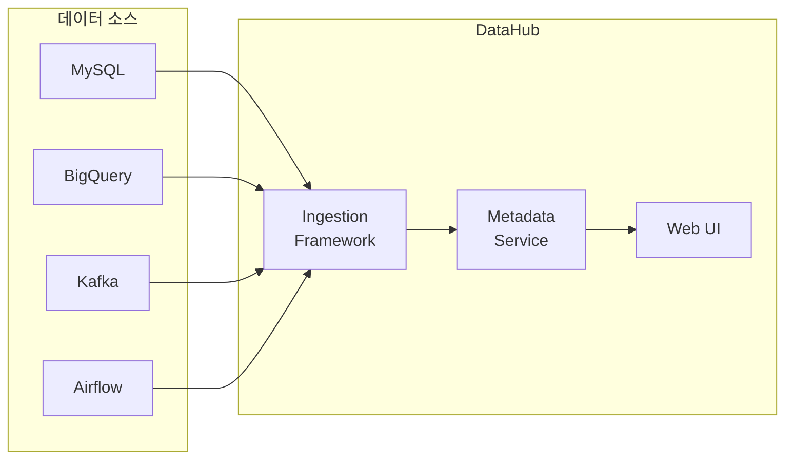

### 주요 기능

| 기능                | 설명                                                       |
| ------------------- | ---------------------------------------------------------- |
| **메타데이터 검색** | 데이터셋, 대시보드, 파이프라인 등을 키워드/시맨틱으로 검색 |
| **데이터 리니지**   | 데이터 흐름(상류/하류 의존성)을 시각화                     |
| **데이터 거버넌스** | 소유권, 태그, 용어집, 정책 관리                            |
| **데이터 품질**     | Assertion과 모니터링으로 데이터 품질 추적                  |
| **데이터 발견**     | 브라우징, 추천, 자동 분류                                  |

---

## 2. 전체 시스템 아키텍처

### 2.1 고수준 아키텍처

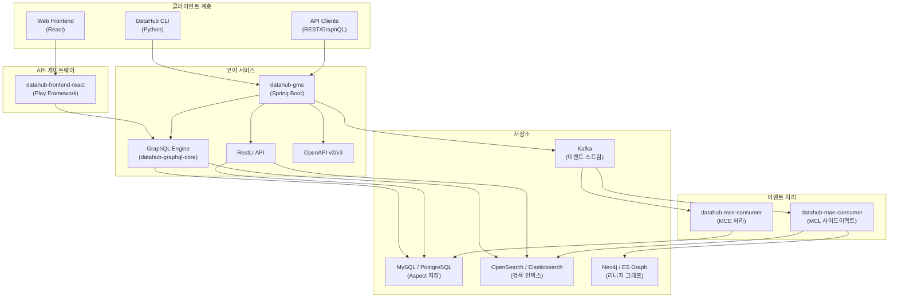

### 2.2 컨테이너 구성

DataHub는 Docker Compose로 다음 컨테이너들을 실행합니다:

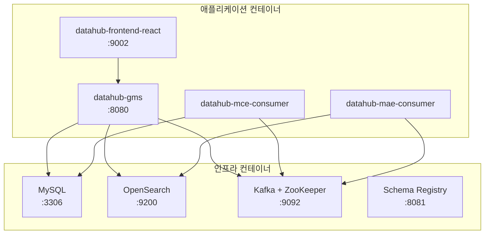

**소스-컨테이너 매핑**:

| 소스 디렉토리                     | 컨테이너               | 역할                      |
| --------------------------------- | ---------------------- | ------------------------- |
| `metadata-service/`               | datahub-gms            | 코어 메타데이터 서비스    |
| `datahub-graphql-core/`           | datahub-gms            | GraphQL 엔진 (GMS에 내장) |
| `metadata-io/`                    | datahub-gms            | 데이터 접근 계층          |
| `datahub-frontend/`               | datahub-frontend-react | 웹 프론트엔드             |
| `metadata-jobs/mce-consumer-job/` | datahub-mce-consumer   | MCE 이벤트 처리           |
| `metadata-jobs/mae-consumer-job/` | datahub-mae-consumer   | MCL 사이드이펙트          |
| `metadata-models/`                | 전체                   | 스키마 → 코드 생성        |

---

## 3. 핵심 개념: Entity-Aspect 모델

DataHub의 메타데이터 모델은 **Entity-Aspect** 패턴을 사용합니다.
이는 DataHub 아키텍처의 가장 중요한 개념입니다.

### 3.1 Entity (엔티티)

**엔티티**는 메타데이터를 관리할 대상 객체입니다.

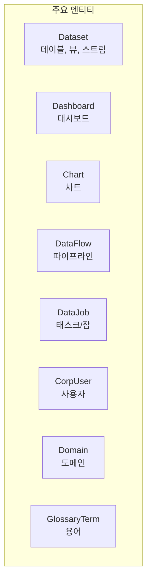

각 엔티티는 **URN(Uniform Resource Name)**으로 고유하게 식별됩니다:

```
urn:li:dataset:(urn:li:dataPlatform:mysql,my_db.users,PROD)
urn:li:dashboard:(urn:li:dataPlatform:looker,dashboards.1234)
urn:li:corpuser:john.doe
```

### 3.2 Aspect (애스펙트)

**애스펙트**는 엔티티의 메타데이터 속성을 구성하는 모듈화된 단위입니다.

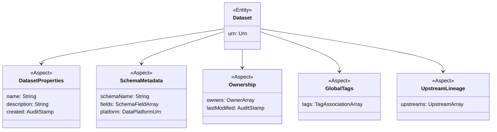

**핵심 원리**: 하나의 엔티티는 여러 애스펙트를 가지며, 각 애스펙트는 독립적으로 생성/수정/삭제됩니다.

### 3.3 Entity Registry

엔티티와 애스펙트의 관계는 `entity-registry.yml`에 정의됩니다.

**파일**: `metadata-models/src/main/resources/entity-registry.yml`

```yaml
entities:
  - name: dataset
    doc: Datasets represent logical or physical data assets...
    category: core
    keyAspect: datasetKey
    searchGroup: primary
    aspects:
      - datasetProperties
      - schemaMetadata
      - ownership
      - globalTags
      - glossaryTerms
      - upstreamLineage
      - status
      - domains
      # ... 30+ aspects
```

**코드 참조**:

| 파일                                                                    | 설명                         |
| ----------------------------------------------------------------------- | ---------------------------- |
| `entity-registry/src/main/java/.../models/registry/EntityRegistry.java` | 엔티티 레지스트리 인터페이스 |
| `entity-registry/src/main/java/.../models/EntitySpec.java`              | 엔티티 사양 클래스           |
| `entity-registry/src/main/java/.../models/AspectSpec.java`              | 애스펙트 사양 클래스         |

### 3.4 스키마 정의 (PDL)

애스펙트의 스키마는 **PDL(Pegasus Data Language)**로 정의되며, 빌드 시 Java 코드로 변환됩니다.

**파일 위치**: `metadata-models/src/main/pegasus/`

```
com/linkedin/
├── dataset/
│   ├── DatasetProperties.pdl    # Dataset의 properties aspect
│   └── DatasetKey.pdl           # Dataset의 key aspect
├── schema/
│   └── SchemaMetadata.pdl       # 스키마 메타데이터
├── common/
│   ├── Ownership.pdl            # 소유권
│   ├── GlobalTags.pdl           # 태그
│   └── GlossaryTerms.pdl       # 용어
└── mxe/
    ├── MetadataChangeEvent.pdl  # MCE 이벤트
    └── MetadataChangeLog.pdl    # MCL 이벤트
```

**PDL 스키마 예시** (`DatasetProperties.pdl`):

```pegasus
@Aspect = {
  "name": "datasetProperties"
}
record DatasetProperties {
  @Searchable = {
    "fieldType": "TEXT_PARTIAL",
    "enableAutocomplete": true,
    "boostScore": 10.0
  }
  name: optional string

  @Searchable = {
    "fieldType": "TEXT",
    "hasValuesFieldName": "hasDescription"
  }
  description: optional string
}
```

**`@Searchable` 어노테이션**: PDL 필드에 붙이면 해당 필드가 검색 인덱스에 자동으로 포함됩니다.

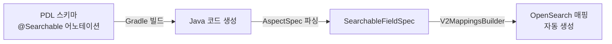

**코드 참조**:

| 파일                                                                     | 설명                        |
| ------------------------------------------------------------------------ | --------------------------- |
| `entity-registry/src/main/java/.../annotation/SearchableAnnotation.java` | @Searchable 어노테이션 파싱 |
| `entity-registry/src/main/java/.../models/SearchableFieldSpec.java`      | 검색 가능 필드 사양         |
| `metadata-io/src/main/java/.../index/entity/v2/V2MappingsBuilder.java`   | 어노테이션 → ES 매핑 변환   |

---

## 4. 서비스 아키텍처

### 4.1 GMS (Generalized Metadata Service)

GMS는 DataHub의 핵심 백엔드 서비스입니다.

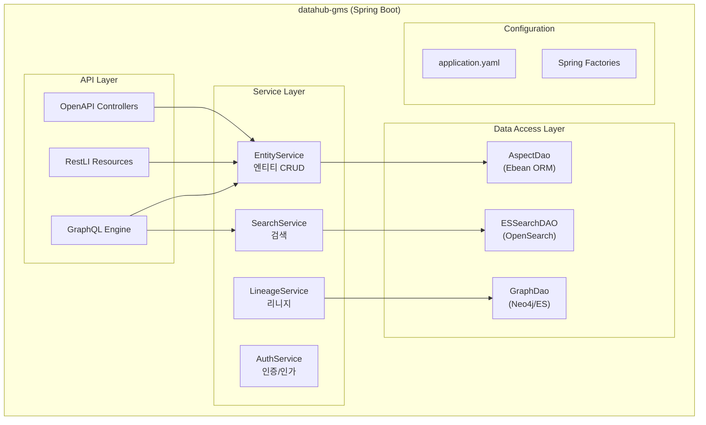

**핵심 코드 경로**:

| 계층        | 파일 위치                                                               |
| ----------- | ----------------------------------------------------------------------- |
| 진입점      | `metadata-service/war/` (Spring Boot App)                               |
| Spring 설정 | `metadata-service/configuration/src/main/resources/application.yaml`    |
| Factory     | `metadata-service/factories/src/main/java/com/linkedin/gms/factory/`    |
| 서비스      | `metadata-service/services/src/main/java/com/linkedin/metadata/entity/` |
| DAO         | `metadata-io/src/main/java/com/linkedin/metadata/`                      |

### 4.2 MAE Consumer

MCL(Metadata Change Log) 이벤트를 소비하여 사이드이펙트를 실행합니다.

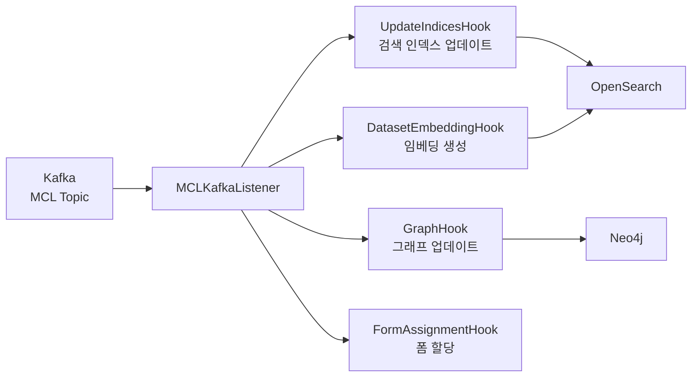

**파일 위치**: `metadata-jobs/mae-consumer/src/main/java/com/linkedin/metadata/kafka/`

### 4.3 MCE Consumer

외부에서 들어오는 메타데이터 변경 이벤트를 처리합니다.

**파일 위치**: `metadata-jobs/mce-consumer-job/src/main/java/`

---

## 5. 데이터 흐름: 쓰기 경로 (Ingestion)

### 5.1 메타데이터 수집 흐름

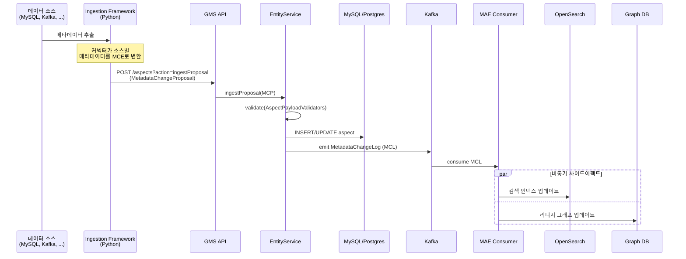

### 5.2 MetadataChangeProposal (MCP)

MCP는 메타데이터 변경을 요청하는 표준 메시지입니다.

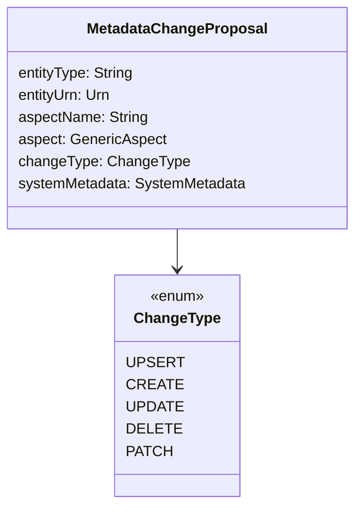

### 5.3 Aspect 저장 상세

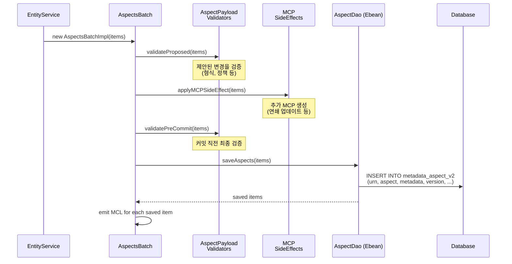

**코드 참조**:

| 파일                                                                                      | 설명        |
| ----------------------------------------------------------------------------------------- | ----------- |
| `metadata-io/metadata-io-api/src/main/java/.../entity/ebean/batch/AspectsBatchImpl.java`  | 배치 처리   |
| `metadata-io/metadata-io-api/src/main/java/.../entity/ebean/batch/ChangeItemImpl.java`    | 변경 항목   |
| `entity-registry/src/main/java/.../aspect/plugins/validation/AspectPayloadValidator.java` | 유효성 검증 |

---

## 6. 데이터 흐름: 읽기 경로 (Query)

### 6.1 GraphQL 검색 흐름

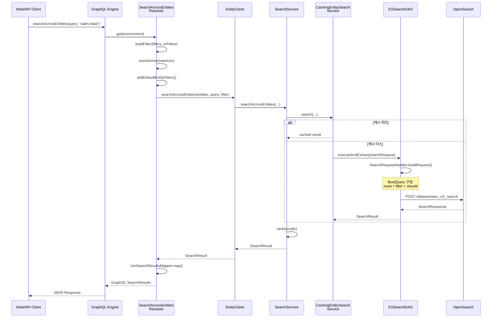

### 6.2 엔티티 조회 흐름

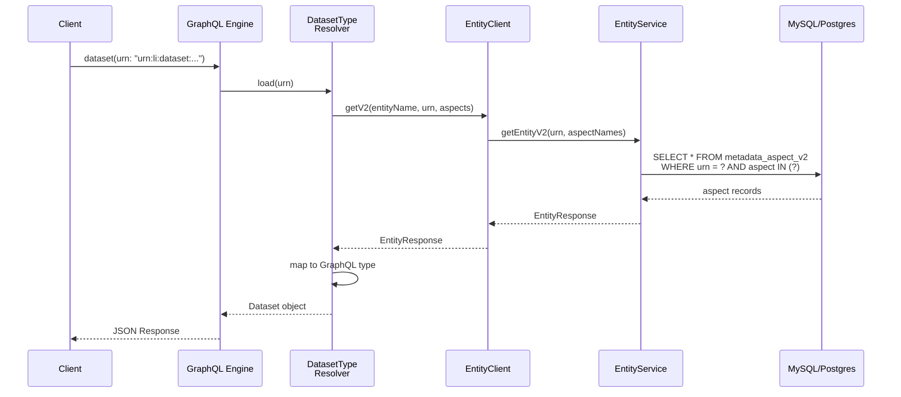

---

## 7. API 계층

DataHub는 세 가지 API를 제공합니다. 모두 같은 `EntityService`를 사용합니다.

### 7.1 API 비교

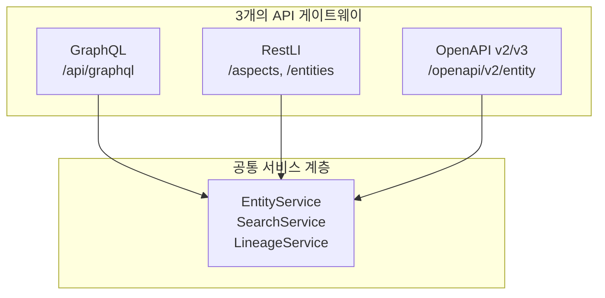

### 7.2 GraphQL

**역할**: 프론트엔드와 외부 클라이언트의 주 API

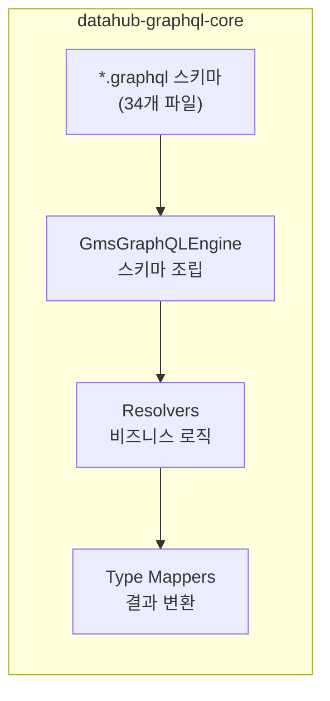

**주요 GraphQL 스키마 파일**:

| 파일                | 내용                          |
| ------------------- | ----------------------------- |
| `search.graphql`    | 검색, 자동완성, 브라우즈 쿼리 |
| `entity.graphql`    | 엔티티 타입 정의              |
| `auth.graphql`      | 인증 관련                     |
| `lineage.graphql`   | 리니지 쿼리                   |
| `ingestion.graphql` | 수집 관리                     |

**파일 위치**: `datahub-graphql-core/src/main/resources/`

**리졸버 예시** (`SearchResolver`):

```
datahub-graphql-core/src/main/java/
└── com/linkedin/datahub/graphql/
    ├── GmsGraphQLEngine.java           # 엔진 조립
    ├── resolvers/
    │   ├── search/
    │   │   ├── SearchResolver.java     # 단일 엔티티 검색
    │   │   ├── SearchAcrossEntitiesResolver.java  # 멀티 엔티티 검색
    │   │   └── SearchUtils.java        # 유틸리티
    │   ├── load/
    │   │   └── EntityTypeResolver.java # 엔티티 로드
    │   └── mutate/
    │       └── UpdateResolver.java     # 엔티티 수정
    └── types/
        ├── dataset/
        │   └── DatasetType.java        # Dataset GraphQL 타입
        └── mappers/
            └── UrnSearchResultsMapper.java  # 결과 매핑
```

### 7.3 RestLI

**역할**: 서비스 간 통신, Python CLI의 주 API

**파일 위치**: `metadata-service/restli-servlet-impl/src/main/java/com/linkedin/metadata/resources/`

```java
// EntityV2Resource 예시
@RestLiCollection(name = "entitiesV2", namespace = "com.linkedin.entity")
public class EntityV2Resource extends CollectionResourceTaskTemplate<String, Entity> {

    @Action(name = ACTION_INGEST_PROPOSAL)
    public Task<String> ingestProposal(
        @ActionParam("proposal") MetadataChangeProposal proposal) {
        // MCP를 EntityService에 전달
    }
}
```

### 7.4 OpenAPI

**역할**: 표준 REST API, Swagger UI 제공

**파일 위치**: `metadata-service/openapi-entity-servlet/src/main/java/io/datahubproject/openapi/`

### 7.5 중요: 유효성 검증은 서비스 계층에서

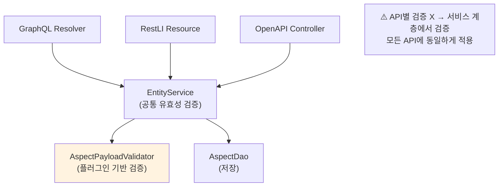

---

## 8. 저장소 계층

### 8.1 MySQL/PostgreSQL (Aspect 저장)

메타데이터의 원본(source of truth)을 저장합니다.

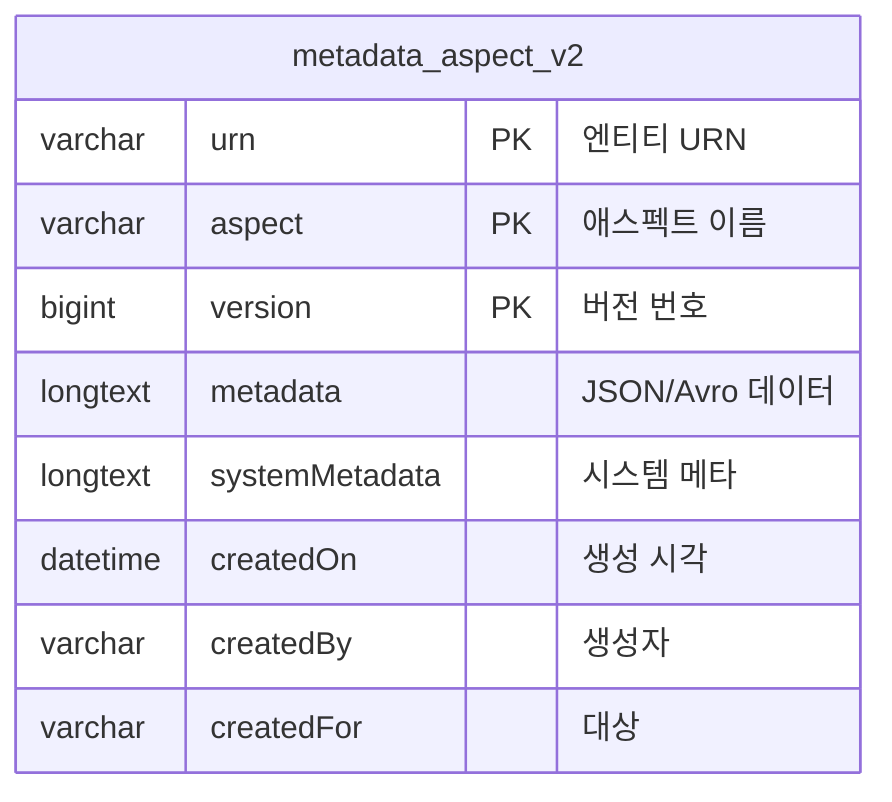

### 8.2 OpenSearch/Elasticsearch (검색 인덱스)

검색을 위한 비정규화된 문서를 저장합니다.

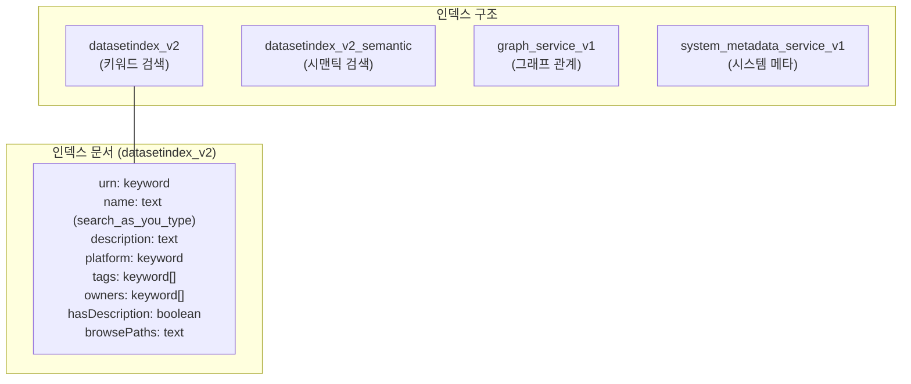

**인덱스 빌드 과정**:

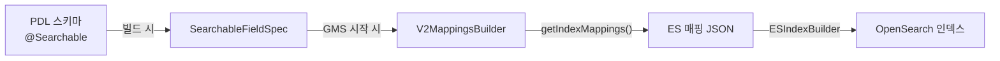

**코드 참조**:

| 파일                                                                           | 설명      |
| ------------------------------------------------------------------------------ | --------- |
| `metadata-io/src/main/java/.../index/entity/v2/V2MappingsBuilder.java`         | 매핑 생성 |
| `metadata-io/src/main/java/.../index/entity/v2/V2LegacySettingsBuilder.java`   | 설정 생성 |
| `metadata-io/src/main/java/.../search/elasticsearch/ElasticSearchService.java` | ES 서비스 |
| `metadata-io/src/main/java/.../search/elasticsearch/query/ESSearchDAO.java`    | 검색 쿼리 |

### 8.3 검색 인덱스 업데이트 흐름

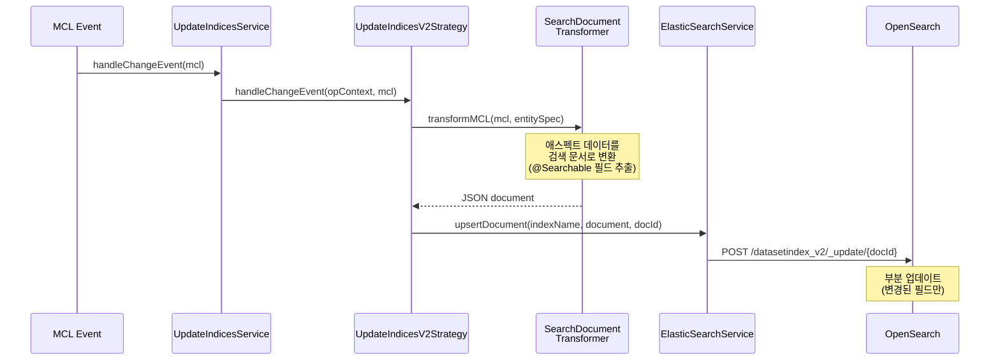

---

## 9. 주요 설계 패턴

### 9.1 플러그인 아키텍처

DataHub는 확장 가능한 플러그인 시스템을 사용합니다.

```mermaid
classDiagram
    class AspectPayloadValidator {
        <<abstract>>
        +validateProposed(items) Stream~AspectValidationException~
        +validatePreCommit(items) Stream~AspectValidationException~
    }

    class MCPSideEffect {
        <<abstract>>
        +applyMCPSideEffect(items) Stream~MCPItem~
        +postApply(items) void
    }

    class MCLSideEffect {
        <<abstract>>
        +applyMCLSideEffect(items) Stream~MCLItem~
    }

    class MutationHook {
        <<abstract>>
        +applyMutationHook(items) Stream~AspectValidationException~
    }

    note for AspectPayloadValidator "데이터 유효성 검증\n예: 정책 검증, 필드 검증"
    note for MCPSideEffect "쓰기 시 추가 MCP 생성\n예: 연쇄 업데이트"
    note for MCLSideEffect "읽기 후 사이드이펙트\n예: 인덱스 업데이트"
```

**코드 참조**: `entity-registry/src/main/java/com/linkedin/metadata/aspect/plugins/`

**플러그인 등록** (Spring Bean):

```java
// SpringStandardPluginConfiguration.java에서 등록
@Bean
public AspectPayloadValidator systemPolicyValidator() {
    return new SystemPolicyValidator();
}
```

### 9.2 OperationContext 패턴

모든 서비스 메서드에 `OperationContext`를 전달하여 요청 범위 컨텍스트를 공유합니다.

```mermaid
classDiagram
    class OperationContext {
        -Authentication authentication
        -EntityRegistry entityRegistry
        -SearchContext searchContext
        -ObjectMapper objectMapper
        +getEntityRegistry() EntityRegistry
        +getAuthentication() Authentication
        +withSearchFlags(flags) OperationContext
        +withSpan(name, callable) T
    }

    class SearchContext {
        -IndexConvention indexConvention
        -SearchFlags searchFlags
    }

    class Authentication {
        -Actor actor
        -String credentials
    }

    OperationContext --> SearchContext
    OperationContext --> Authentication
```

**사용 예시**:

```java
// 모든 서비스 메서드의 첫 번째 파라미터
public SearchResult searchAcrossEntities(
    @Nonnull OperationContext opContext,  // 항상 첫 번째
    @Nonnull List<String> entities,
    @Nonnull String query, ...) {

    // 인증 정보 접근
    Actor actor = opContext.getAuthentication().getActor();

    // 엔티티 레지스트리 접근
    EntitySpec spec = opContext.getEntityRegistry().getEntitySpec("dataset");

    // 검색 플래그 오버라이드
    opContext.withSearchFlags(flags -> flags.setSkipCache(true));
}
```

### 9.3 이벤트 소싱 패턴

모든 메타데이터 변경은 이벤트로 기록됩니다.

```mermaid
flowchart LR
    MCP["MCP<br/>(변경 제안)"]
    -->|"EntityService"| DB["DB 저장"]
    -->|"emit"| MCL["MCL<br/>(변경 로그)"]
    -->|"Kafka"| CONSUMERS["Consumers"]

    CONSUMERS --> ES["검색 인덱스"]
    CONSUMERS --> GRAPH["그래프 DB"]
    CONSUMERS --> HOOKS["커스텀 훅"]
```

### 9.4 Decorator 패턴 (인덱스 빌더)

인덱스 빌더는 Decorator 패턴으로 기능을 확장합니다.

```mermaid
graph TB
    DEL["DelegatingMappingsBuilder<br/>(조합)"]
    --> V2["V2MappingsBuilder<br/>(기본 매핑)"]
    DEL --> SEM["V2SemanticSearchMappingsBuilder<br/>(시맨틱 매핑)"]
    SEM --> V2_BASE["V2MappingsBuilder<br/>(기본 매핑 재사용)"]
```

### 9.5 Factory 패턴 (Spring Beans)

모든 주요 컴포넌트는 Spring Factory를 통해 생성됩니다.

```
metadata-service/factories/src/main/java/com/linkedin/gms/factory/
├── entity/
│   ├── EntityServiceFactory.java
│   └── update/indices/UpdateIndicesStrategyFactory.java
├── search/
│   ├── ElasticSearchServiceFactory.java
│   ├── MappingsBuilderFactory.java
│   ├── SettingsBuilderFactory.java
│   └── semantic/
│       ├── EmbeddingProviderFactory.java
│       └── SemanticEntitySearchServiceFactory.java
├── graphql/
│   └── GraphQLEngineFactory.java
└── auth/
    └── AuthorizerChainFactory.java
```

### 9.6 @Searchable 어노테이션 → 자동 인덱싱

PDL 스키마에 `@Searchable` 어노테이션을 붙이면 자동으로 검색 인덱스에 포함됩니다.

```mermaid
flowchart TD
    A["@Searchable 어노테이션<br/>(PDL 스키마)"]
    -->|"EntityRegistry 파싱"| B["SearchableFieldSpec"]
    -->|"V2MappingsBuilder"| C["ES 인덱스 매핑"]

    A -->|"SearchDocumentTransformer"| D["문서 변환 로직"]
    -->|"aspect 변경 시"| E["인덱스 문서 업데이트"]

    A -->|"SearchRequestHandler"| F["검색 쿼리 빌드"]
    -->|"queryByDefault=true"| G["기본 검색 대상"]
```

**FieldType별 매핑**:

| FieldType      | ES 매핑              | 용도            |
| -------------- | -------------------- | --------------- |
| `TEXT`         | `text` + `keyword`   | 전문 검색       |
| `TEXT_PARTIAL` | `search_as_you_type` | 자동완성        |
| `KEYWORD`      | `keyword`            | 정확 매칭, 필터 |
| `BOOLEAN`      | `boolean`            | 불리언 필터     |
| `COUNT`        | `long`               | 숫자 필터/정렬  |
| `DATETIME`     | `date`               | 날짜 필터/정렬  |
| `URN`          | `text` + `keyword`   | URN 검색        |
| `URN_PARTIAL`  | `search_as_you_type` | URN 자동완성    |
| `WORD_GRAM`    | ngram                | n-gram 검색     |

---

## 10. 모듈별 코드 가이드

### 10.1 모듈 의존성

```mermaid
graph TB
    subgraph "데이터 모델"
        MM["metadata-models<br/>PDL 스키마, 코드 생성"]
        ER["entity-registry<br/>엔티티/애스펙트 메타"]
    end

    subgraph "데이터 접근"
        MIO["metadata-io<br/>DB, ES, Graph DAO"]
        MIO_API["metadata-io-api<br/>배치 처리"]
    end

    subgraph "서비스"
        MS["metadata-service<br/>GMS 서버"]
        MS_SVC["metadata-service/services<br/>비즈니스 로직"]
        MS_FAC["metadata-service/factories<br/>Spring Bean"]
        MS_CFG["metadata-service/configuration<br/>application.yaml"]
    end

    subgraph "API"
        GQL["datahub-graphql-core<br/>GraphQL"]
        RESTLI_API["restli-api<br/>RestLI 인터페이스"]
    end

    subgraph "이벤트"
        MXE["metadata-events<br/>이벤트 스키마"]
        MCE_JOB["mce-consumer-job"]
        MAE_JOB["mae-consumer-job"]
    end

    MM --> ER
    ER --> MIO
    MIO_API --> MIO
    MIO --> MS_SVC
    MS_SVC --> GQL
    MS_SVC --> MS
    MS_FAC --> MS
    MS_CFG --> MS
    MXE --> MCE_JOB
    MXE --> MAE_JOB
    GQL --> MS
    RESTLI_API --> MS
```

### 10.2 각 모듈의 역할과 핵심 파일

#### metadata-models

**역할**: 메타데이터 스키마 정의 (PDL → Java 코드 생성)

| 파일                                     | 설명                             |
| ---------------------------------------- | -------------------------------- |
| `src/main/resources/entity-registry.yml` | 엔티티-애스펙트 관계 정의        |
| `src/main/pegasus/com/linkedin/dataset/` | Dataset 관련 스키마              |
| `src/main/pegasus/com/linkedin/common/`  | 공통 스키마 (Ownership, Tags 등) |
| `src/main/pegasus/com/linkedin/mxe/`     | 이벤트 스키마 (MCE, MCL)         |

#### entity-registry

**역할**: 엔티티/애스펙트 메타데이터 파싱 및 플러그인 시스템

| 파일                                                            | 설명                  |
| --------------------------------------------------------------- | --------------------- |
| `src/main/java/.../models/registry/EntityRegistry.java`         | 레지스트리 인터페이스 |
| `src/main/java/.../models/EntitySpec.java`                      | 엔티티 사양           |
| `src/main/java/.../models/AspectSpec.java`                      | 애스펙트 사양         |
| `src/main/java/.../models/annotation/SearchableAnnotation.java` | @Searchable 파싱      |
| `src/main/java/.../aspect/plugins/`                             | 플러그인 인터페이스   |

#### metadata-io

**역할**: 데이터 접근 계층 (DB, ES, Graph)

| 파일                                                                            | 설명            |
| ------------------------------------------------------------------------------- | --------------- |
| `src/main/java/.../search/SearchService.java`                                   | 검색 서비스     |
| `src/main/java/.../search/elasticsearch/ElasticSearchService.java`              | ES 구현         |
| `src/main/java/.../search/elasticsearch/query/ESSearchDAO.java`                 | 검색 쿼리       |
| `src/main/java/.../search/elasticsearch/index/entity/v2/V2MappingsBuilder.java` | 매핑 빌더       |
| `src/main/java/.../search/transformer/SearchDocumentTransformer.java`           | 문서 변환       |
| `src/main/java/.../service/UpdateIndicesV2Strategy.java`                        | 인덱스 업데이트 |

#### datahub-graphql-core

**역할**: GraphQL 스키마, 리졸버, 타입 매핑

| 파일                                                                   | 설명          |
| ---------------------------------------------------------------------- | ------------- |
| `src/main/resources/search.graphql`                                    | 검색 스키마   |
| `src/main/resources/entity.graphql`                                    | 엔티티 스키마 |
| `src/main/java/.../GmsGraphQLEngine.java`                              | 엔진 조립     |
| `src/main/java/.../resolvers/search/SearchAcrossEntitiesResolver.java` | 검색 리졸버   |
| `src/main/java/.../types/mappers/UrnSearchResultsMapper.java`          | 결과 매핑     |

#### metadata-service

**역할**: GMS 서버 (Spring Boot), 설정, Factory

| 파일                                                                    | 설명              |
| ----------------------------------------------------------------------- | ----------------- |
| `configuration/src/main/resources/application.yaml`                     | 전체 설정         |
| `factories/src/main/java/.../factory/graphql/GraphQLEngineFactory.java` | GraphQL 빈 생성   |
| `factories/src/main/java/.../factory/search/`                           | 검색 관련 빈 생성 |
| `services/src/main/java/.../entity/EntityService.java`                  | 엔티티 서비스     |

---

## 11. 코드 읽기 순서 추천

DataHub 코드를 처음 읽을 때 다음 순서를 추천합니다.

### 11.1 1단계: 데이터 모델 이해

```mermaid
graph LR
    A["1. entity-registry.yml<br/>엔티티/애스펙트 관계"] --> B["2. DatasetProperties.pdl<br/>PDL 스키마 문법"]
    B --> C["3. SearchableAnnotation.java<br/>@Searchable 구조"]
    C --> D["4. EntitySpec.java<br/>스키마 → 런타임 메타"]
```

**읽어야 할 파일**:

1. `metadata-models/src/main/resources/entity-registry.yml`
2. `metadata-models/src/main/pegasus/com/linkedin/dataset/DatasetProperties.pdl`
3. `entity-registry/src/main/java/.../annotation/SearchableAnnotation.java`
4. `entity-registry/src/main/java/.../models/EntitySpec.java`

### 11.2 2단계: 쓰기 경로 추적

```mermaid
graph LR
    A["1. EntityService.java<br/>ingestProposal()"] --> B["2. AspectsBatchImpl.java<br/>배치 처리"]
    B --> C["3. AspectPayloadValidator.java<br/>유효성 검증"]
    C --> D["4. UpdateIndicesV2Strategy.java<br/>인덱스 업데이트"]
```

**읽어야 할 파일**:

1. `metadata-service/services/src/main/java/.../entity/EntityService.java` (인터페이스)
2. `metadata-io/metadata-io-api/src/main/java/.../entity/ebean/batch/AspectsBatchImpl.java`
3. `entity-registry/src/main/java/.../aspect/plugins/validation/AspectPayloadValidator.java`
4. `metadata-io/src/main/java/.../service/UpdateIndicesV2Strategy.java`

### 11.3 3단계: 읽기 경로 추적

```mermaid
graph LR
    A["1. search.graphql<br/>GraphQL 스키마"] --> B["2. SearchAcrossEntitiesResolver.java<br/>리졸버"]
    B --> C["3. SearchService.java<br/>검색 서비스"]
    C --> D["4. ESSearchDAO.java<br/>ES 쿼리 실행"]
    D --> E["5. V2MappingsBuilder.java<br/>인덱스 매핑"]
```

**읽어야 할 파일**:

1. `datahub-graphql-core/src/main/resources/search.graphql`
2. `datahub-graphql-core/src/main/java/.../resolvers/search/SearchAcrossEntitiesResolver.java`
3. `metadata-io/src/main/java/.../search/SearchService.java`
4. `metadata-io/src/main/java/.../search/elasticsearch/query/ESSearchDAO.java`
5. `metadata-io/src/main/java/.../index/entity/v2/V2MappingsBuilder.java`

### 11.4 4단계: 설정과 조립

```mermaid
graph LR
    A["1. application.yaml<br/>전체 설정"] --> B["2. GraphQLEngineFactory.java<br/>GraphQL 조립"]
    B --> C["3. ElasticSearchServiceFactory.java<br/>검색 조립"]
    C --> D["4. MappingsBuilderFactory.java<br/>매핑 빌더 조립"]
```

**읽어야 할 파일**:

1. `metadata-service/configuration/src/main/resources/application.yaml`
2. `metadata-service/factories/src/main/java/.../factory/graphql/GraphQLEngineFactory.java`
3. `metadata-service/factories/src/main/java/.../factory/search/ElasticSearchServiceFactory.java`
4. `metadata-service/factories/src/main/java/.../factory/search/MappingsBuilderFactory.java`

### 11.5 전체 추천 읽기 맵

```mermaid
graph TD
    subgraph "1단계: 데이터 모델"
        M1["entity-registry.yml"]
        M2["*.pdl 스키마"]
        M3["SearchableAnnotation"]
    end

    subgraph "2단계: 쓰기 경로"
        W1["EntityService"]
        W2["AspectsBatchImpl"]
        W3["UpdateIndicesV2Strategy"]
    end

    subgraph "3단계: 읽기 경로"
        R1["search.graphql"]
        R2["SearchAcrossEntitiesResolver"]
        R3["SearchService → ESSearchDAO"]
    end

    subgraph "4단계: 설정/조립"
        C1["application.yaml"]
        C2["Factory 클래스들"]
    end

    subgraph "5단계: 확장 기능"
        E1["플러그인 시스템"]
        E2["시맨틱 검색"]
        E3["리니지"]
    end

    M1 --> M2 --> M3
    M3 --> W1 --> W2 --> W3
    W3 --> R1 --> R2 --> R3
    R3 --> C1 --> C2
    C2 --> E1
    C2 --> E2
    C2 --> E3
```

---

### 참고 자료

| 문서              | 위치                                       |
| ----------------- | ------------------------------------------ |
| 아키텍처 개요     | `docs/architecture/architecture.md`        |
| 메타데이터 모델링 | `docs/modeling/metadata-model.md`          |
| 핵심 개념         | `docs/what-is-datahub/datahub-concepts.md` |
| 개발자 가이드     | https://docs.datahub.com/docs/developers   |
| 데모 환경         | https://demo.datahub.com/                  |
