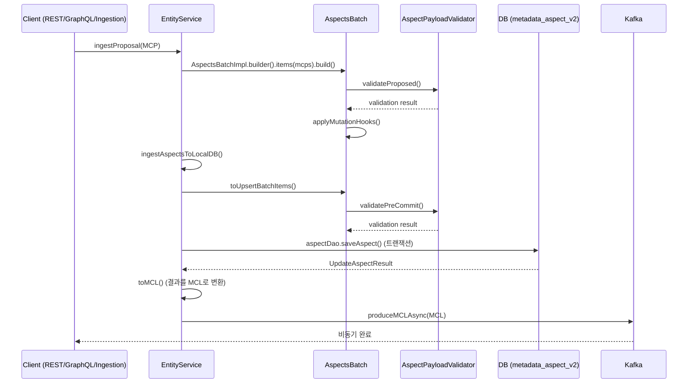

# Tutorial 2: Write Path (Ingestion)

> **시리즈**: DataHub 온보딩 튜토리얼 (2/5)
>
> **선수 조건**: Tutorial 1 완료, Java/Spring 기본 지식
>
> **학습 목표**: 메타데이터가 DataHub에 저장되기까지의 전체 Write Path를 이해한다.

---

## 개요

DataHub의 Write Path는 외부 시스템(ingestion 커넥터, REST API, GraphQL 등)에서 발생한 메타데이터 변경이 DB에 저장되고 Kafka로 전파되기까지의 경로를 의미한다. 이 튜토리얼에서는 그 경로를 구성하는 핵심 컴포넌트를 하나씩 살펴본다.

### 전체 흐름 시퀀스 다이어그램



---

## 1. MetadataChangeProposal (MCP)

MCP는 메타데이터 변경 **요청**을 나타내는 데이터 구조다. "이 엔티티의 이 애스펙트를 이 값으로 변경해 주세요"라는 의도를 담고 있다.

### PDL 스키마

파일: `metadata-models/src/main/pegasus/com/linkedin/mxe/MetadataChangeProposal.pdl`

```pdl
record MetadataChangeProposal {
  entityType: string           // 엔티티 타입 (예: "dataset")
  entityUrn: optional Urn      // 대상 엔티티 URN
  changeType: ChangeType       // UPSERT, CREATE, DELETE 등
  aspectName: optional string  // 변경할 애스펙트 이름 (예: "ownership")
  aspect: optional GenericAspect  // 실제 애스펙트 데이터 (JSON/Avro 직렬화)
  systemMetadata: optional SystemMetadata
  headers: optional map[string, string]
}
```

### 핵심 필드 설명

| 필드         | 설명                                                                  |
| ------------ | --------------------------------------------------------------------- |
| `entityType` | Entity Registry에 등록된 엔티티 타입 이름                             |
| `entityUrn`  | 대상 엔티티의 고유 식별자 (URN)                                       |
| `changeType` | 변경 유형: `UPSERT` (기본), `CREATE`, `DELETE`, `PATCH`               |
| `aspectName` | 변경할 애스펙트의 이름. 미지정 시 엔티티 전체에 대한 작업             |
| `aspect`     | `GenericAspect` 형태의 직렬화된 애스펙트 데이터 (value + contentType) |

> **참고**: MCP는 "제안(Proposal)"이다. 실제 반영 여부는 validation 결과에 따라 달라진다. 성공 시 `MetadataChangeLog`(MCL)이 발행되고, 실패 시 `FailedMetadataChangeProposal`이 발행된다.

---

## 2. EntityService

`EntityService`는 DataHub의 모든 write/read 작업이 통과하는 중앙 서비스다. REST API, GraphQL, ingestion 모두 결국 이 서비스를 호출한다.

### 인터페이스

파일: `metadata-service/services/src/main/java/com/linkedin/metadata/entity/EntityService.java`

핵심 메서드:

```java
// 배치 처리 (권장)
List<IngestResult> ingestProposal(
    @Nonnull OperationContext opContext,
    AspectsBatch aspectsBatch,
    final boolean async);

// 단건 처리 (내부적으로 배치로 변환됨)
IngestResult ingestProposal(
    @Nonnull OperationContext opContext,
    MetadataChangeProposal proposal,
    AuditStamp auditStamp,
    final boolean async);
```

### 구현체

파일: `metadata-io/src/main/java/com/linkedin/metadata/entity/EntityServiceImpl.java`

`ingestProposal`은 `async` 플래그에 따라 두 가지 경로로 분기한다:

- **async = true**: Kafka에 MCP를 전송하고 즉시 반환. MCE Consumer가 나중에 처리한다.
- **async = false**: 동기적으로 DB 저장 + MCL 발행까지 완료 후 반환.

동기 경로(`ingestProposalSync`)의 핵심 흐름:

```
ingestProposalSync()
  -> ingestAspects()
       -> ingestAspectsToLocalDB()  // DB 저장 (트랜잭션)
       -> produceMCLAsync()         // Kafka에 MCL 발행
```

---

## 3. AspectsBatch

`AspectsBatch`는 여러 MCP를 묶어서 처리하는 배치 단위다. validation, mutation hook, DB 저장이 모두 이 배치 단위로 수행된다.

### 구현체

파일: `metadata-io/metadata-io-api/src/main/java/com/linkedin/metadata/entity/ebean/batch/AspectsBatchImpl.java`

### 배치 처리 흐름

`AspectsBatchImpl`의 빌드와 처리 과정:

```
1. AspectsBatchImpl.builder()
     .items(mcpItems)
     .build(opContext)

2. build() 내부:
   -> validateProposed()        // 플러그인 기반 사전 검증
   -> applyMutationHooks()      // 데이터 변환 (예: 필드 자동 채우기)

3. toUpsertBatchItems() 호출 시:
   -> proposedItemsToChangeItemStream()  // ProposedItem -> ChangeMCP 변환
   -> validatePreCommit()                // 커밋 직전 최종 검증
   -> databaseUpsert                     // 실제 DB 저장
```

### 항목 타입

배치 내부에서 아이템은 두 가지 타입으로 구분된다:

- **`ProposedItem`**: 아직 검증되지 않은 원본 MCP. `build()` 시 검증을 거친다.
- **`ChangeMCP`**: 검증 완료 후 DB에 저장할 준비가 된 변경 항목. 이전 값과 새 값을 모두 갖고 있다.

---

## 4. Validation (AspectPayloadValidator)

DataHub는 플러그인 기반의 validation 아키텍처를 사용한다. 모든 API(REST, GraphQL, OpenAPI)를 통한 write가 동일한 validation을 거치도록 `EntityService` 레벨에서 검증한다.

### 인터페이스

파일: `entity-registry/src/main/java/com/linkedin/metadata/aspect/plugins/validation/AspectPayloadValidator.java`

```java
public abstract class AspectPayloadValidator extends PluginSpec {
    // MCP가 처음 제출될 때 호출 (build 시점)
    public final Stream<AspectValidationException> validateProposed(
        Collection<? extends BatchItem> mcpItems,
        RetrieverContext retrieverContext,
        AuthorizationSession session);

    // DB 커밋 직전에 호출 (이전 값 참조 가능)
    public final Stream<AspectValidationException> validatePreCommit(
        Collection<ChangeMCP> changeMCPs,
        RetrieverContext retrieverContext);

    // 구현 시 오버라이드할 메서드
    protected abstract Stream<AspectValidationException> validateProposedAspects(...);
    protected abstract Stream<AspectValidationException> validatePreCommitAspects(...);
}
```

### 검증 시점

| 시점           | 메서드                | 설명                                                |
| -------------- | --------------------- | --------------------------------------------------- |
| `build()` 시점 | `validateProposed()`  | MCP 구조, 필수 필드, 권한 등 기본 검증              |
| DB 커밋 직전   | `validatePreCommit()` | 이전 값과 비교한 비즈니스 로직 검증 (예: 삭제 방지) |

### 구현 예시: FieldPathValidator

파일: `entity-registry/src/main/java/com/linkedin/metadata/aspect/validation/FieldPathValidator.java`

`FieldPathValidator`는 `SchemaMetadata` 애스펙트의 필드 경로가 올바른지 검증하는 validator이다.

새로운 validator를 만들 때는:

1. `AspectPayloadValidator`를 상속한다.
2. `validateProposedAspects()` 또는 `validatePreCommitAspects()`를 구현한다.
3. Spring Bean으로 등록한다 (`SpringStandardPluginConfiguration.java`).

> **중요**: API 레이어(GraphQL resolver, REST controller)에서 validation하지 마라. 그렇게 하면 다른 API를 통한 write는 검증되지 않는다.

---

## 5. MCL Emission (MetadataChangeLog)

DB 저장이 완료되면, 변경 사항이 `MetadataChangeLog`(MCL)로 변환되어 Kafka에 발행된다. MCL은 downstream 시스템(검색 인덱스 업데이트, 알림 등)을 트리거한다.

### MCL 스키마

파일: `metadata-models/src/main/pegasus/com/linkedin/mxe/MetadataChangeLog.pdl`

```pdl
record MetadataChangeLog includes MetadataChangeProposal {
  previousAspectValue: optional GenericAspect   // 변경 전 값
  previousSystemMetadata: optional SystemMetadata
  created: optional AuditStamp                  // 변경 시각 및 변경자
}
```

MCL은 MCP의 모든 필드를 상속(`includes`)하면서, 이전 값(`previousAspectValue`)과 감사 정보(`created`)를 추가로 포함한다.

### 발행 흐름

```
ingestAspects()
  -> ingestAspectsToLocalDB()     // DB 저장 -> UpdateAspectResult 반환
  -> UpdateAspectResult.toMCL()   // 결과를 MCL로 변환
  -> produceMCLAsync()            // Kafka 토픽에 MCL 발행
```

### MCL 소비

MCL은 `datahub-mae-consumer` 컨테이너의 `UpdateIndicesService`가 소비한다.

파일: `metadata-io/src/main/java/com/linkedin/metadata/service/UpdateIndicesService.java`

이 서비스는 MCL을 기반으로:

- **Elasticsearch 인덱스** 업데이트 (검색 반영)
- **Neo4j/RDBMS 그래프** 업데이트 (관계 반영)
- **System 업데이트** 수행

---

## 6. DB Storage

### 테이블 구조

메타데이터는 `metadata_aspect_v2` 테이블에 저장된다. 이 테이블의 ORM 매핑은 Ebean을 사용한다.

파일: `metadata-io/src/main/java/com/linkedin/metadata/entity/ebean/EbeanAspectV2.java`

```java
@Entity
@Table(name = "metadata_aspect_v2")
public class EbeanAspectV2 extends Model {
    // 복합 PK: (urn, aspect, version)
    @EmbeddedId
    private PrimaryKey key;

    @Lob
    private String metadata;        // JSON 직렬화된 애스펙트 데이터

    private String systemMetadata;  // 시스템 메타데이터
    private Timestamp createdOn;    // 생성 시각
    private String createdBy;       // 생성자
    private String createdFor;      // 대리 생성 대상
}
```

### 주요 컬럼

| 컬럼             | 설명                                          |
| ---------------- | --------------------------------------------- |
| `urn`            | 엔티티 URN (PK의 일부, varchar 500)           |
| `aspect`         | 애스펙트 이름 (PK의 일부, varchar 200)        |
| `version`        | 버전 번호 (PK의 일부). `0`이 최신 버전        |
| `metadata`       | JSON 직렬화된 애스펙트 데이터 (TEXT/LONGTEXT) |
| `systemMetadata` | 시스템 메타데이터 JSON                        |
| `createdOn`      | 레코드 생성/수정 시각                         |
| `createdBy`      | 변경을 수행한 주체의 URN                      |

### DAO 계층

파일: `metadata-io/src/main/java/com/linkedin/metadata/entity/ebean/EbeanAspectDao.java`

`EbeanAspectDao`는 `metadata_aspect_v2` 테이블에 대한 CRUD 작업을 담당하며, `EntityServiceImpl`의 `ingestAspectsToLocalDB()`에서 트랜잭션 내에서 호출된다.

> **버전 관리**: `version = 0`이 항상 최신 버전이다. 이전 버전은 증가하는 version 번호로 저장되어 이력을 추적할 수 있다.

---

## 핵심 파일 맵

| 역할                      | 파일 경로                                                                                                   |
| ------------------------- | ----------------------------------------------------------------------------------------------------------- |
| MCP 스키마 (PDL)          | `metadata-models/src/main/pegasus/com/linkedin/mxe/MetadataChangeProposal.pdl`                              |
| MCL 스키마 (PDL)          | `metadata-models/src/main/pegasus/com/linkedin/mxe/MetadataChangeLog.pdl`                                   |
| EntityService 인터페이스  | `metadata-service/services/src/main/java/com/linkedin/metadata/entity/EntityService.java`                   |
| EntityService 구현        | `metadata-io/src/main/java/com/linkedin/metadata/entity/EntityServiceImpl.java`                             |
| AspectsBatch 구현         | `metadata-io/metadata-io-api/src/main/java/com/linkedin/metadata/entity/ebean/batch/AspectsBatchImpl.java`  |
| AspectPayloadValidator    | `entity-registry/src/main/java/com/linkedin/metadata/aspect/plugins/validation/AspectPayloadValidator.java` |
| FieldPathValidator (예시) | `entity-registry/src/main/java/com/linkedin/metadata/aspect/validation/FieldPathValidator.java`             |
| UpdateIndicesService      | `metadata-io/src/main/java/com/linkedin/metadata/service/UpdateIndicesService.java`                         |
| EbeanAspectV2 (DB 모델)   | `metadata-io/src/main/java/com/linkedin/metadata/entity/ebean/EbeanAspectV2.java`                           |
| EbeanAspectDao (DB DAO)   | `metadata-io/src/main/java/com/linkedin/metadata/entity/ebean/EbeanAspectDao.java`                          |

---

## 다음 단계

- **Tutorial 3**: Read Path -- 저장된 메타데이터를 GraphQL/REST로 조회하는 흐름을 학습한다.
