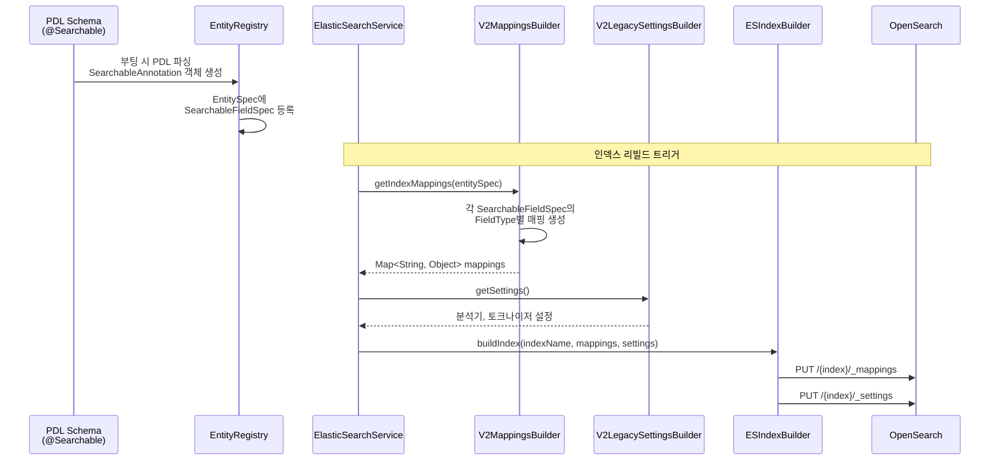
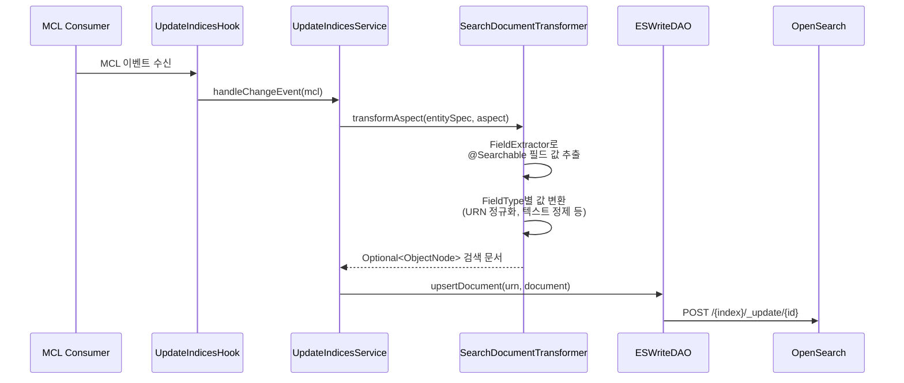
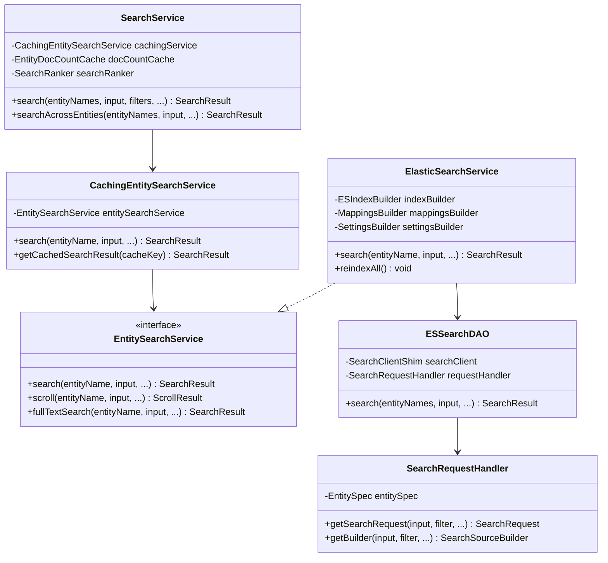
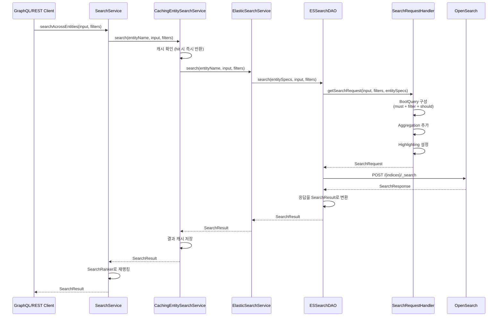

# Tutorial 3: 검색 아키텍처 이해하기

DataHub는 OpenSearch(ElasticSearch)를 기반으로 한 강력한 검색 시스템을 제공합니다.
이 튜토리얼에서는 PDL 스키마의 `@Searchable` 어노테이션이 어떻게 OpenSearch 인덱스 매핑으로 변환되고,
검색 쿼리가 어떤 서비스 계층을 거쳐 실행되는지를 코드 레벨에서 학습합니다.

---

## 학습 목표

이 튜토리얼을 마치면 다음을 할 수 있습니다:

1. `@Searchable` 어노테이션의 `FieldType`이 OpenSearch 매핑으로 변환되는 과정을 설명할 수 있다
2. Aspect가 검색 문서로 변환되는 파이프라인을 추적할 수 있다
3. SearchService 계층 구조와 각 클래스의 역할을 이해할 수 있다
4. 검색 쿼리가 빌드되는 과정을 설명할 수 있다
5. 인덱스 매핑과 설정이 관리되는 패턴을 이해할 수 있다

---

## 사전 지식

- Java, Spring 기본 지식 (이미 보유)
- OpenSearch/ElasticSearch의 매핑, 분석기, 쿼리 DSL 개념
- Tutorial 1 (Entity-Aspect 모델)과 Tutorial 2 (쓰기 경로)를 완료한 상태

---

## 1. @Searchable 어노테이션에서 ES 매핑 자동 생성

### 1.1 @Searchable 어노테이션이란?

Tutorial 1에서 PDL 스키마의 `@Searchable` 어노테이션을 간략히 보았습니다.
이 어노테이션은 해당 필드가 OpenSearch 인덱스에 포함되어야 함을 선언합니다.

PDL 스키마에서의 사용 예시 (`DatasetProperties.pdl`):

```pdl
@Searchable = {
  "fieldType": "TEXT_PARTIAL",
  "enableAutocomplete": true,
  "boostScore": 10.0
}
name: optional string
```

이 어노테이션은 런타임에 파싱되어 `SearchableAnnotation` 객체로 변환됩니다.

### 1.2 SearchableAnnotation 클래스

```
entity-registry/src/main/java/com/linkedin/metadata/models/annotation/SearchableAnnotation.java
```

이 클래스는 `@Searchable` 어노테이션의 메타데이터를 담는 값 객체입니다. 핵심 필드들을 살펴보세요:

| 필드                 | 타입               | 설명                                                 |
| -------------------- | ------------------ | ---------------------------------------------------- |
| `fieldName`          | `String`           | 검색 인덱스에서의 필드 이름 (기본: 스키마 필드 이름) |
| `fieldType`          | `FieldType`        | 필드 타입 (인덱싱/매칭 방식 결정)                    |
| `queryByDefault`     | `boolean`          | 기본 검색 쿼리에 포함 여부                           |
| `enableAutocomplete` | `boolean`          | 자동완성 대상 여부                                   |
| `addToFilters`       | `boolean`          | 필터 패싯에 추가 여부                                |
| `boostScore`         | `double`           | 검색 점수 부스트 배수                                |
| `hasValuesFieldName` | `Optional<String>` | 값 존재 여부를 체크하는 인덱스 필드 이름             |

### 1.3 FieldType enum과 ES 매핑 대응표

`SearchableAnnotation` 안에 정의된 `FieldType` enum은 각 필드가 OpenSearch에서 어떻게 인덱싱되는지를 결정합니다:

| FieldType        | ES 타입               | 용도                               |
| ---------------- | --------------------- | ---------------------------------- |
| `TEXT`           | `text` + subfields    | 전문 검색 (토큰화, 분석기 적용)    |
| `TEXT_PARTIAL`   | `search_as_you_type`  | 자동완성/부분 매칭 (ngram 기반)    |
| `KEYWORD`        | `keyword`             | 정확한 매칭, 필터, 집계            |
| `WORD_GRAM`      | `text` + word_grams   | n-gram 단어 조합 검색 (2/3/4-gram) |
| `URN`            | `text` (URN 분석기)   | URN 형식 검색 (커스텀 분석기 사용) |
| `URN_PARTIAL`    | `text` + ngram        | URN 부분 매칭                      |
| `BOOLEAN`        | `boolean`             | 참/거짓 필터                       |
| `COUNT`          | `long`                | 숫자 카운트                        |
| `DATETIME`       | `date`                | 날짜/시간 범위 검색                |
| `DOUBLE`         | `double`              | 부동소수점 숫자                    |
| `BROWSE_PATH`    | `text` (hierarchy)    | 탐색 경로 (계층형 분석기)          |
| `BROWSE_PATH_V2` | `text` (v2 hierarchy) | 탐색 경로 v2 (유닛 구분자 기반)    |
| `OBJECT`         | `object` (dynamic)    | 동적 객체 필드                     |
| `MAP_ARRAY`      | `object` (dynamic)    | 맵 배열 필드                       |

### 실습 3-1: FieldType에서 ES 매핑으로의 변환 추적

`V2MappingsBuilder.java`의 `getMappingsForField()` 메서드를 열어보세요:

```
metadata-io/src/main/java/com/linkedin/metadata/search/elasticsearch/index/entity/v2/V2MappingsBuilder.java
```

이 메서드에서 `FieldType`별로 분기하는 로직을 확인할 수 있습니다:

```java
private static Map<String, Object> getMappingsForField(
    @Nonnull final SearchableFieldSpec searchableFieldSpec) {
  FieldType fieldType = searchableFieldSpec.getSearchableAnnotation().getFieldType();

  if (fieldType == FieldType.KEYWORD) {
    mappingForField.putAll(getMappingsForKeyword());
  } else if (fieldType == FieldType.TEXT
      || fieldType == FieldType.TEXT_PARTIAL
      || fieldType == FieldType.WORD_GRAM) {
    mappingForField.putAll(getMappingsForSearchText(fieldType));
  } else if (fieldType == FieldType.URN || fieldType == FieldType.URN_PARTIAL) {
    // URN 전용 분석기 적용
    mappingForField.put(ANALYZER, URN_ANALYZER);
    mappingForField.put(SEARCH_ANALYZER, URN_SEARCH_ANALYZER);
    // ...
  }
  // ... 나머지 타입들
}
```

**관찰 포인트**:

- `TEXT_PARTIAL`은 `search_as_you_type`으로 매핑됩니다 (상수 `PARTIAL_NGRAM_CONFIG`에 정의)
- `WORD_GRAM`은 `text` 타입에 2/3/4-gram subfield를 추가합니다
- `URN`과 `URN_PARTIAL`은 커스텀 URN 분석기를 사용합니다

### 1.4 어노테이션에서 인덱스 생성까지의 흐름



---

## 2. 인덱스 문서 변환

Aspect가 저장될 때, 해당 Aspect의 `@Searchable` 필드가 OpenSearch 문서로 변환됩니다.
이 과정은 MAE(Metadata Audit Event) 처리 파이프라인에서 이루어집니다.

### 2.1 변환 트리거: UpdateIndicesHook

Tutorial 2에서 학습한 쓰기 경로를 떠올려보세요. Aspect가 저장되면 MCL(Metadata Change Log)이 발행됩니다.
이 MCL을 받아 검색 인덱스를 업데이트하는 흐름은 다음과 같습니다:

```
MCL 수신 → UpdateIndicesHook → UpdateIndicesService → SearchDocumentTransformer
```

### 2.2 SearchDocumentTransformer

```
metadata-io/src/main/java/com/linkedin/metadata/search/transformer/SearchDocumentTransformer.java
```

이 클래스는 Aspect 레코드를 OpenSearch 문서(JSON)로 변환하는 핵심 컴포넌트입니다.

변환 과정:

1. `EntitySpec`에서 해당 Aspect의 `SearchableFieldSpec` 목록을 가져옵니다
2. 각 `SearchableFieldSpec`에 대해 `FieldExtractor`로 실제 값을 추출합니다
3. `FieldType`에 따라 적절한 형태로 값을 변환합니다
4. 최종 JSON 문서를 구성합니다

### 실습 3-2: 변환 과정 추적

`SearchDocumentTransformer.java`를 열고 다음을 확인하세요:

- `transformSnapshot()` 또는 `transformAspect()` 메서드가 변환의 진입점입니다
- `FieldExtractor`를 사용해 PDL 레코드에서 값을 추출합니다
- 결과 문서에는 `urn`, `runId` 같은 고정 필드와 `@Searchable`로 선언한 동적 필드가 포함됩니다



---

## 3. 검색 서비스 계층

검색 요청은 여러 서비스 계층을 거쳐 처리됩니다. 각 계층은 고유한 책임을 가집니다.

### 3.1 서비스 계층 구조



### 3.2 각 계층의 역할

**SearchService** (`metadata-io/.../search/SearchService.java`):

- 최상위 진입점으로, GraphQL과 REST API에서 호출합니다
- 여러 엔티티 타입에 걸친 검색(`searchAcrossEntities`)을 조율합니다
- `SearchRanker`를 사용해 결과를 재랭킹합니다
- 엔티티별 문서 수 캐시(`EntityDocCountCache`)를 관리합니다

**CachingEntitySearchService** (`metadata-io/.../search/client/CachingEntitySearchService.java`):

- 검색 결과를 캐시합니다 (Guava Cache 기반)
- 동일한 검색 쿼리에 대한 반복 호출을 최적화합니다
- 캐시 이름: `entitySearchServiceSearch`, `entitySearchServiceAutoComplete` 등

**ElasticSearchService** (`metadata-io/.../search/elasticsearch/ElasticSearchService.java`):

- `EntitySearchService` 인터페이스의 OpenSearch 구현체입니다
- 인덱스 관리(매핑, 설정, 리인덱싱)를 담당합니다
- `ESSearchDAO`, `ESWriteDAO`, `ESBrowseDAO`에 실제 작업을 위임합니다

**ESSearchDAO** (`metadata-io/.../search/elasticsearch/query/ESSearchDAO.java`):

- OpenSearch 클라이언트를 직접 호출하여 검색을 수행합니다
- `SearchRequestHandler`를 사용해 검색 요청을 빌드합니다
- 응답을 `SearchResult` 객체로 변환합니다

### 실습 3-3: 검색 흐름 추적

`SearchService.java`의 `searchAcrossEntities()` 메서드를 시작으로 호출 체인을 추적해보세요:

```java
// SearchService.java
public SearchResult searchAcrossEntities(...) {
    // 1. 검색 대상 엔티티 목록 결정
    // 2. CachingEntitySearchService에 위임
    // 3. 결과를 SearchRanker로 재랭킹
}
```

---

## 4. 검색 쿼리 빌드

### 4.1 SearchRequestHandler

```
metadata-io/src/main/java/com/linkedin/metadata/search/elasticsearch/query/request/SearchRequestHandler.java
```

이 클래스는 사용자의 검색 입력을 OpenSearch 쿼리 DSL로 변환하는 핵심 컴포넌트입니다.

### 4.2 BoolQuery 구조

DataHub의 검색 쿼리는 OpenSearch의 `BoolQuery`를 기반으로 구성됩니다:

```json
{
  "bool": {
    "must": [
      {
        "// 사용자 입력 텍스트 매칭": "",
        "// queryByDefault=true인 필드들에 대해 multi_match 수행": ""
      }
    ],
    "filter": [
      {
        "// 엔티티 타입, 소프트 삭제 여부 등 필수 필터": "",
        "// 사용자가 선택한 패싯 필터": ""
      }
    ],
    "should": [
      {
        "// boostScore가 높은 필드에 대한 부스트 쿼리": "",
        "// URN 정확 매칭 등 선호도 쿼리": ""
      }
    ]
  }
}
```

**must**: 반드시 매칭되어야 하는 조건 (사용자의 검색어)

**filter**: 결과를 걸러내는 조건 (스코어에 영향 없음)

**should**: 매칭되면 스코어를 높이는 조건 (부스팅)

### 4.3 쿼리 빌드 과정

`SearchRequestHandler`는 다음 단계로 쿼리를 구성합니다:

1. **필드 수집**: `EntitySpec`에서 `queryByDefault=true`인 `SearchableFieldSpec`들을 수집합니다
2. **텍스트 쿼리 생성**: 수집된 필드에 대해 `multi_match` 쿼리를 생성합니다
3. **필터 적용**: 사용자 필터와 기본 필터(soft delete 제외 등)를 결합합니다
4. **부스팅**: `boostScore`에 따라 필드별 가중치를 적용합니다
5. **집계(Aggregation)**: 패싯 필터용 집계 쿼리를 추가합니다
6. **하이라이팅**: 검색 결과에서 매칭된 부분을 표시하는 설정을 추가합니다



### 실습 3-4: 쿼리 빌드 코드 탐색

`SearchRequestHandler.java`의 `getSearchRequest()` 메서드를 추적하면서 다음을 확인하세요:

- `queryByDefault=true`인 필드가 어떻게 `multi_match` 쿼리에 포함되는지
- `boostScore`가 필드 가중치(`^` 연산자)로 어떻게 적용되는지
- 필터가 `BoolQuery`의 `filter` 절에 어떻게 추가되는지

---

## 5. 인덱스 관리: Settings와 Mappings 빌더

### 5.1 DelegatingMappingsBuilder 패턴

```
metadata-io/src/main/java/com/linkedin/metadata/search/elasticsearch/index/DelegatingMappingsBuilder.java
```

DataHub는 **위임 패턴(Delegation Pattern)**을 사용하여 매핑 빌더를 관리합니다:

```java
public class DelegatingMappingsBuilder implements MappingsBuilder {
    private final List<MappingsBuilder> builders;

    @Override
    public Collection<IndexMapping> getIndexMappings(
        @Nonnull OperationContext opContext,
        @Nonnull Collection<Pair<Urn, StructuredPropertyDefinition>> structuredProperties) {
      // 첫 번째 빌더의 결과를 기준으로 사용
      MappingsBuilder firstBuilder = builders.get(0);
      Collection<IndexMapping> referenceMappings =
          firstBuilder.getIndexMappings(opContext, structuredProperties);
      // ...
    }
}
```

이 패턴의 장점:

- **버전 관리**: v2와 v3 매핑 빌더를 동시에 활성화할 수 있습니다
- **점진적 마이그레이션**: 새로운 매핑 전략을 안전하게 도입할 수 있습니다
- **설정 기반 전환**: `EntityIndexConfiguration`에 따라 빌더를 선택합니다

### 5.2 V2MappingsBuilder

```
metadata-io/src/main/java/com/linkedin/metadata/search/elasticsearch/index/entity/v2/V2MappingsBuilder.java
```

현재 기본으로 사용되는 매핑 빌더입니다. 핵심 메서드:

**`getIndexMappings(EntityRegistry, EntitySpec)`**:

- `EntitySpec`의 모든 `SearchableFieldSpec`을 순회합니다
- 각 필드의 `FieldType`에 따라 적절한 매핑을 생성합니다
- `urn`, `runId`, `systemCreated` 같은 고정 필드를 추가합니다

**`getMappingsForField(SearchableFieldSpec)`**:

- `FieldType`별로 분기하여 ES 매핑을 결정합니다 (Section 1.3의 표 참조)

**`getIndexMappingsForStructuredProperty(...)`**:

- Structured Property에 대한 매핑을 동적으로 생성합니다

### 5.3 V2LegacySettingsBuilder

```
metadata-io/src/main/java/com/linkedin/metadata/search/elasticsearch/index/entity/v2/V2LegacySettingsBuilder.java
```

OpenSearch 인덱스의 분석기(Analyzer), 토크나이저(Tokenizer), 필터(Filter) 설정을 정의합니다.

주요 커스텀 분석기:

| 분석기 이름                            | 용도                                 |
| -------------------------------------- | ------------------------------------ |
| `browse_path_hierarchy`                | 탐색 경로 계층 분석 (`/a/b/c`)       |
| `browse_path_v2_hierarchy`             | v2 탐색 경로 분석 (유닛 구분자 기반) |
| `urn_analyzer` / `urn_search_analyzer` | URN 형식 토큰화 및 검색              |
| `quote_analyzer`                       | 인용 부호 검색용 분석기              |

### 실습 3-5: 인덱스 구조 종합 이해

다음 파일들을 종합적으로 살펴보며 인덱스가 어떻게 구성되는지 이해하세요:

1. `entity-registry.yml`에서 `dataset` 엔티티의 aspect 목록 확인
2. `DatasetProperties.pdl`에서 `@Searchable` 어노테이션이 붙은 필드 확인
3. `V2MappingsBuilder.java`에서 해당 FieldType이 어떤 ES 매핑으로 변환되는지 확인
4. `V2LegacySettingsBuilder.java`에서 사용되는 분석기 설정 확인

이 과정을 통해 PDL 스키마 선언이 실제 OpenSearch 인덱스 구조로 변환되는 전체 흐름을 이해할 수 있습니다.

---

## 핵심 정리

| 개념                | 파일                              | 핵심 역할                             |
| ------------------- | --------------------------------- | ------------------------------------- |
| 어노테이션 정의     | `SearchableAnnotation.java`       | `@Searchable`의 메타데이터 표현       |
| FieldType → ES 매핑 | `V2MappingsBuilder.java`          | FieldType별 OpenSearch 매핑 생성      |
| Aspect → 검색 문서  | `SearchDocumentTransformer.java`  | Aspect 값을 검색 문서 JSON으로 변환   |
| 검색 진입점         | `SearchService.java`              | 검색 요청 조율 및 재랭킹              |
| 캐싱 계층           | `CachingEntitySearchService.java` | 검색 결과 캐싱                        |
| ES 검색 구현        | `ElasticSearchService.java`       | EntitySearchService의 OpenSearch 구현 |
| 쿼리 실행           | `ESSearchDAO.java`                | OpenSearch 클라이언트 직접 호출       |
| 쿼리 빌드           | `SearchRequestHandler.java`       | BoolQuery (must/filter/should) 구성   |
| 매핑 위임           | `DelegatingMappingsBuilder.java`  | 버전별 매핑 빌더 위임 관리            |
| 인덱스 설정         | `V2LegacySettingsBuilder.java`    | 분석기, 토크나이저, 필터 설정         |

---

## 다음 단계

- **Tutorial 4**: GraphQL API 계층 - 검색 쿼리가 GraphQL을 통해 프론트엔드에 어떻게 노출되는지
- **실습 심화**: `DatasetProperties.pdl`에 새로운 `@Searchable` 필드를 추가하고, 매핑 생성과 검색 결과를 확인해보세요
