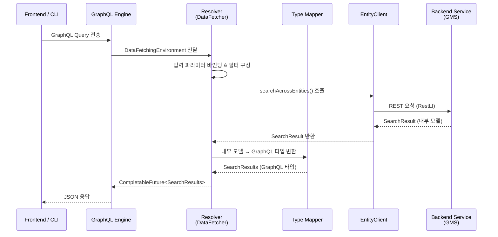
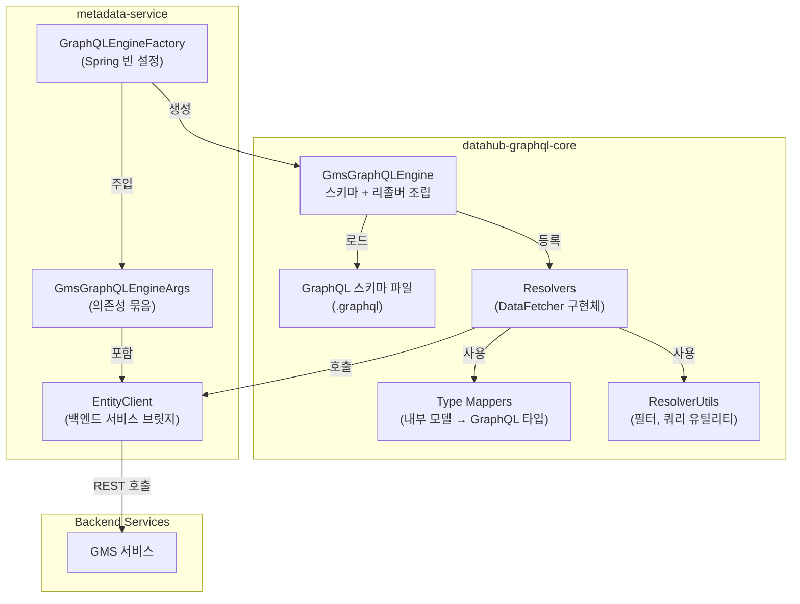

# Tutorial 4: GraphQL API 레이어 이해하기

DataHub의 프론트엔드와 외부 클라이언트는 **GraphQL API**를 통해 백엔드와 통신합니다.
이 튜토리얼에서는 GraphQL 스키마 정의부터 리졸버, 타입 매퍼, EntityClient까지
요청이 처리되는 전체 흐름을 코드를 탐색하며 학습합니다.

---

## 학습 목표

이 튜토리얼을 마치면 다음을 할 수 있습니다:

1. GraphQL 스키마 파일의 위치와 구조를 파악할 수 있다
2. GmsGraphQLEngine이 리졸버를 조립하는 방식을 이해할 수 있다
3. 리졸버 패턴(DataFetcher)의 구조와 비동기 실행 흐름을 설명할 수 있다
4. 내부 모델이 GraphQL 타입으로 변환되는 매핑 과정을 이해할 수 있다
5. EntityClient가 GraphQL 레이어와 백엔드 서비스를 연결하는 역할을 설명할 수 있다

---

## 사전 지식

- Java, Spring 기본 지식 (이미 보유)
- Tutorial 1~3의 Entity-Aspect 모델, Write Path, Read Path 이해
- 코드 에디터에서 DataHub 소스를 열어둔 상태

---

## 아키텍처 개요

GraphQL 요청이 처리되는 전체 흐름을 먼저 살펴봅시다.

### 요청 처리 시퀀스



### 컴포넌트 구성도



---

## 1. GraphQL 스키마 파일

### 스키마 파일 위치

모든 GraphQL 스키마는 다음 디렉토리에 정의되어 있습니다:

```
datahub-graphql-core/src/main/resources/
```

### 주요 스키마 파일

| 파일                     | 역할                                      |
| ------------------------ | ----------------------------------------- |
| `search.graphql`         | 검색 관련 쿼리 (search, browse 등)        |
| `entity.graphql`         | 엔티티 CRUD 관련 타입과 뮤테이션          |
| `auth.graphql`           | 인증/인가 관련 타입과 뮤테이션            |
| `common.graphql`         | 공통 타입 (StringMapEntry, AuditStamp 등) |
| `lineage.graphql`        | 리니지(계보) 관련 쿼리와 타입             |
| `recommendation.graphql` | 추천 관련 쿼리와 타입                     |
| `ingestion.graphql`      | 인제스천 소스/런 관련 타입                |
| `assertions.graphql`     | 데이터 품질 어써션 관련 타입              |
| `settings.graphql`       | 글로벌 설정 관련 타입                     |
| `properties.graphql`     | 구조화된 프로퍼티 관련 타입               |

현재 약 30개 이상의 `.graphql` 파일이 존재하며, 기능 도메인별로 분리되어 있습니다.

### 실습 4-1: search.graphql 구조 살펴보기

`datahub-graphql-core/src/main/resources/search.graphql` 파일을 열어보세요:

```graphql
extend type Query {
  """
  Full text search against a specific DataHub Entity Type
  """
  search(input: SearchInput!): SearchResults

  """
  Search DataHub entities
  """
  searchAcrossEntities(input: SearchAcrossEntitiesInput!): SearchResults

  """
  Search DataHub entities by providing a pointer reference for scrolling.
  """
  scrollAcrossEntities(input: ScrollAcrossEntitiesInput!): ScrollResults

  """
  Autocomplete a search query against a specific DataHub Entity Type
  """
  autoComplete(input: AutoCompleteInput!): AutoCompleteResults

  """
  Hierarchically browse a specific type of DataHub Entity by path
  """
  browse(input: BrowseInput!): BrowseResults
}
```

**관찰 포인트**:

- `extend type Query`를 사용하여 루트 Query 타입을 확장합니다. 각 `.graphql` 파일이 독립적으로 쿼리를 추가할 수 있는 구조입니다.
- 모든 쿼리는 `Input` 타입 하나를 파라미터로 받습니다 (예: `SearchAcrossEntitiesInput!`).
- 반환 타입은 도메인에 맞는 결과 타입입니다 (예: `SearchResults`).

---

## 2. GmsGraphQLEngine: 엔진 조립

### 핵심 파일

```
datahub-graphql-core/src/main/java/com/linkedin/datahub/graphql/GmsGraphQLEngine.java
```

이 클래스는 DataHub GraphQL API의 **중심 허브**입니다. 모든 스키마 파일을 로드하고, 각 쿼리/뮤테이션에 대한 리졸버(DataFetcher)를 등록합니다.

### configureRuntimeWiring: 리졸버 등록의 시작점

`GmsGraphQLEngine.configureRuntimeWiring()` 메서드가 모든 리졸버를 등록하는 진입점입니다:

```java
public void configureRuntimeWiring(final RuntimeWiring.Builder builder) {
    configureQueryResolvers(builder);       // Query 타입 리졸버 등록
    configureMutationResolvers(builder);    // Mutation 타입 리졸버 등록
    configureGenericEntityResolvers(builder);
    configureDatasetResolvers(builder);
    configureCorpUserResolvers(builder);
    // ... 엔티티별 리졸버 설정 계속
}
```

### 실습 4-2: searchAcrossEntities 리졸버 등록 확인

`configureQueryResolvers()` 메서드 안에서 검색 리졸버가 어떻게 등록되는지 살펴보세요:

```java
private void configureQueryResolvers(final RuntimeWiring.Builder builder) {
    builder.type(
        "Query",
        typeWiring ->
            typeWiring
                .dataFetcher("search", new SearchResolver(this.entityClient))
                .dataFetcher(
                    "searchAcrossEntities",
                    new SearchAcrossEntitiesResolver(this.entityClient, this.viewService))
                .dataFetcher(
                    "scrollAcrossEntities",
                    new ScrollAcrossEntitiesResolver(this.entityClient, this.viewService))
                .dataFetcher("me", new MeResolver(this.entityClient, featureFlags))
                // ... 더 많은 쿼리 리졸버
    );
}
```

**핵심 패턴**: `.dataFetcher("GraphQL필드명", new 리졸버(의존성들))` 형태로 GraphQL 스키마의 필드와 Java 리졸버를 연결합니다.

### GmsGraphQLEngineArgs: 의존성 묶음

```
datahub-graphql-core/src/main/java/com/linkedin/datahub/graphql/GmsGraphQLEngineArgs.java
```

GmsGraphQLEngine이 필요로 하는 모든 의존성을 하나의 객체에 담는 `@Data` 클래스입니다:

```java
@Data
public class GmsGraphQLEngineArgs {
    EntityClient entityClient;
    SystemEntityClient systemEntityClient;
    GraphClient graphClient;
    UsageStatsJavaClient usageClient;
    AnalyticsService analyticsService;
    EntityService entityService;
    RecommendationsService recommendationsService;
    // ... 수십 개의 서비스 의존성
}
```

Spring의 `GraphQLEngineFactory`가 이 Args 객체를 구성하여 GmsGraphQLEngine에 전달합니다.

---

## 3. 리졸버 패턴

### DataFetcher 인터페이스

모든 리졸버는 graphql-java의 `DataFetcher<CompletableFuture<T>>` 인터페이스를 구현합니다.

### 실습 4-3: SearchAcrossEntitiesResolver 분석

```
datahub-graphql-core/src/main/java/com/linkedin/datahub/graphql/resolvers/search/SearchAcrossEntitiesResolver.java
```

이 리졸버의 구조를 단계별로 분석해봅시다:

```java
@Slf4j
@RequiredArgsConstructor
public class SearchAcrossEntitiesResolver
    implements DataFetcher<CompletableFuture<SearchResults>> {

    private final EntityClient _entityClient;
    private final ViewService _viewService;

    @Override
    public CompletableFuture<SearchResults> get(DataFetchingEnvironment environment) {
        // 1단계: 컨텍스트와 입력 파라미터 추출
        final QueryContext context = getQueryContext(environment);
        final SearchAcrossEntitiesInput input =
            bindArgument(environment.getArgument("input"),
                         SearchAcrossEntitiesInput.class);

        // 2단계: 파라미터 가공
        final String sanitizedQuery =
            ResolverUtils.escapeForwardSlash(input.getQuery());
        final int start = input.getStart() != null ? input.getStart() : 0;
        final int count = input.getCount() != null ? input.getCount() : 10;

        // 3단계: 비동기 실행
        return GraphQLConcurrencyUtils.supplyAsync(() -> {
            // 필터 구성
            final Filter baseFilter =
                ResolverUtils.buildFilter(input.getFilters(),
                                          input.getOrFilters());

            // EntityClient를 통해 백엔드 서비스 호출
            SearchResult searchResult =
                _entityClient.searchAcrossEntities(
                    context.getOperationContext()
                           .withSearchFlags(flags -> searchFlags),
                    finalEntities, sanitizedQuery, combinedFilter,
                    start, count, sortCriteria, facets);

            // 4단계: 내부 모델 → GraphQL 타입 변환
            return UrnSearchResultsMapper.map(context, searchResult);
        }, ...);
    }
}
```

**리졸버의 4단계 패턴**:

| 단계 | 작업                 | 핵심 메서드                           |
| ---- | -------------------- | ------------------------------------- |
| 1    | 입력 파라미터 바인딩 | `ResolverUtils.bindArgument()`        |
| 2    | 쿼리/필터 가공       | `ResolverUtils.escapeForwardSlash()`  |
| 3    | 백엔드 서비스 호출   | `EntityClient.searchAcrossEntities()` |
| 4    | 결과 타입 변환       | `UrnSearchResultsMapper.map()`        |

### ResolverUtils: 공통 유틸리티

```
datahub-graphql-core/src/main/java/com/linkedin/datahub/graphql/resolvers/ResolverUtils.java
```

리졸버에서 반복적으로 사용되는 유틸리티 메서드를 모아둔 클래스입니다:

```java
public class ResolverUtils {
    // GraphQL 인자를 Java 객체로 변환
    public static <T> T bindArgument(Object argument, Class<T> clazz) {
        return MAPPER.convertValue(argument, clazz);
    }

    // GraphQL FacetFilterInput → 내부 Filter 변환
    public static Filter buildFilter(
        List<FacetFilterInput> filters,
        List<AndFilterInput> orFilters) { ... }

    // Elasticsearch 예약 문자 이스케이프
    public static String escapeForwardSlash(String query) { ... }

    // DataFetchingEnvironment에서 QueryContext 추출
    public static QueryContext getQueryContext(
        DataFetchingEnvironment environment) { ... }
}
```

---

## 4. 타입 매퍼

### 내부 모델과 GraphQL 타입의 분리

DataHub은 백엔드 내부 모델(PDL로 생성된 Java 클래스)과 GraphQL 타입(graphql-java codegen으로 생성된 클래스)을 분리합니다. 타입 매퍼가 이 둘 사이의 변환을 담당합니다.

### UrnSearchResultsMapper

```
datahub-graphql-core/src/main/java/com/linkedin/datahub/graphql/types/mappers/UrnSearchResultsMapper.java
```

검색 결과를 내부 `SearchResult`에서 GraphQL `SearchResults`로 변환합니다:

```java
public class UrnSearchResultsMapper<T extends RecordTemplate, E extends Entity> {

    public static <T extends RecordTemplate, E extends Entity> SearchResults map(
            @Nullable final QueryContext context,
            com.linkedin.metadata.search.SearchResult searchResult) {
        return new UrnSearchResultsMapper<T, E>().apply(context, searchResult);
    }

    public SearchResults apply(@Nullable final QueryContext context,
            com.linkedin.metadata.search.SearchResult input) {
        final SearchResults result = new SearchResults();
        result.setStart(input.getFrom());
        result.setCount(input.getPageSize());
        result.setTotal(input.getNumEntities());

        // 개별 엔티티 결과 매핑
        result.setSearchResults(
            input.getEntities().stream()
                .map(r -> MapperUtils.mapResult(context, r))
                .collect(Collectors.toList()));

        // 패싯(집계) 결과 매핑
        result.setFacets(
            searchResultMetadata.getAggregations().stream()
                .map(f -> MapperUtils.mapFacet(context, f))
                .collect(Collectors.toList()));

        return result;
    }
}
```

### MapperUtils: 개별 항목 매핑

```
datahub-graphql-core/src/main/java/com/linkedin/datahub/graphql/types/mappers/MapperUtils.java
```

`MapperUtils`는 검색 결과의 개별 항목(엔티티, 패싯, 매치된 필드)을 GraphQL 타입으로 변환하는 정적 메서드를 제공합니다:

- `mapResult()`: `SearchEntity` (내부) → `SearchResult` (GraphQL)
- `mapFacet()`: 집계 메타데이터 → `FacetMetadata` (GraphQL)
- `mapSearchSuggestion()`: 검색 제안 → `SearchSuggestion` (GraphQL)

---

## 5. EntityClient: GraphQL과 백엔드의 브릿지

### 인터페이스 정의

```
metadata-service/restli-client-api/src/main/java/com/linkedin/entity/client/EntityClient.java
```

`EntityClient`는 GraphQL 리졸버가 백엔드 서비스(GMS)와 통신하기 위해 사용하는 인터페이스입니다. 검색, 조회, 수정 등 모든 메타데이터 작업을 추상화합니다.

### 주요 메서드

```java
public interface EntityClient {
    // 여러 엔티티 타입에 걸쳐 검색
    SearchResult searchAcrossEntities(
        @Nonnull OperationContext opContext,
        @Nonnull List<String> entities,
        @Nonnull String input,
        @Nullable Filter filter,
        int start,
        @Nullable Integer count,
        List<SortCriterion> sortCriteria,
        @Nonnull List<String> facets)
        throws RemoteInvocationException;

    // 엔티티 상세 조회 (aspect 포함)
    EntityResponse getV2(
        @Nonnull OperationContext opContext,
        @Nonnull String entityName,
        @Nonnull Urn urn,
        @Nullable Set<String> aspectNames)
        throws RemoteInvocationException, URISyntaxException;

    // 단일 엔티티 타입 내 검색
    SearchResult search(
        @Nonnull OperationContext opContext,
        @Nonnull String entity,
        @Nonnull String input,
        @Nullable Filter filter,
        @Nullable List<SortCriterion> sortCriteria,
        int start,
        int count)
        throws RemoteInvocationException;
}
```

**설계 포인트**: EntityClient를 인터페이스로 정의함으로써, 실제 구현체(RestLI 기반)를 교체하거나 테스트에서 목(mock)으로 대체할 수 있습니다.

---

## 6. GraphQLEngineFactory: Spring 와이어링

### 팩토리 클래스

```
metadata-service/factories/src/main/java/com/linkedin/gms/factory/graphql/GraphQLEngineFactory.java
```

이 Spring `@Configuration` 클래스는 GmsGraphQLEngine에 필요한 모든 의존성을 조립하여 `GraphQLEngine` 빈을 생성합니다:

```java
@Configuration
@Import({
    IndexConventionFactory.class,
    RecommendationServiceFactory.class,
    EntityRegistryFactory.class,
    DataHubTokenServiceFactory.class,
    // ... 다른 팩토리들
})
public class GraphQLEngineFactory {

    @Autowired private EntityService<?> entityService;
    @Autowired private EntityClient entityClient;
    @Autowired private GraphClient graphClient;
    @Autowired private RecommendationsService recommendationsService;
    // ... 수십 개의 의존성 주입

    @Bean
    public GraphQLEngine graphQLEngine() {
        // GmsGraphQLEngineArgs에 모든 의존성을 담아서
        GmsGraphQLEngineArgs args = new GmsGraphQLEngineArgs();
        args.setEntityClient(entityClient);
        args.setGraphClient(graphClient);
        // ... 나머지 의존성 설정

        // GmsGraphQLEngine을 생성하고 GraphQL 스키마를 빌드
        GmsGraphQLEngine engine = new GmsGraphQLEngine(args);
        return engine.builder().build();
    }
}
```

**조립 흐름 요약**:

1. Spring이 `GraphQLEngineFactory`를 초기화하면서 필요한 서비스 빈을 주입
2. `GmsGraphQLEngineArgs`에 모든 의존성을 담음
3. `GmsGraphQLEngine`이 스키마 파일을 로드하고 리졸버를 등록
4. 완성된 `GraphQLEngine` 빈이 HTTP 요청을 처리할 준비 완료

---

## 정리: 전체 흐름 한눈에 보기

새로운 GraphQL 쿼리를 추가하려면 다음 단계를 거칩니다:

1. **스키마 정의**: `.graphql` 파일에 쿼리/뮤테이션/타입 선언
2. **리졸버 구현**: `DataFetcher<CompletableFuture<T>>`를 구현하는 리졸버 클래스 작성
3. **타입 매퍼 작성**: 내부 모델 → GraphQL 타입 변환 로직
4. **엔진에 등록**: `GmsGraphQLEngine`의 적절한 `configure*` 메서드에 `.dataFetcher()` 호출 추가
5. **팩토리 수정** (필요시): 새로운 서비스 의존성이 있다면 `GraphQLEngineFactory`와 `GmsGraphQLEngineArgs`에 추가

### 주요 파일 경로 요약

| 컴포넌트       | 경로                                                       |
| -------------- | ---------------------------------------------------------- |
| GraphQL 스키마 | `datahub-graphql-core/src/main/resources/*.graphql`        |
| 엔진           | `datahub-graphql-core/.../GmsGraphQLEngine.java`           |
| 엔진 인자      | `datahub-graphql-core/.../GmsGraphQLEngineArgs.java`       |
| 리졸버         | `datahub-graphql-core/.../resolvers/`                      |
| 유틸리티       | `datahub-graphql-core/.../resolvers/ResolverUtils.java`    |
| 타입 매퍼      | `datahub-graphql-core/.../types/mappers/`                  |
| EntityClient   | `metadata-service/restli-client-api/.../EntityClient.java` |
| Spring 팩토리  | `metadata-service/factories/.../GraphQLEngineFactory.java` |

---

## 다음 단계

- **Tutorial 5**: DataHub 프론트엔드와 React 컴포넌트 구조를 학습합니다.
- 직접 간단한 GraphQL 쿼리를 추가해보는 것을 권장합니다. `datahub graphql --agent-context` 명령으로 CLI에서 GraphQL API를 탐색할 수도 있습니다.
