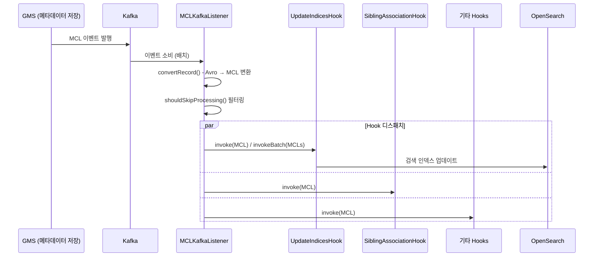
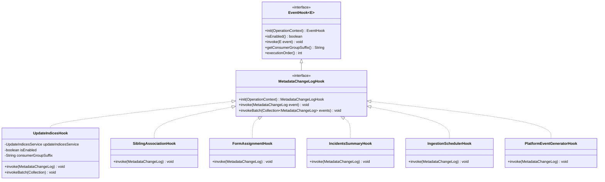
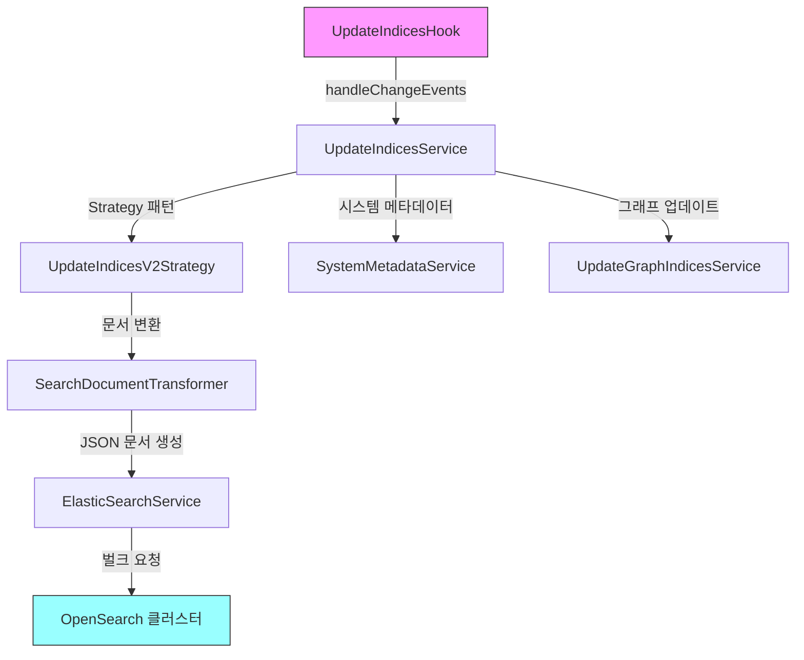

# Tutorial 5: 이벤트 처리와 Hook 시스템

DataHub은 **이벤트 기반 아키텍처**를 핵심으로 채택하고 있습니다.
메타데이터가 저장될 때마다 Kafka 이벤트가 발행되고, 이 이벤트를 소비하는 **Hook** 시스템이 검색 인덱스 업데이트, 관계 처리, 인시던트 요약 등 후속 작업을 수행합니다.

이 튜토리얼에서는 MCL(MetadataChangeLog) 이벤트의 흐름과 Hook 패턴을 코드를 직접 탐색하며 학습합니다.

---

## 학습 목표

이 튜토리얼을 마치면 다음을 할 수 있습니다:

1. MCE와 MCL의 차이를 설명할 수 있다
2. MCL 이벤트가 Kafka를 통해 Hook까지 전달되는 경로를 추적할 수 있다
3. `MetadataChangeLogHook` 인터페이스의 구조를 이해할 수 있다
4. 기존 Hook 구현체들의 역할을 설명할 수 있다
5. 새로운 Hook을 직접 구현할 수 있다

---

## 사전 지식

- Java, Spring, Kafka 기본 지식
- Tutorial 1~4의 Entity-Aspect 모델, 쓰기/읽기 경로 이해

---

## 1. 이벤트 모델: MCE vs MCL

DataHub의 이벤트 모델은 두 가지 핵심 이벤트 타입으로 구성됩니다.

### MCE (MetadataChangeEvent) - 레거시

MCE는 초기 DataHub에서 사용하던 **인바운드 이벤트**입니다. 외부 시스템이 메타데이터를 DataHub에 보낼 때 사용했습니다. 현재는 **MetadataChangeProposal (MCP)**로 대체되었습니다.

### MCL (MetadataChangeLog) - 현재 핵심

MCL은 Aspect가 **실제로 저장된 후** 발행되는 이벤트입니다. 변경 전/후 상태를 모두 담고 있어 다양한 후속 처리가 가능합니다.

### 실습 5-1: MCL 스키마 살펴보기

PDL 스키마 파일을 열어보세요:

```
metadata-models/src/main/pegasus/com/linkedin/mxe/MetadataChangeLog.pdl
```

```pdl
record MetadataChangeLog includes MetadataChangeProposal {
  previousAspectValue: optional GenericAspect
  previousSystemMetadata: optional SystemMetadata
  created: optional AuditStamp
}
```

핵심 필드를 이해해봅시다:

| 필드                     | 설명                                    |
| ------------------------ | --------------------------------------- |
| `entityType`             | 엔티티 타입 (예: `dataset`, `chart`)    |
| `entityUrn`              | 엔티티 URN                              |
| `aspectName`             | 변경된 Aspect 이름                      |
| `aspect`                 | 변경 후 Aspect 값 (GenericAspect)       |
| `previousAspectValue`    | 변경 전 Aspect 값 (MCL 고유 필드)       |
| `changeType`             | CREATE, UPSERT, DELETE 등               |
| `systemMetadata`         | 시스템 메타데이터 (소스, 타임스탬프 등) |
| `previousSystemMetadata` | 변경 전 시스템 메타데이터               |
| `created`                | 변경을 수행한 사용자와 시간             |

MCL은 `MetadataChangeProposal`을 **includes**(상속)하므로 MCP의 모든 필드를 포함하면서, `previousAspectValue`와 `previousSystemMetadata` 같은 변경 이력 필드가 추가됩니다.

### Kafka 토픽

MCL 이벤트는 두 개의 Kafka 토픽으로 발행됩니다:

- **`MetadataChangeLog_Versioned_v1`**: 버전 관리되는 Aspect (Ownership, SchemaMetadata 등)
- **`MetadataChangeLog_Timeseries_v1`**: 시계열 Aspect (DatasetProfile, DatasetUsageStatistics 등)

---

## 2. MCL Consumer: 이벤트 소비 경로

MCL 이벤트가 Kafka에 발행되면, **MAE Consumer** 서비스가 이를 소비합니다.

### 전체 이벤트 흐름



### 실습 5-2: MCLKafkaListener 살펴보기

```
metadata-jobs/mae-consumer/src/main/java/com/linkedin/metadata/kafka/listener/mcl/MCLKafkaListener.java
```

이 클래스는 `AbstractKafkaListener`를 확장하며, Kafka에서 수신한 Avro 레코드를 MCL 객체로 변환합니다:

```java
public class MCLKafkaListener
    extends AbstractKafkaListener<MetadataChangeLog, MetadataChangeLogHook, GenericRecord> {

  @Override
  public MetadataChangeLog convertRecord(@Nonnull GenericRecord record) throws IOException {
    return EventUtils.avroToPegasusMCL(record);
  }

  @Override
  protected boolean shouldSkipProcessing(MetadataChangeLog event) {
    // aspectsToDrop 설정으로 특정 이벤트 건너뛰기
    String entityType = event.hasEntityType() ? event.getEntityType() : null;
    String aspectName = event.hasAspectName() ? event.getAspectName() : null;
    return aspectsToDrop.getOrDefault(entityType, Collections.emptySet()).contains(aspectName)
        || aspectsToDrop.getOrDefault(WILDCARD, Collections.emptySet()).contains(aspectName);
  }

  @Override
  protected void setMDCContext(MetadataChangeLog event) {
    // 로깅을 위한 MDC 컨텍스트 설정 (entityUrn, aspectName, entityType, changeType)
  }
}
```

핵심 메서드:

| 메서드                   | 역할                                              |
| ------------------------ | ------------------------------------------------- |
| `convertRecord()`        | Avro `GenericRecord`를 `MetadataChangeLog`로 변환 |
| `shouldSkipProcessing()` | 설정에 따라 특정 이벤트를 건너뛸지 결정           |
| `setMDCContext()`        | 로그 추적을 위한 MDC 컨텍스트 설정                |
| `updateMetrics()`        | Hook별 큐 대기 시간 등 메트릭 기록                |

---

## 3. MetadataChangeLogHook 인터페이스

모든 MCL Hook은 `MetadataChangeLogHook` 인터페이스를 구현합니다.

### 실습 5-3: 인터페이스 살펴보기

```
metadata-jobs/mae-consumer/src/main/java/com/linkedin/metadata/kafka/hook/MetadataChangeLogHook.java
```

```java
public interface MetadataChangeLogHook extends EventHook<MetadataChangeLog> {

  /** Hook 초기화 */
  default MetadataChangeLogHook init(@Nonnull OperationContext systemOperationContext) {
    return this;
  }

  /** 단일 MCL 이벤트 처리 */
  void invoke(@Nonnull MetadataChangeLog event) throws Exception;

  /**
   * 배치 MCL 이벤트 처리 - 성능 최적화를 위해 여러 이벤트를 한번에 처리
   * 기본 구현은 개별 invoke()를 순차 호출
   */
  default void invokeBatch(@Nonnull Collection<MetadataChangeLog> events) throws Exception {
    for (MetadataChangeLog event : events) {
      invoke(event);
    }
  }
}
```

부모 인터페이스 `EventHook<E>`에서 상속받는 메서드:

| 메서드                     | 역할                                                   |
| -------------------------- | ------------------------------------------------------ |
| `isEnabled()`              | Hook 활성화 여부. `false`면 `invoke()`가 호출되지 않음 |
| `getConsumerGroupSuffix()` | Kafka Consumer Group 접미사. 병렬 처리 격리에 사용     |
| `executionOrder()`         | Hook 실행 순서 (기본값: 100)                           |

### 클래스 다이어그램



---

## 4. 핵심 Hook 구현체들

DataHub에는 여러 MCL Hook이 Spring `@Component`로 등록되어 있습니다. 각 Hook의 역할을 살펴봅시다.

### 4.1 UpdateIndicesHook - 검색 인덱스 업데이트

**가장 중요한 Hook**입니다. 메타데이터 변경 사항을 OpenSearch 검색 인덱스에 반영합니다.

```
metadata-jobs/mae-consumer/src/main/java/com/linkedin/metadata/kafka/hook/UpdateIndicesHook.java
```

```java
@Component
public class UpdateIndicesHook implements MetadataChangeLogHook {

  protected final UpdateIndicesService updateIndicesService;
  private final boolean isEnabled;
  private final String consumerGroupSuffix;

  @Override
  public void invoke(@Nonnull final MetadataChangeLog event) {
    invokeBatch(Collections.singletonList(event));
  }

  @Override
  public void invokeBatch(@Nonnull final Collection<MetadataChangeLog> events) {
    List<MetadataChangeLog> eventsToProcess =
        events.stream().filter(this::shouldProcessEvent).collect(Collectors.toList());
    if (!eventsToProcess.isEmpty()) {
      updateIndicesService.handleChangeEvents(systemOperationContext, eventsToProcess);
    }
  }
}
```

주목할 점:

- `invoke()`는 단일 이벤트를 `invokeBatch()`로 위임합니다 (배치 최적화)
- UI에서 온 이벤트는 `reprocessUIEvents` 플래그에 따라 건너뛸 수 있습니다 (UI는 별도 fast path로 처리)
- `consumerGroupSuffix`로 다른 Hook과 독립된 Kafka Consumer Group을 사용할 수 있습니다

### 4.2 SiblingAssociationHook - 데이터셋 형제 관계

```
metadata-jobs/mae-consumer/src/main/java/com/linkedin/metadata/kafka/hook/siblings/SiblingAssociationHook.java
```

데이터셋 간의 **sibling(형제) 관계**를 관리합니다. 예를 들어, dbt 모델과 그에 대응하는 Snowflake 테이블은 같은 데이터를 나타내는 형제 엔티티입니다. 이 Hook은 `UpstreamLineage` Aspect의 변경을 감지하여 자동으로 `Siblings` Aspect를 설정합니다.

### 4.3 FormAssignmentHook - 폼 자동 할당

```
metadata-jobs/mae-consumer/src/main/java/com/linkedin/metadata/kafka/hook/form/FormAssignmentHook.java
```

DataHub의 **Form(양식)** 기능과 관련된 Hook입니다. 엔티티가 특정 조건을 만족하면 자동으로 폼을 할당합니다. 예를 들어, 특정 도메인에 속한 모든 데이터셋에 데이터 거버넌스 양식을 자동 배정할 수 있습니다.

### 4.4 IncidentsSummaryHook - 인시던트 요약 관리

```
metadata-jobs/mae-consumer/src/main/java/com/linkedin/metadata/kafka/hook/incident/IncidentsSummaryHook.java
```

엔티티에 연결된 **인시던트(장애/이슈)**의 요약 정보를 유지합니다. 인시던트가 생성, 수정, 해결될 때 해당 엔티티의 `IncidentsSummary` Aspect를 자동 갱신합니다.

### 4.5 IngestionSchedulerHook - 인제스천 스케줄 관리

```
metadata-jobs/mae-consumer/src/main/java/com/linkedin/metadata/kafka/hook/ingestion/IngestionSchedulerHook.java
```

인제스천 소스의 설정이 변경될 때 스케줄러를 업데이트합니다.

### 4.6 PlatformEventGeneratorHook - 플랫폼 이벤트 생성

```
metadata-jobs/mae-consumer/src/main/java/com/linkedin/metadata/kafka/hook/event/PlatformEventGeneratorHook.java
```

MCL을 기반으로 사용자 친화적인 **플랫폼 이벤트**(예: "소유자 변경됨", "태그 추가됨")를 생성합니다.

---

## 5. UpdateIndicesService 상세

`UpdateIndicesHook`은 실제 인덱스 업데이트 로직을 `UpdateIndicesService`에 위임합니다. 이 서비스는 Strategy 패턴으로 설계되어 있습니다.

### 실습 5-4: UpdateIndicesService 코드 탐색

```
metadata-io/src/main/java/com/linkedin/metadata/service/UpdateIndicesService.java
```

### 인덱스 업데이트 흐름



### UpdateIndicesV2Strategy

```
metadata-io/src/main/java/com/linkedin/metadata/service/UpdateIndicesV2Strategy.java
```

이 전략 클래스는 V2 매핑 방식으로 엔티티별 인덱스를 관리합니다:

1. **MCL → MCLItem 변환**: MCL 이벤트를 내부 처리 단위인 `MCLItem`으로 변환
2. **검색 문서 변환**: `SearchDocumentTransformer`를 사용하여 Aspect를 검색용 JSON 문서로 변환
3. **diff 모드**: `searchDiffMode`가 활성화되면 변경된 필드만 업데이트 (성능 최적화)
4. **시맨틱 인덱스 동기화**: 시맨틱 검색이 활성화된 경우, 기본 인덱스와 시맨틱 인덱스에 이중 기록

### 처리 대상 ChangeType

`UpdateIndicesService`는 다음 ChangeType만 처리합니다:

- `CREATE`: 새 Aspect 생성
- `UPSERT`: 기존 Aspect 업데이트 또는 생성
- `CREATE_ENTITY`: 새 엔티티 생성
- `DELETE`: Aspect 삭제
- `PATCH`: 부분 업데이트
- `RESTATE`: 기존 데이터 재처리

---

## 6. Hook 개발 가이드

새로운 Hook을 만들어야 하는 상황을 가정하고, 구현 방법을 단계별로 살펴봅시다.

### 6.1 MetadataChangeLogHook 구현

```java
package com.linkedin.metadata.kafka.hook.custom;

import com.linkedin.metadata.kafka.hook.MetadataChangeLogHook;
import com.linkedin.mxe.MetadataChangeLog;
import io.datahubproject.metadata.context.OperationContext;
import javax.annotation.Nonnull;
import lombok.Getter;
import lombok.extern.slf4j.Slf4j;
import org.springframework.beans.factory.annotation.Value;
import org.springframework.stereotype.Component;

@Slf4j
@Component
public class CustomMetadataHook implements MetadataChangeLogHook {

  private OperationContext systemOperationContext;

  @Getter
  private final String consumerGroupSuffix;

  private final boolean isEnabled;

  public CustomMetadataHook(
      @Value("${customHook.enabled:true}") boolean isEnabled,
      @Value("${customHook.consumerGroupSuffix:}") String consumerGroupSuffix) {
    this.isEnabled = isEnabled;
    this.consumerGroupSuffix = consumerGroupSuffix;
  }

  @Override
  public boolean isEnabled() {
    return isEnabled;
  }

  @Override
  public MetadataChangeLogHook init(@Nonnull OperationContext systemOperationContext) {
    this.systemOperationContext = systemOperationContext;
    return this;
  }

  @Override
  public void invoke(@Nonnull MetadataChangeLog event) throws Exception {
    // 1. 관심 있는 엔티티 타입과 Aspect만 필터링
    if (!"dataset".equals(event.getEntityType())) {
      return;
    }
    if (!"schemaMetadata".equals(event.getAspectName())) {
      return;
    }

    // 2. 비즈니스 로직 수행
    log.info("Processing schema change for {}", event.getEntityUrn());

    // 3. 변경 전/후 비교가 필요하면 previousAspectValue 활용
    if (event.hasPreviousAspectValue()) {
      log.info("Schema was modified (not created)");
    }
  }
}
```

### 6.2 핵심 설계 원칙

1. **필터링 먼저**: `invoke()` 진입 직후 `entityType`과 `aspectName`으로 관심 없는 이벤트를 빠르게 건너뛰세요
2. **Spring `@Component` 등록**: Hook을 `@Component`로 선언하면 자동으로 MCL 리스너에 등록됩니다
3. **`consumerGroupSuffix` 활용**: 비어있지 않은 suffix를 설정하면 별도의 Kafka Consumer Group이 생성됩니다. 이렇게 하면 다른 Hook의 처리 지연에 영향을 받지 않습니다
4. **멱등성 고려**: "at most once" 시맨틱이지만, 향후 "at least once"로 변경될 수 있으므로 멱등하게 구현하세요
5. **배치 처리 최적화**: 대량 이벤트를 처리하는 Hook이라면 `invokeBatch()`를 오버라이드하여 벌크 연산을 활용하세요

### 6.3 설정

`application.yml`에서 Hook을 활성화/비활성화할 수 있습니다:

```yaml
customHook:
  enabled: true
  consumerGroupSuffix: "custom-hook"
```

---

## 정리

DataHub의 이벤트 처리 시스템은 다음과 같이 동작합니다:

1. **GMS**가 Aspect를 저장하면 **MCL 이벤트**가 Kafka로 발행됩니다
2. **MCLKafkaListener**가 이벤트를 소비하고, Avro에서 MCL 객체로 변환합니다
3. 등록된 모든 **MetadataChangeLogHook** 구현체에 이벤트가 전달됩니다
4. 각 Hook은 자신이 관심 있는 이벤트만 필터링하여 처리합니다
5. **UpdateIndicesHook**이 가장 중요한 Hook으로, 검색 인덱스를 최신 상태로 유지합니다

---

## 검증 테스트 실행

```bash
./docs/dev-guides/onboarding/tests/05-event-processing-test.sh
```

모든 테스트가 통과하면 이벤트 처리 시스템을 충분히 이해한 것입니다.

---

## 시리즈 완료

이것으로 DataHub 온보딩 튜토리얼 시리즈가 완료되었습니다:

1. **Entity-Aspect 모델** - 메타데이터 구조의 기초
2. **쓰기 경로** - Ingestion과 데이터 저장
3. **읽기 경로** - 검색과 GraphQL
4. **프론트엔드** - React UI와 테마
5. **이벤트 처리와 Hook** - 비동기 후속 처리 (본 튜토리얼)

이 기반 위에 DataHub 코드베이스에 자신 있게 기여할 수 있기를 바랍니다!
