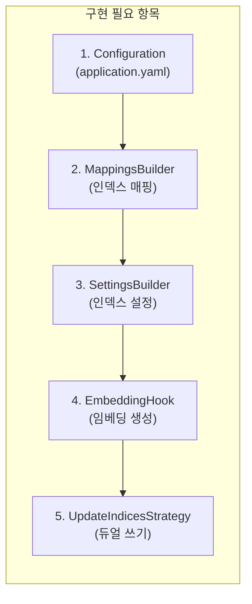
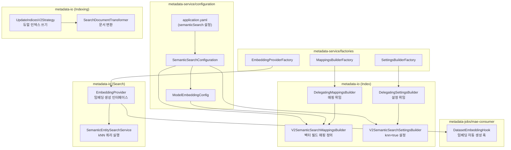
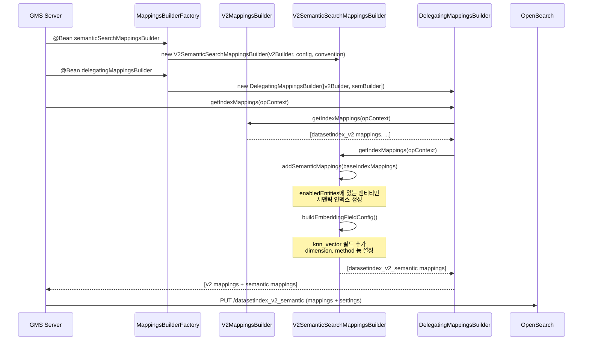
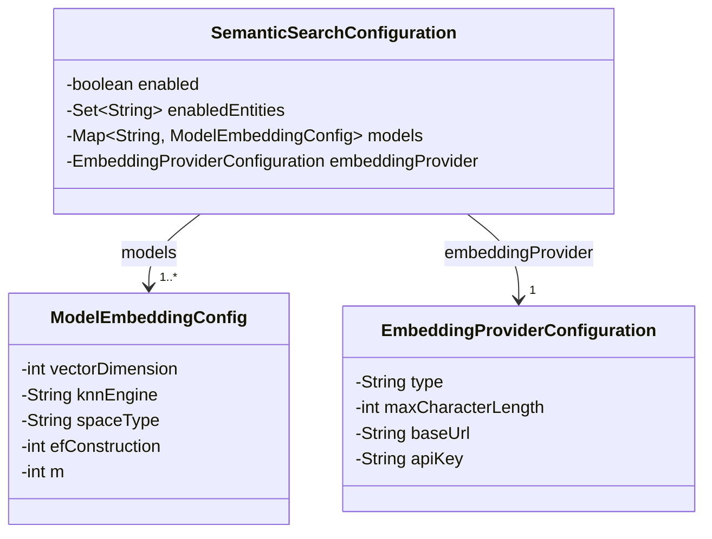
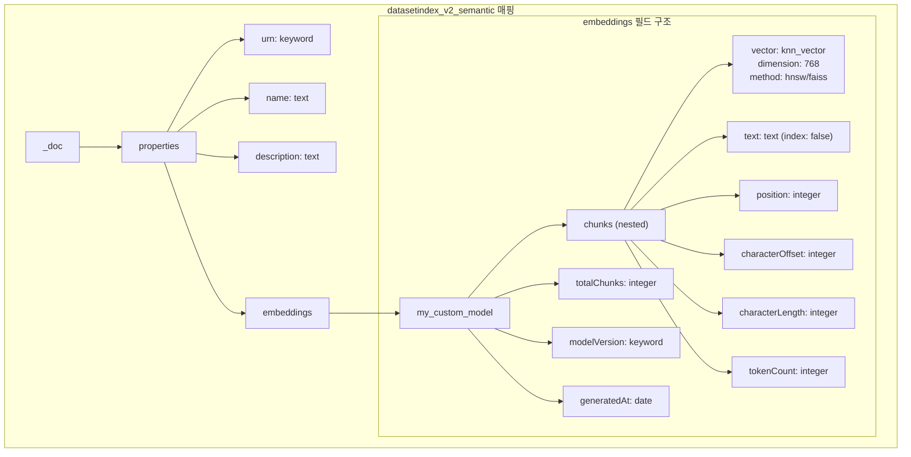
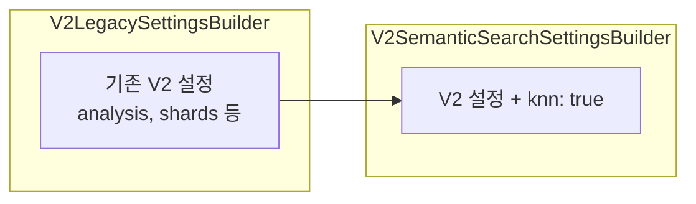
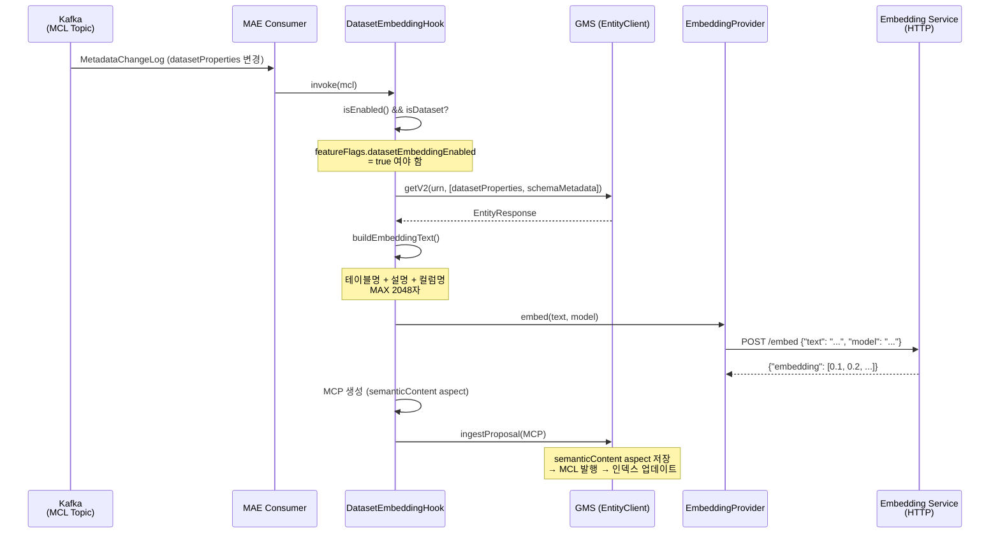
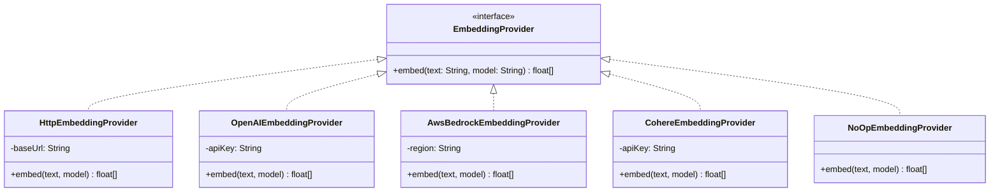
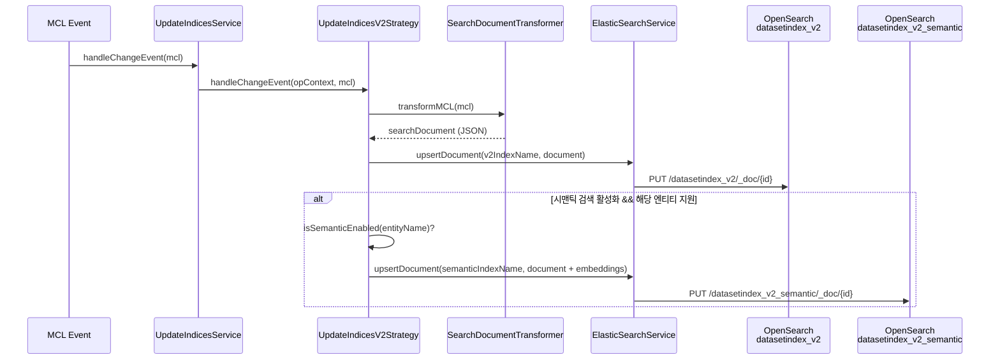
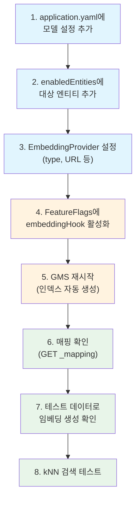

# 단일 필드에 대한 벡터 필드 추가 가이드

OpenSearch/Elasticsearch에 단일 필드의 벡터 임베딩을 추가하여 시맨틱 검색을 지원하는 방법을 설명합니다.

> **Note**: 다이어그램은 [Mermaid](https://mermaid.js.org/) 문법으로 작성되었습니다.

---

## Table of Contents

- [1. 개요](#1-개요)
- [2. 전체 흐름 개요](#2-전체-흐름-개요)
- [3. Step 1: 설정 (Configuration)](#3-step-1-설정-configuration)
- [4. Step 2: 인덱스 매핑 (Index Mapping)](#4-step-2-인덱스-매핑-index-mapping)
- [5. Step 3: 인덱스 설정 (Index Settings)](#5-step-3-인덱스-설정-index-settings)
- [6. Step 4: 임베딩 생성 및 저장](#6-step-4-임베딩-생성-및-저장)
- [7. Step 5: 듀얼 인덱스 쓰기 (Dual-Write)](#7-step-5-듀얼-인덱스-쓰기-dual-write)
- [8. 검증 방법](#8-검증-방법)
- [9. 체크리스트](#9-체크리스트)

---

## 1. 개요

DataHub의 시맨틱 검색은 **Dual-Index** 전략을 사용합니다.
기존 키워드 인덱스(`_v2`)와 별도로 벡터 필드가 포함된 시맨틱 인덱스(`_v2_semantic`)를 생성합니다.

단일 필드에 벡터를 추가한다는 것은, 예를 들어 Dataset의 `description` 필드를
임베딩 벡터로 변환하여 시맨틱 인덱스에 저장하고 kNN 검색이 가능하도록 만드는 것을 의미합니다.

### 핵심 구성 요소



---

## 2. 전체 흐름 개요

벡터 필드를 추가할 때 영향을 받는 모듈과 데이터 흐름을 보여줍니다.

### 2.1 모듈 의존성 다이어그램



### 2.2 인덱스 생성 시퀀스 다이어그램

GMS 서버가 시작될 때 시맨틱 인덱스가 생성되는 과정입니다.



---

## 3. Step 1: 설정 (Configuration)

### 3.1 application.yaml 수정

`application.yaml`에서 시맨틱 검색을 활성화하고 모델을 설정합니다.

**파일**: `metadata-service/configuration/src/main/resources/application.yaml`

```yaml
elasticsearch:
  entityIndex:
    semanticSearch:
      enabled: ${ELASTICSEARCH_SEMANTIC_SEARCH_ENABLED:false}
      enabledEntities: ${ELASTICSEARCH_SEMANTIC_SEARCH_ENTITIES:dataset}
      models:
        # 모델 키 = 인덱스 매핑에서 embeddings.<model_key> 경로로 사용
        my_custom_model:
          vectorDimension: 768 # 임베딩 차원 수
          knnEngine: faiss # faiss, nmslib, lucene 중 선택
          spaceType: cosinesimil # 거리 메트릭
          efConstruction: 128 # HNSW 빌드 파라미터
          m: 16 # HNSW 연결 수
      embeddingProvider:
        type: local-http # local-http, openai, aws-bedrock, cohere
        maxCharacterLength: 2048
```

### 3.2 Configuration 클래스

설정 값은 아래 클래스들에 바인딩됩니다.



**주요 파일 위치**:

| 클래스                           | 파일 경로                                                                                                              |
| -------------------------------- | ---------------------------------------------------------------------------------------------------------------------- |
| `SemanticSearchConfiguration`    | `metadata-service/configuration/src/main/java/com/linkedin/metadata/config/search/SemanticSearchConfiguration.java`    |
| `ModelEmbeddingConfig`           | `metadata-service/configuration/src/main/java/com/linkedin/metadata/config/search/ModelEmbeddingConfig.java`           |
| `EmbeddingProviderConfiguration` | `metadata-service/configuration/src/main/java/com/linkedin/metadata/config/search/EmbeddingProviderConfiguration.java` |

---

## 4. Step 2: 인덱스 매핑 (Index Mapping)

### 4.1 매핑 구조

시맨틱 인덱스는 기존 V2 매핑에 `embeddings` 필드를 추가한 구조입니다.



### 4.2 생성되는 실제 매핑 JSON

위 구조가 OpenSearch에 전달되면 아래와 같은 JSON이 생성됩니다:

```json
{
  "properties": {
    "urn": { "type": "keyword" },
    "name": { "type": "text" },
    "embeddings": {
      "properties": {
        "my_custom_model": {
          "properties": {
            "chunks": {
              "type": "nested",
              "properties": {
                "vector": {
                  "type": "knn_vector",
                  "dimension": 768,
                  "method": {
                    "name": "hnsw",
                    "space_type": "cosinesimil",
                    "engine": "faiss",
                    "parameters": {
                      "ef_construction": 128,
                      "m": 16
                    }
                  }
                },
                "text": { "type": "text", "index": false },
                "position": { "type": "integer" },
                "characterOffset": { "type": "integer" },
                "characterLength": { "type": "integer" },
                "tokenCount": { "type": "integer" }
              }
            },
            "totalChunks": { "type": "integer" },
            "modelVersion": { "type": "keyword" },
            "generatedAt": { "type": "date" }
          }
        }
      }
    }
  }
}
```

### 4.3 코드: V2SemanticSearchMappingsBuilder

이 클래스가 시맨틱 인덱스의 매핑을 생성합니다.

**파일**: `metadata-io/src/main/java/com/linkedin/metadata/search/elasticsearch/index/entity/v2/V2SemanticSearchMappingsBuilder.java`

핵심 메서드:

```java
// buildEmbeddingFieldConfig(): 모든 모델의 벡터 필드 설정 생성
private Map<String, Object> buildEmbeddingFieldConfig() {
    Map<String, Object> modelProperties = new HashMap<>();

    for (Map.Entry<String, ModelEmbeddingConfig> entry : semanticConfig.getModels().entrySet()) {
        String modelKey = entry.getKey();
        ModelEmbeddingConfig modelConfig = entry.getValue();

        // HNSW 메서드 파라미터
        Map<String, Object> method = Map.of(
            "name", "hnsw",
            "space_type", modelConfig.getSpaceType(),
            "engine", modelConfig.getKnnEngine(),
            "parameters", Map.of(
                "ef_construction", modelConfig.getEfConstruction(),
                "m", modelConfig.getM()
            )
        );

        // knn_vector 필드 정의
        Map<String, Object> vectorField = Map.of(
            "type", "knn_vector",
            "dimension", modelConfig.getVectorDimension(),
            "method", method
        );

        // nested chunks 구조
        Map<String, Object> chunksField = Map.of(
            "type", "nested",
            "properties", Map.of(
                "vector", vectorField,
                "text", Map.of("type", "text", "index", false),
                "position", Map.of("type", "integer")
                // ... 기타 메타 필드
            )
        );

        modelProperties.put(modelKey, Map.of("properties", Map.of(
            "chunks", chunksField,
            "totalChunks", Map.of("type", "integer"),
            "modelVersion", Map.of("type", "keyword")
        )));
    }

    return Map.of("properties", modelProperties);
}
```

```java
// addSemanticMappings(): 기존 V2 매핑에 embeddings 필드를 추가
private Collection<IndexMapping> addSemanticMappings(Collection<IndexMapping> baseIndexMappings) {
    Set<String> enabledEntities = semanticConfig.getEnabledEntities();
    Map<String, Object> embeddingFieldConfig = buildEmbeddingFieldConfig();

    for (IndexMapping baseMapping : baseIndexMappings) {
        String entityName = indexConvention.getEntityName(baseMapping.getIndexName()).orElse(null);
        if (!enabledEntities.contains(entityName)) continue;  // 활성화된 엔티티만

        Map<String, Object> baseMappings = baseMapping.getMappings();
        Map<String, Object> baseProperties = (Map<String, Object>) baseMappings.get("properties");

        // 기존 properties + "embeddings" 필드 추가
        Map<String, Object> newProperties = new HashMap<>(baseProperties);
        newProperties.put("embeddings", embeddingFieldConfig);

        String semanticIndexName = indexConvention.getEntityIndexNameSemantic(entityName);
        // ... 시맨틱 IndexMapping 반환
    }
}
```

### 4.4 코드 수정이 필요한 경우

**새로운 벡터 타입을 추가하려면** (예: `dense_vector` for Elasticsearch):

`V2SemanticSearchMappingsBuilder.buildEmbeddingFieldConfig()`에서 `vectorField`의 `type`을 변경하면 됩니다.

```java
// OpenSearch 용 (기본)
vectorField.put("type", "knn_vector");

// Elasticsearch 용 (dense_vector)
vectorField.put("type", "dense_vector");
vectorField.put("dims", modelConfig.getVectorDimension());
vectorField.put("index", true);
vectorField.put("similarity", "cosine");
```

---

## 5. Step 3: 인덱스 설정 (Index Settings)

### 5.1 Settings 구조

시맨틱 인덱스는 기존 V2 설정에 `knn: true`를 추가합니다.



**파일**: `metadata-io/src/main/java/com/linkedin/metadata/search/elasticsearch/index/entity/v2/V2SemanticSearchSettingsBuilder.java`

```java
@Override
public Map<String, Object> getSettings(
    @Nonnull IndexConfiguration indexConfiguration, @Nonnull String indexName) {

    // 시맨틱 인덱스만 처리
    if (!indexConvention.isSemanticEntityIndex(indexName)) {
        return Map.of();
    }

    // 기존 V2 설정을 기반으로
    String v2IndexName = indexConvention.getEntityIndexName(entityName.get());
    Map<String, Object> settings = new HashMap<>(
        v2SettingsBuilder.getSettings(indexConfiguration, v2IndexName));

    // knn 플러그인 활성화
    settings.put("knn", true);
    return settings;
}
```

### 5.2 Factory 등록

**파일**: `metadata-service/factories/src/main/java/com/linkedin/gms/factory/search/SettingsBuilderFactory.java`

Spring Factory에서 `@ConditionalOnProperty`를 사용하여 시맨틱 검색이 활성화된 경우에만 빈을 등록합니다.

---

## 6. Step 4: 임베딩 생성 및 저장

### 6.1 임베딩 생성 흐름

데이터가 변경되면 MAE Consumer의 Hook이 임베딩을 자동 생성합니다.



### 6.2 코드: DatasetEmbeddingHook

**파일**: `metadata-jobs/mae-consumer/src/main/java/com/linkedin/metadata/kafka/hook/DatasetEmbeddingHook.java`

핵심 로직:

```java
// 1. MCL 수신 시 호출
@Override
public void invoke(@Nonnull MetadataChangeLog event) {
    if (!isEnabled || !isEligibleEvent(event)) return;

    Urn entityUrn = event.getEntityUrn();

    // 2. 현재 엔티티의 aspect 조회
    EntityResponse entityResponse = systemEntityClient.getV2(
        systemOperationContext, DATASET_ENTITY_NAME, entityUrn,
        ImmutableSet.of(DATASET_PROPERTIES_ASPECT_NAME, SCHEMA_METADATA_ASPECT_NAME));

    // 3. 임베딩 텍스트 구성
    String embeddingText = buildEmbeddingText(entityResponse);

    // 4. 임베딩 생성
    float[] vector = embeddingProvider.embed(embeddingText, null);

    // 5. semanticContent aspect로 저장
    SemanticContent content = buildSemanticContent(vector, embeddingText);
    MetadataChangeProposal mcp = buildMCP(entityUrn, content);
    systemEntityClient.ingestProposal(systemOperationContext, mcp);
}
```

### 6.3 EmbeddingProvider 구현체



**파일 위치**:

| 클래스                     | 파일 경로                                                                                                         |
| -------------------------- | ----------------------------------------------------------------------------------------------------------------- |
| `EmbeddingProvider`        | `metadata-io/src/main/java/com/linkedin/metadata/search/embedding/EmbeddingProvider.java`                         |
| `HttpEmbeddingProvider`    | `metadata-io/src/main/java/com/linkedin/metadata/search/embedding/HttpEmbeddingProvider.java`                     |
| `EmbeddingProviderFactory` | `metadata-service/factories/src/main/java/com/linkedin/gms/factory/search/semantic/EmbeddingProviderFactory.java` |

---

## 7. Step 5: 듀얼 인덱스 쓰기 (Dual-Write)

### 7.1 듀얼 쓰기 흐름

`semanticContent` aspect가 변경되면 기존 V2 인덱스와 시맨틱 인덱스 모두에 씁니다.



### 7.2 조건: 듀얼 쓰기가 발생하는 경우

세 가지 조건이 모두 충족되어야 합니다:

1. **글로벌 설정**: `ELASTICSEARCH_SEMANTIC_SEARCH_ENABLED=true`
2. **엔티티 지원**: 해당 엔티티가 `enabledEntities`에 포함
3. **aspect 매칭**: 변경된 aspect가 `semanticContent`이거나, 일반 aspect인 경우 V2 인덱스만 업데이트

**파일**: `metadata-io/src/main/java/com/linkedin/metadata/service/UpdateIndicesV2Strategy.java`

---

## 8. 검증 방법

### 8.1 인덱스 매핑 확인

```bash
# 시맨틱 인덱스 매핑 확인
curl -X GET "http://localhost:9200/datasetindex_v2_semantic/_mapping?pretty"

# 기대 결과: embeddings.my_custom_model.chunks.vector 필드가 knn_vector 타입
```

### 8.2 문서 확인

```bash
# 시맨틱 인덱스에 문서가 있는지 확인
curl -X GET "http://localhost:9200/datasetindex_v2_semantic/_count"

# 특정 문서의 embeddings 필드 확인
curl -X GET "http://localhost:9200/datasetindex_v2_semantic/_search?pretty" \
  -H "Content-Type: application/json" \
  -d '{
    "query": {"match_all": {}},
    "size": 1,
    "_source": ["urn", "embeddings"]
  }'
```

### 8.3 kNN 검색 테스트

```bash
# 직접 kNN 검색 실행
curl -X POST "http://localhost:9200/datasetindex_v2_semantic/_search?pretty" \
  -H "Content-Type: application/json" \
  -d '{
    "size": 5,
    "query": {
      "nested": {
        "path": "embeddings.my_custom_model.chunks",
        "score_mode": "max",
        "query": {
          "knn": {
            "embeddings.my_custom_model.chunks.vector": {
              "vector": [0.1, 0.2, ...],
              "k": 5
            }
          }
        }
      }
    }
  }'
```

---

## 9. 체크리스트

벡터 필드를 추가할 때 확인해야 할 항목입니다.



| 단계 | 항목                                                      | 확인 |
| ---- | --------------------------------------------------------- | ---- |
| 설정 | `semanticSearch.enabled: true`                            | ☐    |
| 설정 | `enabledEntities`에 대상 엔티티 포함                      | ☐    |
| 설정 | 모델 config에 올바른 `vectorDimension`                    | ☐    |
| 설정 | `embeddingProvider.type` 설정                             | ☐    |
| 코드 | `V2SemanticSearchMappingsBuilder`에 매핑 반영 확인        | ☐    |
| 코드 | `V2SemanticSearchSettingsBuilder`에 `knn: true` 반영 확인 | ☐    |
| 코드 | `DatasetEmbeddingHook` (또는 커스텀 Hook) 구현            | ☐    |
| 코드 | `UpdateIndicesV2Strategy`에서 듀얼 쓰기 동작 확인         | ☐    |
| 검증 | 인덱스 매핑에 `knn_vector` 필드 존재                      | ☐    |
| 검증 | 문서에 임베딩 벡터 저장됨                                 | ☐    |
| 검증 | kNN 검색 결과 반환됨                                      | ☐    |
