# 여러 필드에 대한 kNN 검색을 GraphQL API로 지원하기 위한 가이드

DataHub의 기존 검색 구조를 유지하면서 여러 필드에 대한 kNN(벡터) 검색을
GraphQL API로 지원하는 방법을 설명합니다.

> **Note**: 다이어그램은 [Mermaid](https://mermaid.js.org/) 문법으로 작성되었습니다.

---

## Table of Contents

- [1. 개요](#1-개요)
- [2. 현재 아키텍처 분석](#2-현재-아키텍처-분석)
- [3. 멀티 필드 kNN 설계](#3-멀티-필드-knn-설계)
- [4. Step 1: 인덱스 매핑 확장](#4-step-1-인덱스-매핑-확장)
- [5. Step 2: 임베딩 생성 확장](#5-step-2-임베딩-생성-확장)
- [6. Step 3: kNN 쿼리 빌더 확장](#6-step-3-knn-쿼리-빌더-확장)
- [7. Step 4: GraphQL 스키마 확장](#7-step-4-graphql-스키마-확장)
- [8. Step 5: GraphQL 리졸버 확장](#8-step-5-graphql-리졸버-확장)
- [9. 전체 시퀀스 다이어그램](#9-전체-시퀀스-다이어그램)
- [10. 기존 구조와의 호환성](#10-기존-구조와의-호환성)
- [11. 테스트 전략](#11-테스트-전략)

---

## 1. 개요

### 1.1 문제 정의

현재 DataHub의 시맨틱 검색은 **단일 임베딩 필드**를 사용합니다.
하나의 텍스트(예: `테이블명 + 설명 + 컬럼명`)를 하나의 벡터로 변환하여 검색합니다.

그러나 실제 검색에서는 **필드별로 다른 가중치와 전략**이 필요합니다:

| 필드           | 특성               | 예시                                      |
| -------------- | ------------------ | ----------------------------------------- |
| `name`         | 짧고 구조적        | `user_purchase_history`                   |
| `description`  | 자연어, 길 수 있음 | "사용자의 구매 이력을 저장하는 테이블..." |
| `schemaFields` | 구조화된 목록      | `user_id, product_id, purchase_date`      |
| `tags`         | 키워드             | `pii, production, tier-1`                 |

### 1.2 목표

- 필드별 **개별 임베딩**을 생성하여 각각에 대해 kNN 검색 가능
- 필드별 **가중치** 적용 (description > name > schema 등)
- 기존 `searchAcrossEntities` GraphQL API를 확장하여 **하위 호환성** 유지
- 기존 키워드 검색과의 **병합(merge) 전략** 유지

### 1.3 설계 원칙

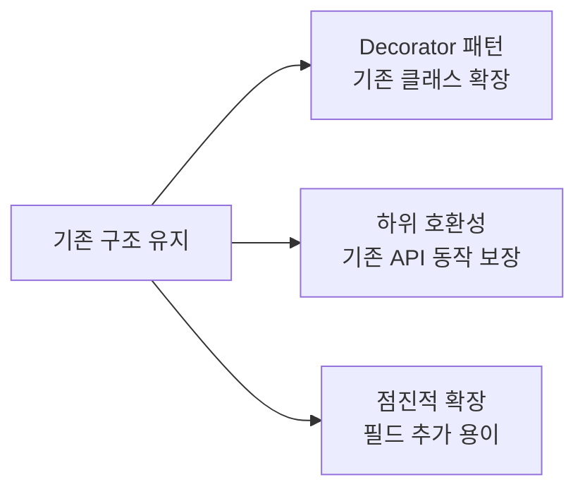
```mermaid
graph LR
    A["기존 구조 유지"] --> B["Decorator 패턴<br/>기존 클래스 확장"]
    A --> C["하위 호환성<br/>기존 API 동작 보장"]
    A --> D["점진적 확장<br/>필드 추가 용이"]
```

---

## 2. 현재 아키텍처 분석

### 2.1 현재 검색 흐름

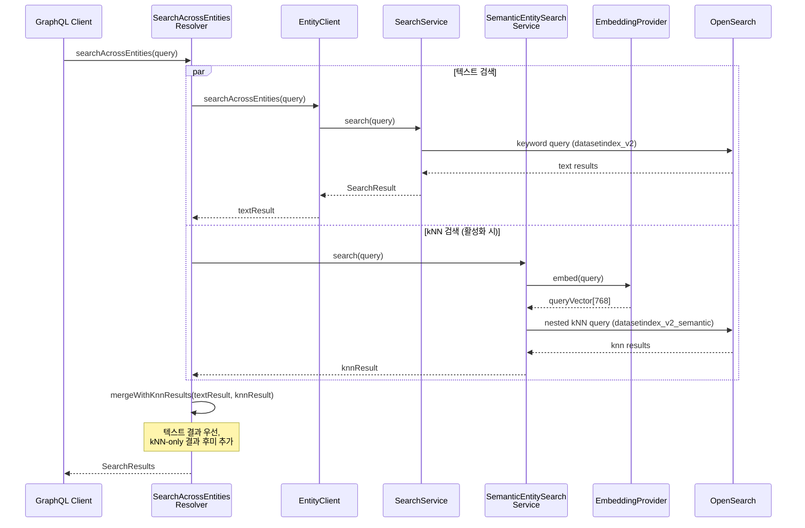
```mermaid
sequenceDiagram
    participant Client as GraphQL Client
    participant Resolver as SearchAcrossEntities<br/>Resolver
    participant EC as EntityClient
    participant SS as SearchService
    participant Sem as SemanticEntitySearch<br/>Service
    participant EP as EmbeddingProvider
    participant OS as OpenSearch

    Client->>Resolver: searchAcrossEntities(query)

    par 텍스트 검색
        Resolver->>EC: searchAcrossEntities(query)
        EC->>SS: search(query)
        SS->>OS: keyword query (datasetindex_v2)
        OS-->>SS: text results
        SS-->>EC: SearchResult
        EC-->>Resolver: textResult
    and kNN 검색 (활성화 시)
        Resolver->>Sem: search(query)
        Sem->>EP: embed(query)
        EP-->>Sem: queryVector[768]
        Sem->>OS: nested kNN query (datasetindex_v2_semantic)
        OS-->>Sem: knn results
        Sem-->>Resolver: knnResult
    end

    Resolver->>Resolver: mergeWithKnnResults(textResult, knnResult)
    Note over Resolver: 텍스트 결과 우선,<br/>kNN-only 결과 후미 추가
    Resolver-->>Client: SearchResults
```

### 2.2 현재 인덱스 구조 (단일 임베딩)

```json
{
  "embeddings": {
    "kure_v1": {
      "chunks": [
        {
          "vector": [0.1, 0.2, ...],   // 단일 벡터
          "text": "테이블명 + 설명 + 컬럼명"  // 모든 필드 결합
        }
      ]
    }
  }
}
```

### 2.3 현재 코드 구조

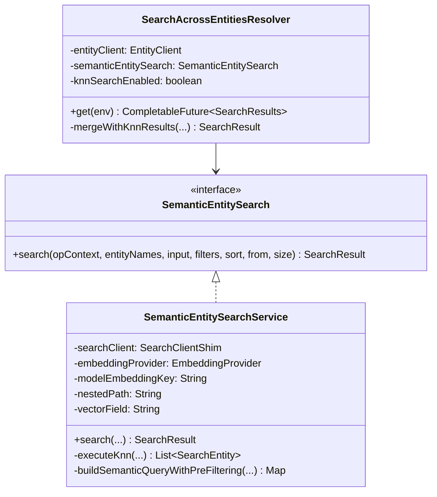
```mermaid
classDiagram
    class SemanticEntitySearch {
        <<interface>>
        +search(opContext, entityNames, input, filters, sort, from, size) SearchResult
    }

    class SemanticEntitySearchService {
        -searchClient: SearchClientShim
        -embeddingProvider: EmbeddingProvider
        -modelEmbeddingKey: String
        -nestedPath: String
        -vectorField: String
        +search(...) SearchResult
        -executeKnn(...) List~SearchEntity~
        -buildSemanticQueryWithPreFiltering(...) Map
    }

    class SearchAcrossEntitiesResolver {
        -entityClient: EntityClient
        -semanticEntitySearch: SemanticEntitySearch
        -knnSearchEnabled: boolean
        +get(env) CompletableFuture~SearchResults~
        -mergeWithKnnResults(...) SearchResult
    }

    SemanticEntitySearch <|.. SemanticEntitySearchService
    SearchAcrossEntitiesResolver --> SemanticEntitySearch
```

**핵심 파일 위치**:

| 컴포넌트               | 파일                                                                                        |
| ---------------------- | ------------------------------------------------------------------------------------------- |
| GraphQL 리졸버         | `datahub-graphql-core/src/main/java/.../resolvers/search/SearchAcrossEntitiesResolver.java` |
| 시맨틱 검색 서비스     | `metadata-io/src/main/java/.../search/semantic/SemanticEntitySearchService.java`            |
| 시맨틱 검색 인터페이스 | `metadata-io/src/main/java/.../search/semantic/SemanticEntitySearch.java`                   |
| 매핑 빌더              | `metadata-io/src/main/java/.../index/entity/v2/V2SemanticSearchMappingsBuilder.java`        |
| 임베딩 훅              | `metadata-jobs/mae-consumer/src/main/java/.../hook/DatasetEmbeddingHook.java`               |
| 설정                   | `metadata-service/configuration/src/main/resources/application.yaml`                        |

---

## 3. 멀티 필드 kNN 설계

### 3.1 인덱스 구조 확장

단일 `chunks` 배열 대신, **필드별 벡터**를 별도 경로에 저장합니다.

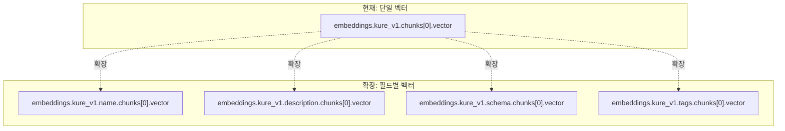
```mermaid
graph TB
    subgraph "현재: 단일 벡터"
        A["embeddings.kure_v1.chunks[0].vector"]
    end

    subgraph "확장: 필드별 벡터"
        B["embeddings.kure_v1.name.chunks[0].vector"]
        C["embeddings.kure_v1.description.chunks[0].vector"]
        D["embeddings.kure_v1.schema.chunks[0].vector"]
        E["embeddings.kure_v1.tags.chunks[0].vector"]
    end

    A -.->|확장| B
    A -.->|확장| C
    A -.->|확장| D
    A -.->|확장| E
```

확장된 인덱스 매핑:

```json
{
  "embeddings": {
    "properties": {
      "kure_v1": {
        "properties": {
          "name": {
            "properties": {
              "chunks": {
                "type": "nested",
                "properties": {
                  "vector": { "type": "knn_vector", "dimension": 768 },
                  "text": { "type": "text", "index": false }
                }
              }
            }
          },
          "description": {
            "properties": {
              "chunks": {
                "type": "nested",
                "properties": {
                  "vector": { "type": "knn_vector", "dimension": 768 },
                  "text": { "type": "text", "index": false }
                }
              }
            }
          },
          "schema": {
            "properties": {
              "chunks": {
                "type": "nested",
                "properties": {
                  "vector": { "type": "knn_vector", "dimension": 768 },
                  "text": { "type": "text", "index": false }
                }
              }
            }
          }
        }
      }
    }
  }
}
```

### 3.2 전체 아키텍처 (확장 후)

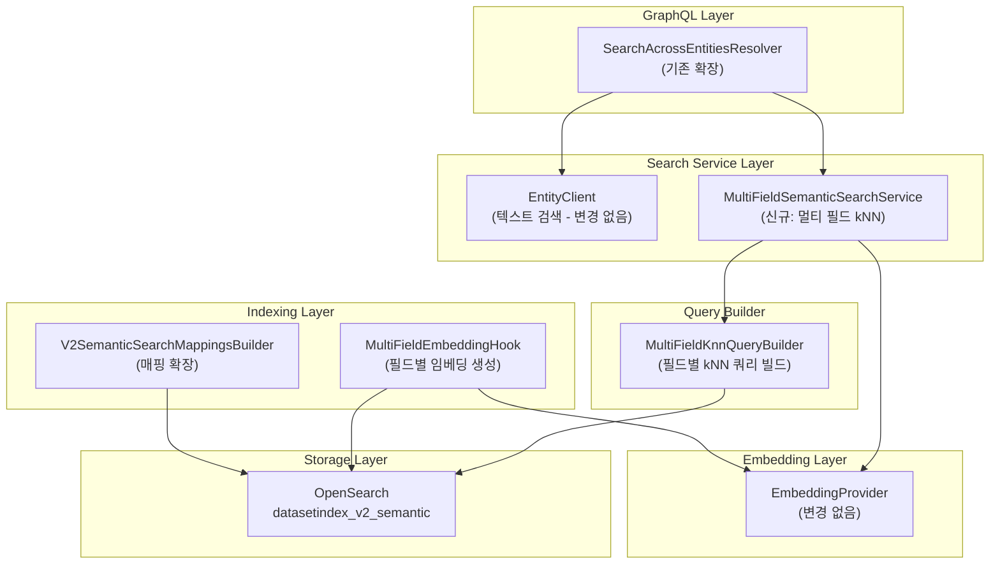
```mermaid
graph TB
    subgraph "GraphQL Layer"
        RESOLVER["SearchAcrossEntitiesResolver<br/>(기존 확장)"]
    end

    subgraph "Search Service Layer"
        TEXT_SEARCH["EntityClient<br/>(텍스트 검색 - 변경 없음)"]
        MULTI_KNN["MultiFieldSemanticSearchService<br/>(신규: 멀티 필드 kNN)"]
    end

    subgraph "Query Builder"
        QUERY_BUILDER["MultiFieldKnnQueryBuilder<br/>(필드별 kNN 쿼리 빌드)"]
    end

    subgraph "Embedding Layer"
        EMB_PROVIDER["EmbeddingProvider<br/>(변경 없음)"]
    end

    subgraph "Indexing Layer"
        MULTI_HOOK["MultiFieldEmbeddingHook<br/>(필드별 임베딩 생성)"]
        MAPPINGS["V2SemanticSearchMappingsBuilder<br/>(매핑 확장)"]
    end

    subgraph "Storage Layer"
        OS["OpenSearch<br/>datasetindex_v2_semantic"]
    end

    RESOLVER --> TEXT_SEARCH
    RESOLVER --> MULTI_KNN
    MULTI_KNN --> QUERY_BUILDER
    MULTI_KNN --> EMB_PROVIDER
    QUERY_BUILDER --> OS
    MULTI_HOOK --> EMB_PROVIDER
    MULTI_HOOK --> OS
    MAPPINGS --> OS
```

---

## 4. Step 1: 인덱스 매핑 확장

### 4.1 설정 확장

`application.yaml`에 필드별 임베딩 설정을 추가합니다.

```yaml
elasticsearch:
  entityIndex:
    semanticSearch:
      enabled: true
      enabledEntities: dataset
      models:
        kure_v1:
          vectorDimension: 768
          knnEngine: faiss
          spaceType: cosinesimil
          efConstruction: 128
          m: 16
          # 신규: 필드별 임베딩 설정
          fields:
            - fieldName: name
              weight: 1.5 # 검색 시 가중치
              maxLength: 256 # 텍스트 최대 길이
            - fieldName: description
              weight: 2.0
              maxLength: 2048
            - fieldName: schema
              weight: 1.0
              maxLength: 1024
```

### 4.2 설정 클래스 확장

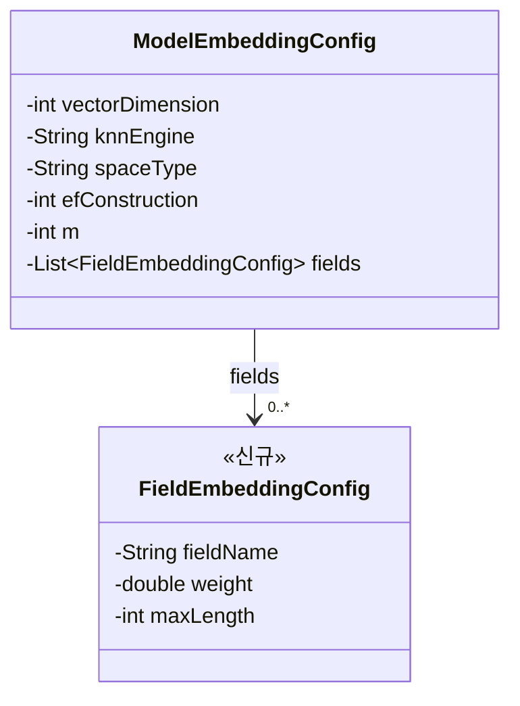
```mermaid
classDiagram
    class ModelEmbeddingConfig {
        -int vectorDimension
        -String knnEngine
        -String spaceType
        -int efConstruction
        -int m
        -List~FieldEmbeddingConfig~ fields
    }

    class FieldEmbeddingConfig {
        <<신규>>
        -String fieldName
        -double weight
        -int maxLength
    }

    ModelEmbeddingConfig --> "0..*" FieldEmbeddingConfig : fields
```

**구현 코드** (`ModelEmbeddingConfig.java` 확장):

```java
@Data
@NoArgsConstructor
@AllArgsConstructor
public class ModelEmbeddingConfig {
    private int vectorDimension = 3072;
    private String knnEngine = "faiss";
    private String spaceType = "cosinesimil";
    private int efConstruction = 128;
    private int m = 16;

    // 신규: 필드별 임베딩 설정
    private List<FieldEmbeddingConfig> fields = List.of();
}
```

```java
// 신규 클래스
@Data
@NoArgsConstructor
@AllArgsConstructor
public class FieldEmbeddingConfig {
    private String fieldName;
    private double weight = 1.0;
    private int maxLength = 2048;
}
```

### 4.3 매핑 빌더 확장

`V2SemanticSearchMappingsBuilder.buildEmbeddingFieldConfig()`를 확장합니다.

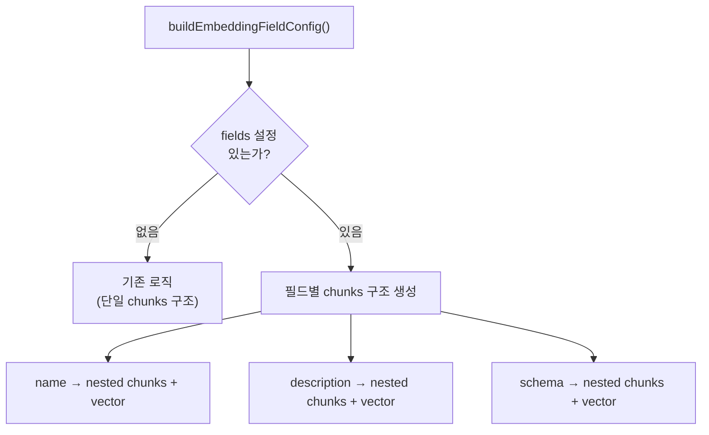
```mermaid
flowchart TD
    A["buildEmbeddingFieldConfig()"] --> B{fields 설정<br/>있는가?}
    B -->|없음| C["기존 로직<br/>(단일 chunks 구조)"]
    B -->|있음| D["필드별 chunks 구조 생성"]

    D --> E["name → nested chunks + vector"]
    D --> F["description → nested chunks + vector"]
    D --> G["schema → nested chunks + vector"]
```

**확장 코드** (의사 코드):

```java
private Map<String, Object> buildEmbeddingFieldConfig() {
    Map<String, Object> modelProperties = new HashMap<>();

    for (Map.Entry<String, ModelEmbeddingConfig> entry : semanticConfig.getModels().entrySet()) {
        String modelKey = entry.getKey();
        ModelEmbeddingConfig modelConfig = entry.getValue();
        List<FieldEmbeddingConfig> fieldConfigs = modelConfig.getFields();

        if (fieldConfigs == null || fieldConfigs.isEmpty()) {
            // 기존 로직: 단일 chunks 구조 (하위 호환)
            modelProperties.put(modelKey, buildSingleChunksConfig(modelConfig));
        } else {
            // 신규 로직: 필드별 chunks 구조
            Map<String, Object> fieldProperties = new HashMap<>();
            for (FieldEmbeddingConfig fieldConfig : fieldConfigs) {
                fieldProperties.put(
                    fieldConfig.getFieldName(),
                    buildChunksConfig(modelConfig)  // 같은 벡터 차원 사용
                );
            }
            // 하위 호환: 기존 단일 chunks도 유지
            fieldProperties.put("chunks", buildChunksNestedField(modelConfig));
            modelProperties.put(modelKey, Map.of("properties", fieldProperties));
        }
    }

    return Map.of("properties", modelProperties);
}
```

---

## 5. Step 2: 임베딩 생성 확장

### 5.1 필드별 임베딩 생성 흐름

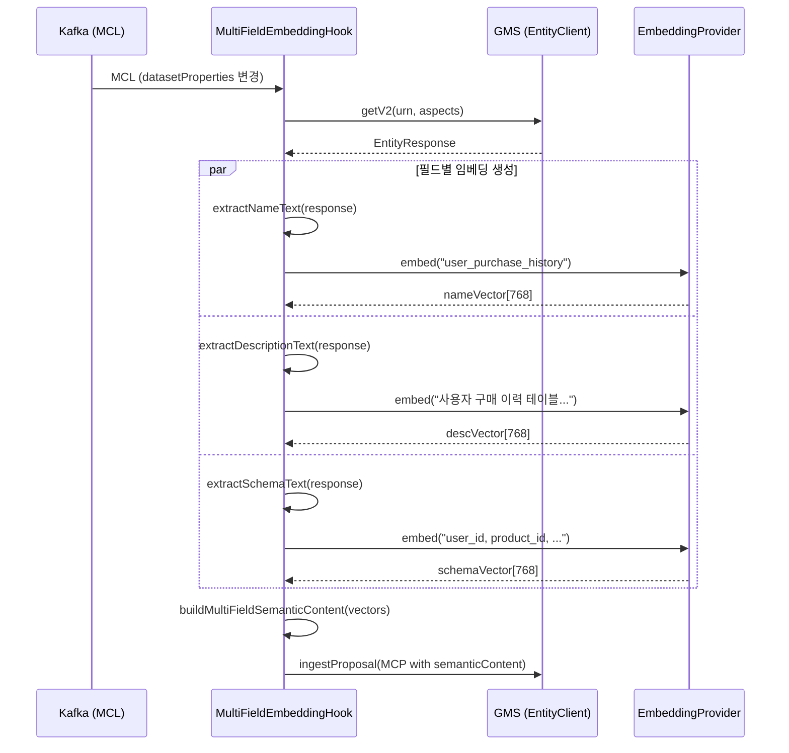
```mermaid
sequenceDiagram
    participant Kafka as Kafka (MCL)
    participant Hook as MultiFieldEmbeddingHook
    participant GMS as GMS (EntityClient)
    participant EP as EmbeddingProvider

    Kafka->>Hook: MCL (datasetProperties 변경)
    Hook->>GMS: getV2(urn, aspects)
    GMS-->>Hook: EntityResponse

    par 필드별 임베딩 생성
        Hook->>Hook: extractNameText(response)
        Hook->>EP: embed("user_purchase_history")
        EP-->>Hook: nameVector[768]
    and
        Hook->>Hook: extractDescriptionText(response)
        Hook->>EP: embed("사용자 구매 이력 테이블...")
        EP-->>Hook: descVector[768]
    and
        Hook->>Hook: extractSchemaText(response)
        Hook->>EP: embed("user_id, product_id, ...")
        EP-->>Hook: schemaVector[768]
    end

    Hook->>Hook: buildMultiFieldSemanticContent(vectors)
    Hook->>GMS: ingestProposal(MCP with semanticContent)
```

### 5.2 DatasetEmbeddingHook 확장

기존 `DatasetEmbeddingHook`을 확장하여 필드별 임베딩을 생성합니다.

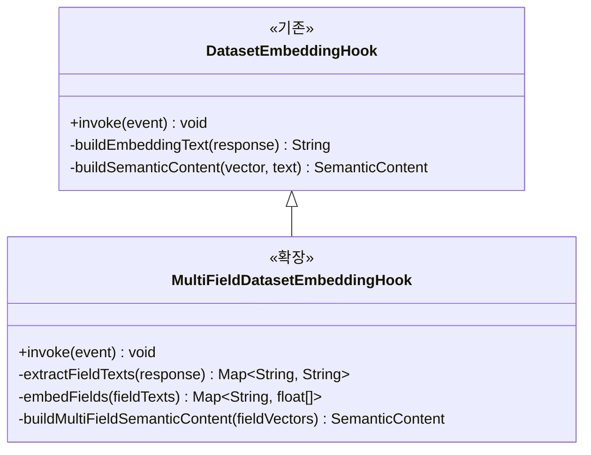
```mermaid
classDiagram
    class DatasetEmbeddingHook {
        <<기존>>
        +invoke(event) void
        -buildEmbeddingText(response) String
        -buildSemanticContent(vector, text) SemanticContent
    }

    class MultiFieldDatasetEmbeddingHook {
        <<확장>>
        +invoke(event) void
        -extractFieldTexts(response) Map~String, String~
        -embedFields(fieldTexts) Map~String, float[]~
        -buildMultiFieldSemanticContent(fieldVectors) SemanticContent
    }

    DatasetEmbeddingHook <|-- MultiFieldDatasetEmbeddingHook
```

**구현 핵심 코드**:

```java
/**
 * 필드별 텍스트를 추출하여 각각 임베딩을 생성합니다.
 * 기존 단일 임베딩도 하위 호환을 위해 유지합니다.
 */
private Map<String, float[]> embedFields(EntityResponse response) {
    Map<String, float[]> fieldVectors = new LinkedHashMap<>();

    // name 필드
    String nameText = extractNameText(response);
    if (nameText != null && !nameText.isEmpty()) {
        fieldVectors.put("name", embeddingProvider.embed(
            truncate(nameText, nameMaxLength), null));
    }

    // description 필드
    String descText = extractDescriptionText(response);
    if (descText != null && !descText.isEmpty()) {
        fieldVectors.put("description", embeddingProvider.embed(
            truncate(descText, descMaxLength), null));
    }

    // schema 필드
    String schemaText = extractSchemaText(response);
    if (schemaText != null && !schemaText.isEmpty()) {
        fieldVectors.put("schema", embeddingProvider.embed(
            truncate(schemaText, schemaMaxLength), null));
    }

    return fieldVectors;
}
```

### 5.3 SemanticContent PDL 확장

기존 `SemanticContent` PDL 스키마와의 호환성을 유지합니다.

```
record SemanticContent {
  // 기존: 단일 임베딩 (하위 호환)
  embeddings: map[string, EmbeddingModelData]

  // 신규: 필드별 임베딩
  fieldEmbeddings: optional map[string, map[string, EmbeddingModelData]]
  // 예: { "kure_v1": { "name": {...}, "description": {...} } }
}
```

또는 기존 `embeddings` 맵의 키를 `{model}_{field}` 형식으로 확장할 수도 있습니다.
이 경우 PDL 스키마 변경 없이 매핑만 변경하면 됩니다:

```
embeddings: {
  "kure_v1": { ... }          // 기존 단일 임베딩 (하위 호환)
  "kure_v1__name": { ... }    // 필드별 임베딩
  "kure_v1__desc": { ... }
}
```

---

## 6. Step 3: kNN 쿼리 빌더 확장

### 6.1 멀티 필드 kNN 쿼리 전략

여러 필드에 대해 kNN 검색을 수행하는 두 가지 전략이 있습니다.

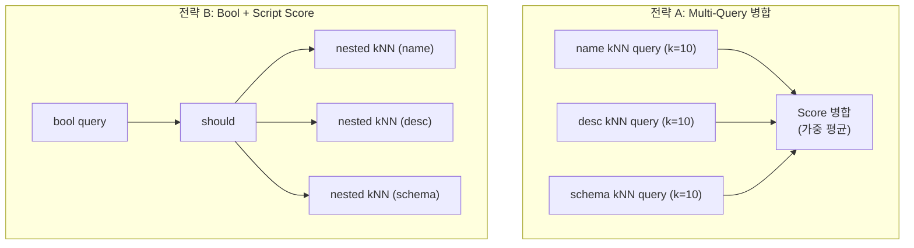
```mermaid
graph TB
    subgraph "전략 A: Multi-Query 병합"
        A1["name kNN query (k=10)"] --> MERGE_A["Score 병합<br/>(가중 평균)"]
        A2["desc kNN query (k=10)"] --> MERGE_A
        A3["schema kNN query (k=10)"] --> MERGE_A
    end

    subgraph "전략 B: Bool + Script Score"
        B1["bool query"] --> SHOULD["should"]
        SHOULD --> B2["nested kNN (name)"]
        SHOULD --> B3["nested kNN (desc)"]
        SHOULD --> B4["nested kNN (schema)"]
    end
```

**전략 A (권장): Multi-Query 후 병합**

- 각 필드에 대해 별도의 kNN 쿼리를 실행하고 결과를 가중 병합
- 장점: 각 필드의 k 값을 독립적으로 조절 가능, 필드별 성능 모니터링 가능
- 단점: 쿼리 수 증가 (필드 수만큼)

**전략 B: Bool Should 조합**

- 하나의 bool 쿼리 안에 여러 nested kNN을 should로 조합
- OpenSearch에서 nested kNN을 bool should로 조합하면 점수가 합산됨
- 장점: 단일 쿼리, 네트워크 오버헤드 최소
- 단점: 필드별 가중치 제어가 제한적

### 6.2 전략 A 구현: MultiFieldKnnQueryBuilder

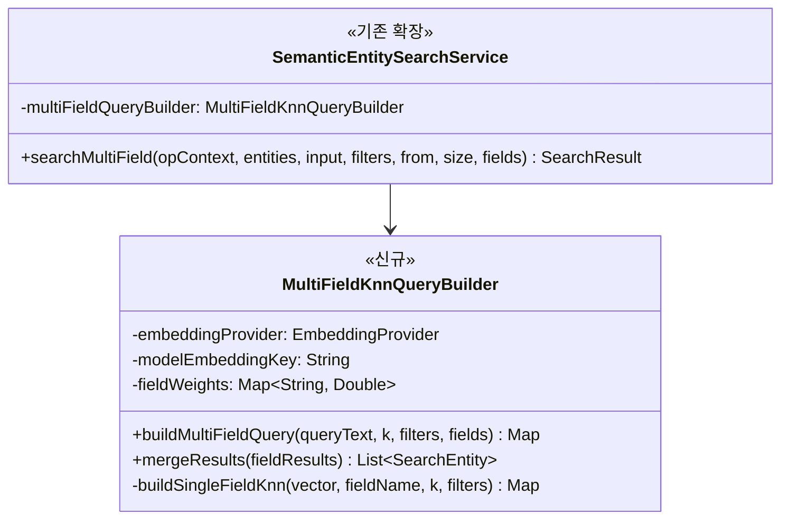
```mermaid
classDiagram
    class MultiFieldKnnQueryBuilder {
        <<신규>>
        -embeddingProvider: EmbeddingProvider
        -modelEmbeddingKey: String
        -fieldWeights: Map~String, Double~
        +buildMultiFieldQuery(queryText, k, filters, fields) Map
        +mergeResults(fieldResults) List~SearchEntity~
        -buildSingleFieldKnn(vector, fieldName, k, filters) Map
    }

    class SemanticEntitySearchService {
        <<기존 확장>>
        -multiFieldQueryBuilder: MultiFieldKnnQueryBuilder
        +searchMultiField(opContext, entities, input, filters, from, size, fields) SearchResult
    }

    SemanticEntitySearchService --> MultiFieldKnnQueryBuilder
```

**핵심 구현 코드**:

```java
/**
 * 여러 필드에 대해 각각 kNN 쿼리를 실행하고 가중 병합합니다.
 */
public List<SearchEntity> searchMultiField(
        ObjectMapper objectMapper,
        List<String> indices,
        String queryText,
        int k,
        Map<String, Object> filters,
        Set<String> fieldsToFetch,
        Map<String, Double> fieldWeights) {

    // 1. 쿼리 텍스트로 임베딩 생성 (동일 벡터를 모든 필드에 사용)
    float[] queryVector = embeddingProvider.embed(queryText, null);

    // 2. 필드별 kNN 실행 (병렬)
    Map<String, List<SearchEntity>> fieldResults = new ConcurrentHashMap<>();
    fieldWeights.entrySet().parallelStream().forEach(entry -> {
        String fieldName = entry.getKey();
        String nestedPath = String.format(
            "embeddings.%s.%s.chunks", modelEmbeddingKey, fieldName);
        String vectorField = nestedPath + ".vector";

        List<SearchEntity> results = executeKnn(
            objectMapper, indices, queryVector, k,
            filters, fieldsToFetch, nestedPath, vectorField);
        fieldResults.put(fieldName, results);
    });

    // 3. 가중 병합
    return mergeResults(fieldResults, fieldWeights);
}

/**
 * 필드별 결과를 가중치를 적용하여 병합합니다.
 * 동일 URN이 여러 필드에서 반환되면 가중 점수를 합산합니다.
 */
private List<SearchEntity> mergeResults(
        Map<String, List<SearchEntity>> fieldResults,
        Map<String, Double> fieldWeights) {

    Map<String, MergedScore> mergedScores = new LinkedHashMap<>();

    for (Map.Entry<String, List<SearchEntity>> entry : fieldResults.entrySet()) {
        String fieldName = entry.getKey();
        double weight = fieldWeights.getOrDefault(fieldName, 1.0);

        for (SearchEntity entity : entry.getValue()) {
            String urn = entity.getEntity().toString();
            mergedScores
                .computeIfAbsent(urn, k -> new MergedScore(entity))
                .addScore(entity.getScore() * weight);
        }
    }

    // 합산 점수로 정렬
    return mergedScores.values().stream()
        .sorted(Comparator.comparingDouble(MergedScore::getTotalScore).reversed())
        .map(MergedScore::toSearchEntity)
        .collect(Collectors.toList());
}
```

### 6.3 전략 B 구현: Bool Should 조합 쿼리

```java
/**
 * Bool should로 여러 nested kNN을 조합하는 단일 쿼리를 생성합니다.
 */
private Map<String, Object> buildMultiFieldBoolQuery(
        float[] queryVector,
        int k,
        Map<String, Object> filters,
        Set<String> fieldsToFetch,
        Map<String, Double> fieldWeights) {

    // should 절에 각 필드의 nested kNN을 추가
    List<Map<String, Object>> shouldClauses = new ArrayList<>();

    for (Map.Entry<String, Double> entry : fieldWeights.entrySet()) {
        String fieldName = entry.getKey();
        double boost = entry.getValue();
        String nestedPath = String.format(
            "embeddings.%s.%s.chunks", modelEmbeddingKey, fieldName);
        String vectorField = nestedPath + ".vector";

        Map<String, Object> knnClause = Map.of(
            "nested", Map.of(
                "path", nestedPath,
                "score_mode", "max",
                "query", Map.of(
                    "knn", Map.of(
                        vectorField, Map.of(
                            "vector", convertToFloatList(queryVector),
                            "k", k
                        )
                    )
                ),
                "boost", boost
            )
        );
        shouldClauses.add(knnClause);
    }

    // Bool query 조립
    Map<String, Object> boolQuery = new HashMap<>();
    boolQuery.put("should", shouldClauses);
    boolQuery.put("minimum_should_match", 1);
    if (filters != null && !filters.isEmpty()) {
        boolQuery.put("filter", List.of(filters));
    }

    return Map.of(
        "size", k,
        "track_total_hits", false,
        "_source", fieldsToFetch.toArray(new String[0]),
        "query", Map.of("bool", boolQuery)
    );
}
```

생성되는 OpenSearch 쿼리:

```json
{
  "size": 10,
  "query": {
    "bool": {
      "should": [
        {
          "nested": {
            "path": "embeddings.kure_v1.name.chunks",
            "score_mode": "max",
            "query": {
              "knn": {
                "embeddings.kure_v1.name.chunks.vector": {
                  "vector": [0.1, 0.2, ...],
                  "k": 10
                }
              }
            },
            "boost": 1.5
          }
        },
        {
          "nested": {
            "path": "embeddings.kure_v1.description.chunks",
            "score_mode": "max",
            "query": {
              "knn": {
                "embeddings.kure_v1.description.chunks.vector": {
                  "vector": [0.1, 0.2, ...],
                  "k": 10
                }
              }
            },
            "boost": 2.0
          }
        }
      ],
      "minimum_should_match": 1,
      "filter": [...]
    }
  }
}
```

---

## 7. Step 4: GraphQL 스키마 확장

### 7.1 기존 스키마와 확장

기존 `SearchAcrossEntitiesInput`에 시맨틱 검색 옵션을 추가합니다.

**파일**: `datahub-graphql-core/src/main/resources/search.graphql`

```graphql
"""
시맨틱 검색에서 필드별 가중치를 지정하는 입력
"""
input SemanticFieldWeight {
  """
  검색할 필드 이름 (name, description, schema 등)
  """
  fieldName: String!

  """
  가중치 (기본값: 1.0). 높을수록 해당 필드의 유사도가 중요
  """
  weight: Float
}

"""
시맨틱 검색 옵션
"""
input SemanticSearchOptions {
  """
  시맨틱 검색 활성화 여부 (기본: false → 키워드 검색만)
  """
  enabled: Boolean

  """
  필드별 가중치 목록. 비어있으면 모든 필드에 동일 가중치 사용
  """
  fieldWeights: [SemanticFieldWeight!]

  """
  키워드 검색 결과와의 병합 전략
  """
  mergeStrategy: SemanticMergeStrategy
}

"""
키워드 검색과 시맨틱 검색 결과의 병합 전략
"""
enum SemanticMergeStrategy {
  """
  텍스트 결과 우선, 시맨틱-only 결과 후미 추가 (기본값)
  """
  TEXT_FIRST

  """
  시맨틱 결과 우선
  """
  SEMANTIC_FIRST

  """
  시맨틱 결과만 반환
  """
  SEMANTIC_ONLY
}
```

### 7.2 기존 SearchAcrossEntitiesInput 확장

```graphql
input SearchAcrossEntitiesInput {
  # ... 기존 필드 (변경 없음) ...
  types: [EntityType!]
  query: String!
  start: Int
  count: Int
  filters: [FacetFilterInput!]
  orFilters: [AndFilterInput!]
  viewUrn: String
  sortInput: SearchSortInput
  searchFlags: SearchFlags

  # 신규: 시맨틱 검색 옵션
  semanticOptions: SemanticSearchOptions
}
```

### 7.3 스키마 변경의 하위 호환성

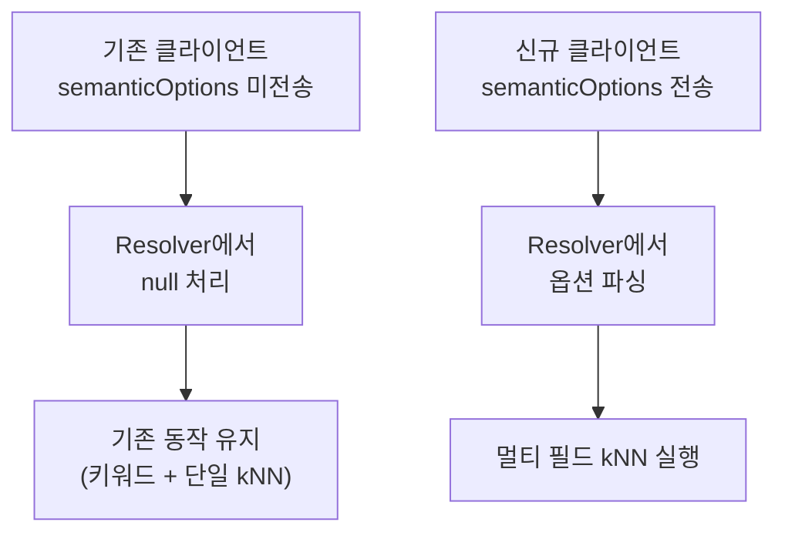
```mermaid
graph TD
    A["기존 클라이언트<br/>semanticOptions 미전송"] --> B["Resolver에서<br/>null 처리"]
    B --> C["기존 동작 유지<br/>(키워드 + 단일 kNN)"]

    D["신규 클라이언트<br/>semanticOptions 전송"] --> E["Resolver에서<br/>옵션 파싱"]
    E --> F["멀티 필드 kNN 실행"]
```

---

## 8. Step 5: GraphQL 리졸버 확장

### 8.1 SearchAcrossEntitiesResolver 확장

기존 리졸버에 멀티 필드 kNN 지원을 추가합니다.

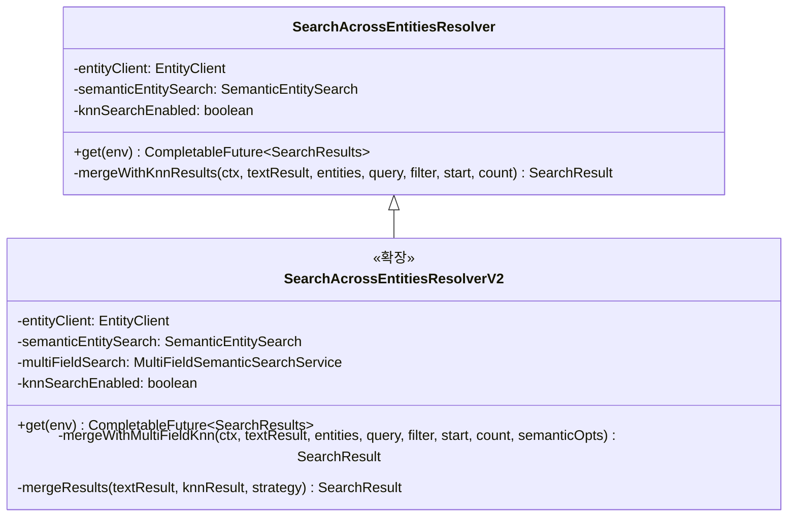
```mermaid
classDiagram
    class SearchAcrossEntitiesResolver {
        -entityClient: EntityClient
        -semanticEntitySearch: SemanticEntitySearch
        -knnSearchEnabled: boolean
        +get(env) CompletableFuture~SearchResults~
        -mergeWithKnnResults(ctx, textResult, entities, query, filter, start, count) SearchResult
    }

    class SearchAcrossEntitiesResolverV2 {
        <<확장>>
        -entityClient: EntityClient
        -semanticEntitySearch: SemanticEntitySearch
        -multiFieldSearch: MultiFieldSemanticSearchService
        -knnSearchEnabled: boolean
        +get(env) CompletableFuture~SearchResults~
        -mergeWithMultiFieldKnn(ctx, textResult, entities, query, filter, start, count, semanticOpts) SearchResult
        -mergeResults(textResult, knnResult, strategy) SearchResult
    }

    SearchAcrossEntitiesResolver <|-- SearchAcrossEntitiesResolverV2
```

**구현 코드**:

```java
@Override
public CompletableFuture<SearchResults> get(DataFetchingEnvironment environment) {
    // ... 기존 코드 ...

    return GraphQLConcurrencyUtils.supplyAsync(() -> {
        // ... 기존 텍스트 검색 실행 ...
        SearchResult searchResult = _entityClient.searchAcrossEntities(...);

        // 시맨틱 검색 옵션 확인
        SemanticSearchOptions semanticOpts = input.getSemanticOptions();

        if (semanticOpts != null && Boolean.TRUE.equals(semanticOpts.getEnabled())) {
            // 멀티 필드 kNN 검색
            searchResult = mergeWithMultiFieldKnn(
                context, searchResult, finalEntities,
                sanitizedQuery, combinedFilter, start, count, semanticOpts);
        } else if (_knnSearchEnabled && _semanticEntitySearch != null) {
            // 기존 단일 kNN 검색 (하위 호환)
            searchResult = mergeWithKnnResults(
                context, searchResult, finalEntities,
                sanitizedQuery, combinedFilter, start, count);
        }

        return UrnSearchResultsMapper.map(context, searchResult);
    });
}

/**
 * 멀티 필드 kNN 검색을 실행하고 텍스트 결과와 병합합니다.
 */
private SearchResult mergeWithMultiFieldKnn(
        QueryContext context,
        SearchResult textResult,
        List<String> entityNames,
        String query,
        Filter filter,
        int start,
        int count,
        SemanticSearchOptions semanticOpts) {
    try {
        // 필드별 가중치 맵 구성
        Map<String, Double> fieldWeights = new LinkedHashMap<>();
        if (semanticOpts.getFieldWeights() != null) {
            for (SemanticFieldWeight fw : semanticOpts.getFieldWeights()) {
                fieldWeights.put(fw.getFieldName(),
                    fw.getWeight() != null ? fw.getWeight() : 1.0);
            }
        }

        // 멀티 필드 kNN 실행
        SearchResult knnResult = _multiFieldSearch.searchMultiField(
            context.getOperationContext(),
            entityNames, query, filter, null, 0, count, fieldWeights);

        // 병합 전략 적용
        SemanticMergeStrategy strategy = semanticOpts.getMergeStrategy() != null
            ? semanticOpts.getMergeStrategy()
            : SemanticMergeStrategy.TEXT_FIRST;

        return mergeResults(textResult, knnResult, strategy);
    } catch (Exception e) {
        log.warn("Multi-field KNN search failed, falling back: {}", e.getMessage());
        return textResult;
    }
}
```

### 8.2 병합 전략 구현

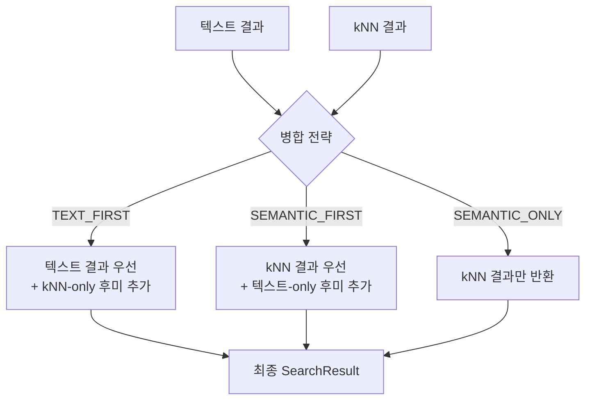
```mermaid
flowchart TD
    A["텍스트 결과"] --> D{병합 전략}
    B["kNN 결과"] --> D

    D -->|TEXT_FIRST| E["텍스트 결과 우선<br/>+ kNN-only 후미 추가"]
    D -->|SEMANTIC_FIRST| F["kNN 결과 우선<br/>+ 텍스트-only 후미 추가"]
    D -->|SEMANTIC_ONLY| G["kNN 결과만 반환"]

    E --> H["최종 SearchResult"]
    F --> H
    G --> H
```

```java
private SearchResult mergeResults(
        SearchResult textResult,
        SearchResult knnResult,
        SemanticMergeStrategy strategy) {

    switch (strategy) {
        case SEMANTIC_ONLY:
            return knnResult;

        case SEMANTIC_FIRST:
            return mergeOrderedResults(knnResult, textResult);

        case TEXT_FIRST:
        default:
            return mergeOrderedResults(textResult, knnResult);
    }
}

/**
 * 첫 번째 결과를 우선으로 하고, 두 번째 결과에서
 * 중복되지 않는 엔티티만 추가합니다.
 */
private SearchResult mergeOrderedResults(
        SearchResult primary, SearchResult secondary) {

    Map<String, SearchEntity> seen = new LinkedHashMap<>();
    for (SearchEntity e : primary.getEntities()) {
        seen.put(e.getEntity().toString(), e);
    }
    for (SearchEntity e : secondary.getEntities()) {
        seen.putIfAbsent(e.getEntity().toString(), e);
    }

    SearchEntityArray merged = new SearchEntityArray(seen.values());
    return primary.clone()
        .setEntities(merged)
        .setNumEntities(merged.size());
}
```

### 8.3 Factory 등록

**파일**: `metadata-service/factories/src/main/java/com/linkedin/gms/factory/graphql/GraphQLEngineFactory.java`

```java
// 기존 코드에서 resolver 등록 부분 확장
SearchAcrossEntitiesResolver searchResolver;
if (multiFieldSemanticSearchService != null) {
    searchResolver = new SearchAcrossEntitiesResolverV2(
        entityClient, viewService,
        semanticEntitySearch, multiFieldSemanticSearchService,
        knnSearchEnabled);
} else {
    searchResolver = new SearchAcrossEntitiesResolver(
        entityClient, viewService, semanticEntitySearch, knnSearchEnabled);
}
```

---

## 9. 전체 시퀀스 다이어그램

### 9.1 멀티 필드 kNN 검색 전체 흐름

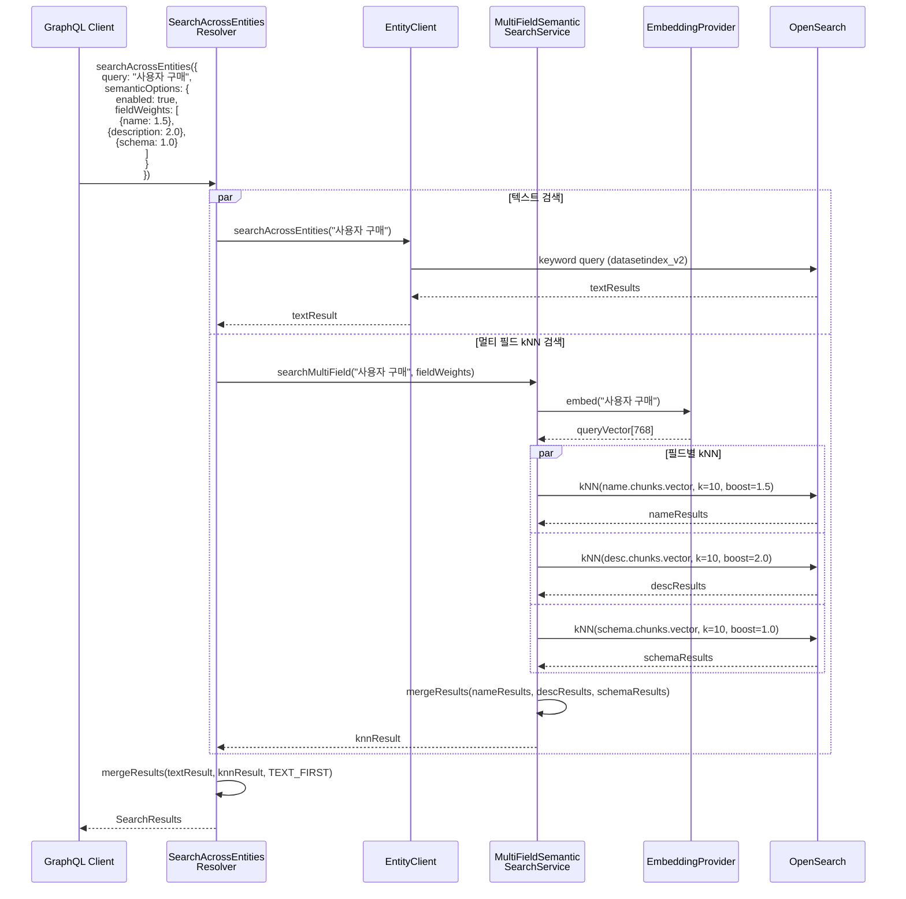
```mermaid
sequenceDiagram
    participant Client as GraphQL Client
    participant Resolver as SearchAcrossEntities<br/>Resolver
    participant EC as EntityClient
    participant MFSS as MultiFieldSemantic<br/>SearchService
    participant EP as EmbeddingProvider
    participant OS as OpenSearch

    Client->>Resolver: searchAcrossEntities({<br/>  query: "사용자 구매",<br/>  semanticOptions: {<br/>    enabled: true,<br/>    fieldWeights: [<br/>      {name: 1.5},<br/>      {description: 2.0},<br/>      {schema: 1.0}<br/>    ]<br/>  }<br/>})

    par 텍스트 검색
        Resolver->>EC: searchAcrossEntities("사용자 구매")
        EC->>OS: keyword query (datasetindex_v2)
        OS-->>EC: textResults
        EC-->>Resolver: textResult
    and 멀티 필드 kNN 검색
        Resolver->>MFSS: searchMultiField("사용자 구매", fieldWeights)
        MFSS->>EP: embed("사용자 구매")
        EP-->>MFSS: queryVector[768]

        par 필드별 kNN
            MFSS->>OS: kNN(name.chunks.vector, k=10, boost=1.5)
            OS-->>MFSS: nameResults
        and
            MFSS->>OS: kNN(desc.chunks.vector, k=10, boost=2.0)
            OS-->>MFSS: descResults
        and
            MFSS->>OS: kNN(schema.chunks.vector, k=10, boost=1.0)
            OS-->>MFSS: schemaResults
        end

        MFSS->>MFSS: mergeResults(nameResults, descResults, schemaResults)
        MFSS-->>Resolver: knnResult
    end

    Resolver->>Resolver: mergeResults(textResult, knnResult, TEXT_FIRST)
    Resolver-->>Client: SearchResults
```

### 9.2 임베딩 인덱싱 전체 흐름

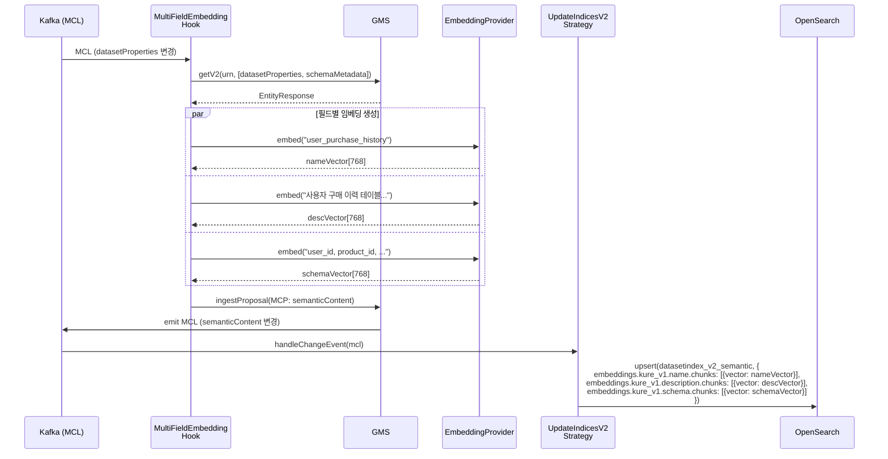
```mermaid
sequenceDiagram
    participant MCL as Kafka (MCL)
    participant Hook as MultiFieldEmbedding<br/>Hook
    participant GMS as GMS
    participant EP as EmbeddingProvider
    participant Update as UpdateIndicesV2<br/>Strategy
    participant OS as OpenSearch

    MCL->>Hook: MCL (datasetProperties 변경)
    Hook->>GMS: getV2(urn, [datasetProperties, schemaMetadata])
    GMS-->>Hook: EntityResponse

    par 필드별 임베딩 생성
        Hook->>EP: embed("user_purchase_history")
        EP-->>Hook: nameVector[768]
    and
        Hook->>EP: embed("사용자 구매 이력 테이블...")
        EP-->>Hook: descVector[768]
    and
        Hook->>EP: embed("user_id, product_id, ...")
        EP-->>Hook: schemaVector[768]
    end

    Hook->>GMS: ingestProposal(MCP: semanticContent)
    GMS->>MCL: emit MCL (semanticContent 변경)
    MCL->>Update: handleChangeEvent(mcl)
    Update->>OS: upsert(datasetindex_v2_semantic, {<br/>  embeddings.kure_v1.name.chunks: [{vector: nameVector}],<br/>  embeddings.kure_v1.description.chunks: [{vector: descVector}],<br/>  embeddings.kure_v1.schema.chunks: [{vector: schemaVector}]<br/>})
```

---

## 10. 기존 구조와의 호환성

### 10.1 변경 영향 분석

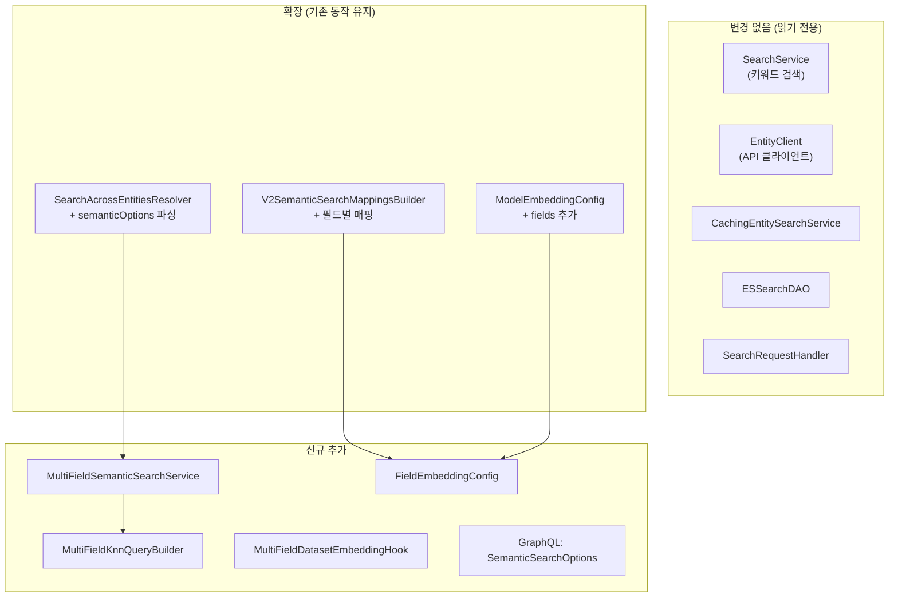
```mermaid
graph TB
    subgraph "변경 없음 (읽기 전용)"
        A["SearchService<br/>(키워드 검색)"]
        B["EntityClient<br/>(API 클라이언트)"]
        C["CachingEntitySearchService"]
        D["ESSearchDAO"]
        E["SearchRequestHandler"]
    end

    subgraph "확장 (기존 동작 유지)"
        F["SearchAcrossEntitiesResolver<br/>+ semanticOptions 파싱"]
        G["V2SemanticSearchMappingsBuilder<br/>+ 필드별 매핑"]
        H["ModelEmbeddingConfig<br/>+ fields 추가"]
    end

    subgraph "신규 추가"
        I["MultiFieldSemanticSearchService"]
        J["MultiFieldKnnQueryBuilder"]
        K["FieldEmbeddingConfig"]
        L["MultiFieldDatasetEmbeddingHook"]
        M["GraphQL: SemanticSearchOptions"]
    end

    F --> I
    G --> K
    H --> K
    I --> J
```

### 10.2 호환성 보장 전략

| 항목                                                    | 기존 동작         | 확장 후               |
| ------------------------------------------------------- | ----------------- | --------------------- |
| `semanticOptions` 미전송                                | 키워드 + 단일 kNN | **변경 없음**         |
| `semanticOptions.enabled=false`                         | -                 | 키워드 검색만         |
| `semanticOptions.enabled=true`, `fieldWeights` 비어있음 | -                 | 모든 필드 동일 가중치 |
| `semanticOptions.enabled=true`, `fieldWeights` 지정     | -                 | 필드별 가중치 적용    |
| 기존 `_knnSearchEnabled=true`                           | 단일 kNN          | **변경 없음**         |
| 기존 `semanticSearch` GraphQL 쿼리                      | 단일 kNN          | **변경 없음**         |

### 10.3 마이그레이션 전략

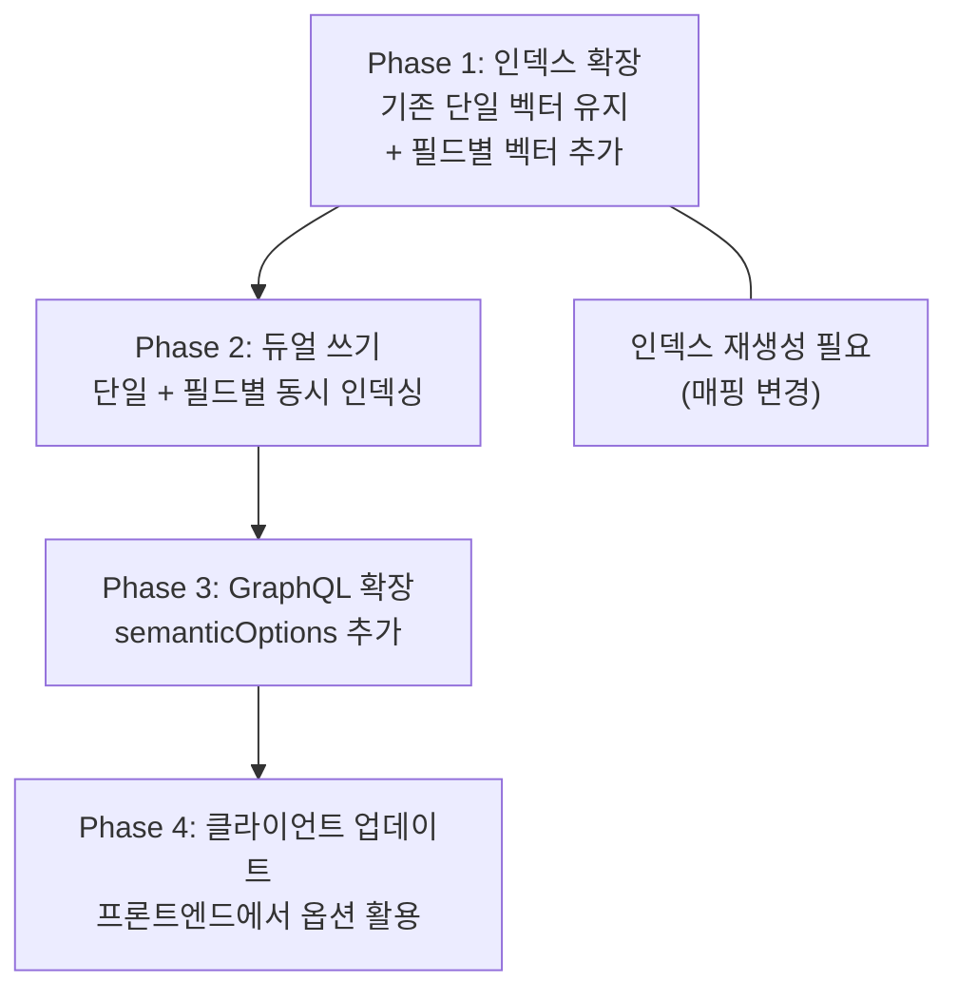
```mermaid
flowchart TD
    Phase1["Phase 1: 인덱스 확장<br/>기존 단일 벡터 유지<br/>+ 필드별 벡터 추가"]
    Phase2["Phase 2: 듀얼 쓰기<br/>단일 + 필드별 동시 인덱싱"]
    Phase3["Phase 3: GraphQL 확장<br/>semanticOptions 추가"]
    Phase4["Phase 4: 클라이언트 업데이트<br/>프론트엔드에서 옵션 활용"]

    Phase1 --> Phase2 --> Phase3 --> Phase4

    Note1["인덱스 재생성 필요<br/>(매핑 변경)"]
    Phase1 --- Note1
```

---

## 11. 테스트 전략

### 11.1 단위 테스트

```java
// MultiFieldKnnQueryBuilder 테스트
@Test
void testBuildMultiFieldBoolQuery() {
    float[] vector = new float[]{0.1f, 0.2f, 0.3f};
    Map<String, Double> weights = Map.of(
        "name", 1.5,
        "description", 2.0
    );

    Map<String, Object> query = builder.buildMultiFieldBoolQuery(
        vector, 10, null, Set.of("urn"), weights);

    // bool.should에 두 개의 nested kNN이 있는지 확인
    Map<String, Object> bool = (Map<String, Object>) query.get("query");
    List<Map<String, Object>> should = (List<Map<String, Object>>) bool.get("should");
    assertEquals(2, should.size());
}

// 결과 병합 테스트
@Test
void testMergeResults_textFirst() {
    SearchResult textResult = createSearchResult("urn1", "urn2");
    SearchResult knnResult = createSearchResult("urn2", "urn3");

    SearchResult merged = mergeResults(textResult, knnResult, TEXT_FIRST);

    // urn1, urn2 (텍스트에서), urn3 (kNN-only) 순서
    assertEquals(3, merged.getEntities().size());
    assertEquals("urn1", merged.getEntities().get(0).getEntity().toString());
}
```

### 11.2 통합 테스트

```bash
# GraphQL 멀티 필드 kNN 검색 테스트
curl -X POST http://localhost:8080/api/graphql \
  -H "Content-Type: application/json" \
  -d '{
    "query": "query { searchAcrossEntities(input: { query: \"사용자 구매\", semanticOptions: { enabled: true, fieldWeights: [{ fieldName: \"name\", weight: 1.5 }, { fieldName: \"description\", weight: 2.0 }], mergeStrategy: TEXT_FIRST } }) { start count total searchResults { entity { urn type } } } }"
  }'
```

### 11.3 성능 테스트 항목

| 항목                    | 기준                  | 측정 방법                 |
| ----------------------- | --------------------- | ------------------------- |
| 멀티 필드 kNN 응답 시간 | < 500ms (3 필드)      | GraphQL 쿼리 타이밍       |
| 임베딩 생성 시간        | < 200ms/필드          | Hook 실행 로그            |
| 인덱스 크기 증가        | < 3x (3 필드)         | OpenSearch `_cat/indices` |
| 메모리 사용량           | HNSW 그래프 크기 확인 | OpenSearch `_cat/nodes`   |
