# DataHub Vector Search Design Document

DataHub의 벡터 검색(Semantic Search) 기능에 대한 상세 설계 문서입니다.
시퀀스 다이어그램, 모듈 다이어그램, 컴포넌트 다이어그램 등의 UML을 포함합니다.

> **Note**: 다이어그램은 [Mermaid](https://mermaid.js.org/) 문법으로 작성되었습니다.
> GitHub, GitLab, Notion 등에서 자동 렌더링됩니다.

---

## Table of Contents

- [1. 개요](#1-개요)
- [2. 컴포넌트 다이어그램](#2-컴포넌트-다이어그램)
- [3. 모듈 다이어그램](#3-모듈-다이어그램)
- [4. 데이터 모델 (클래스 다이어그램)](#4-데이터-모델-클래스-다이어그램)
- [5. 임베딩 생성 시퀀스 다이어그램](#5-임베딩-생성-시퀀스-다이어그램)
- [6. 검색 시퀀스 다이어그램](#6-검색-시퀀스-다이어그램)
- [7. 벡터화 대상 필드](#7-벡터화-대상-필드)
- [8. OpenSearch 인덱스 매핑](#8-opensearch-인덱스-매핑)
- [9. 상태 다이어그램](#9-상태-다이어그램)
- [10. 배포 다이어그램](#10-배포-다이어그램)
- [11. 설정 참조](#11-설정-참조)

---

## 1. 개요

DataHub의 벡터 검색은 기존 키워드 검색에 **시맨틱 유사도 검색**을 추가하는 기능입니다.

- **임베딩 모델**: `nlpai-lab/KURE-v1` (768차원, 한국어 지원)
- **검색 엔진**: OpenSearch k-NN plugin (FAISS/HNSW)
- **인덱스 전략**: Dual-Index (기존 `_v2` + 시맨틱 `_v2_semantic`)
- **병합 전략**: 텍스트 검색 결과 우선, KNN-only 결과를 후미에 추가

---

## 2. 컴포넌트 다이어그램

시스템 전체의 컴포넌트 간 관계를 보여줍니다.

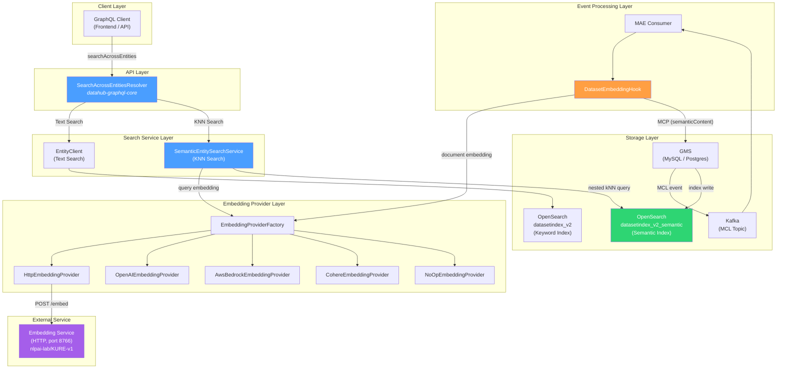

---

## 3. 모듈 다이어그램

소스 코드 모듈과 주요 클래스의 소속 관계를 보여줍니다.

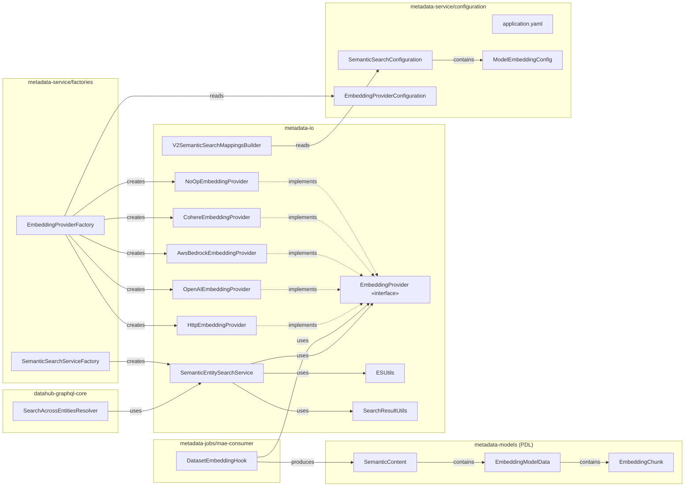

### 주요 파일 경로

| 컴포넌트                        | 파일 경로                                                                                                 |
| ------------------------------- | --------------------------------------------------------------------------------------------------------- |
| SearchAcrossEntitiesResolver    | `datahub-graphql-core/src/main/java/.../resolvers/search/SearchAcrossEntitiesResolver.java`               |
| SemanticEntitySearchService     | `metadata-io/src/main/java/.../search/semantic/SemanticEntitySearchService.java`                          |
| V2SemanticSearchMappingsBuilder | `metadata-io/src/main/java/.../search/elasticsearch/index/entity/v2/V2SemanticSearchMappingsBuilder.java` |
| DatasetEmbeddingHook            | `metadata-jobs/mae-consumer/src/main/java/.../kafka/hook/DatasetEmbeddingHook.java`                       |
| EmbeddingProviderFactory        | `metadata-service/factories/src/main/java/.../factory/search/semantic/EmbeddingProviderFactory.java`      |
| HttpEmbeddingProvider           | `metadata-io/src/main/java/.../search/embedding/HttpEmbeddingProvider.java`                               |
| SemanticContent (PDL)           | `metadata-models/src/main/pegasus/com/linkedin/common/SemanticContent.pdl`                                |
| EmbeddingModelData (PDL)        | `metadata-models/src/main/pegasus/com/linkedin/common/EmbeddingModelData.pdl`                             |
| EmbeddingChunk (PDL)            | `metadata-models/src/main/pegasus/com/linkedin/common/EmbeddingChunk.pdl`                                 |

---

## 4. 데이터 모델 (클래스 다이어그램)

### 4.1 PDL Aspect 스키마

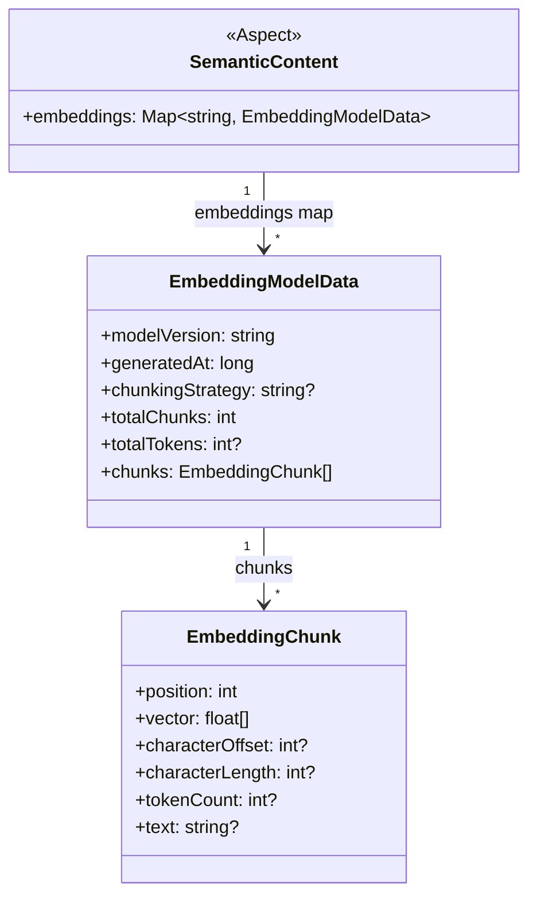

### 4.2 Embedding Provider 계층 구조

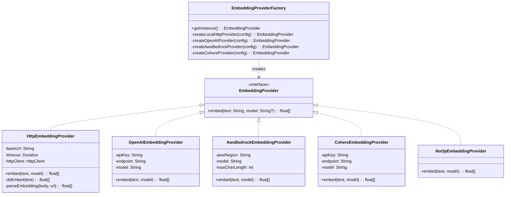

### 4.3 OpenSearch 인덱스 매핑 구조

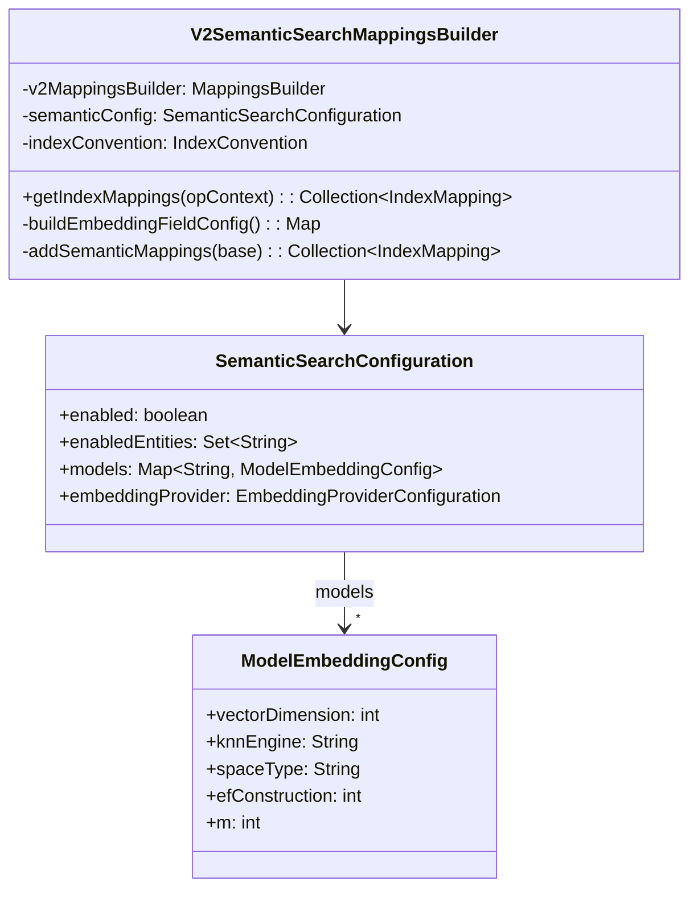

---

## 5. 임베딩 생성 시퀀스 다이어그램

Dataset 엔티티의 메타데이터가 변경될 때 임베딩이 자동 생성되는 전체 흐름입니다.

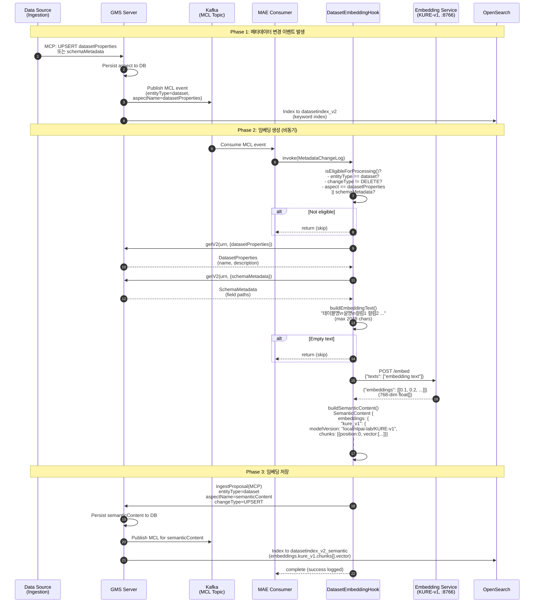

### 임베딩 텍스트 구성 상세

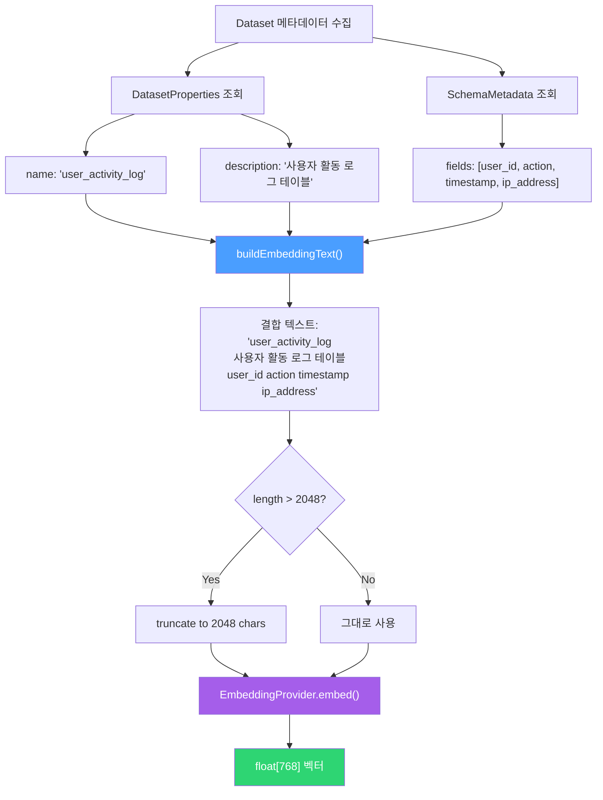

---

## 6. 검색 시퀀스 다이어그램

### 6.1 전체 검색 흐름 (Text + KNN 병합)

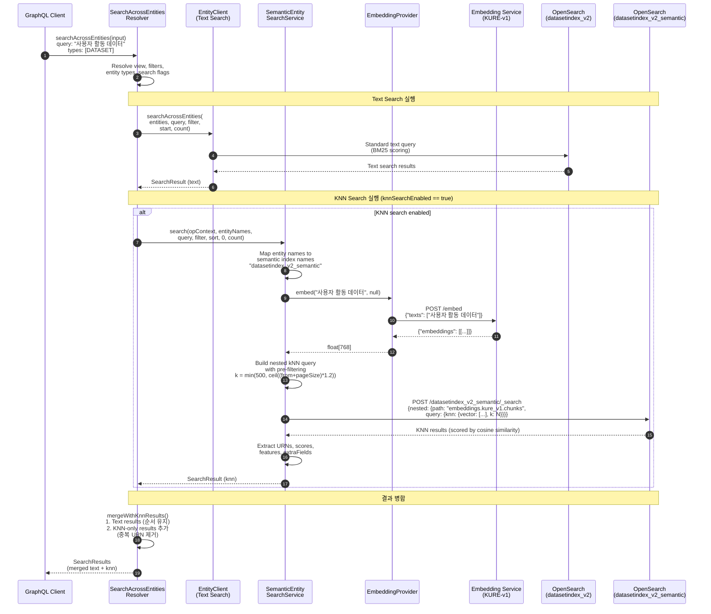

### 6.2 결과 병합 로직 상세

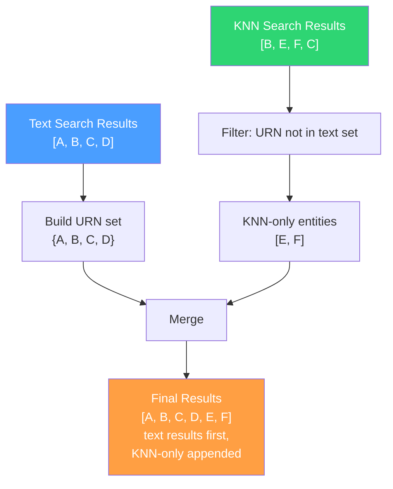

### 6.3 KNN 쿼리 실행 상세

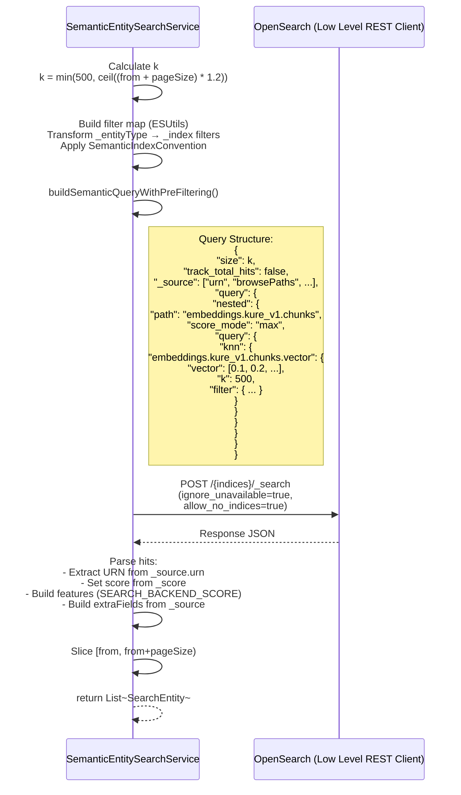

---

## 7. 벡터화 대상 필드

현재 구현에서는 **Dataset** 엔티티만 벡터화를 지원합니다.

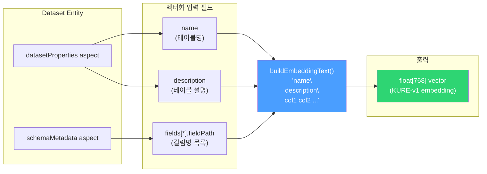

| 소스 Aspect         | 필드                  | 설명                             | 예시                                  |
| ------------------- | --------------------- | -------------------------------- | ------------------------------------- |
| `datasetProperties` | `name`                | Dataset 이름                     | `user_activity_log`                   |
| `datasetProperties` | `description`         | Dataset 설명                     | `사용자 활동을 기록하는 테이블`       |
| `schemaMetadata`    | `fields[*].fieldPath` | 컬럼 경로 목록 (space-separated) | `user_id action timestamp ip_address` |

### 트리거 조건

- `datasetProperties` aspect UPSERT 시
- `schemaMetadata` aspect UPSERT 시
- DELETE 이벤트는 무시
- `semanticContent` aspect 변경은 무시 (무한 루프 방지)

---

## 8. OpenSearch 인덱스 매핑

### 8.1 Dual-Index 구조

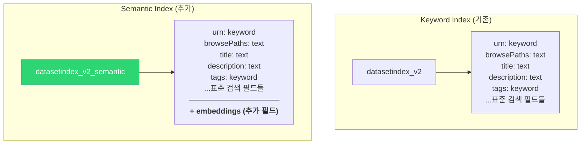

### 8.2 embeddings 필드 상세 매핑

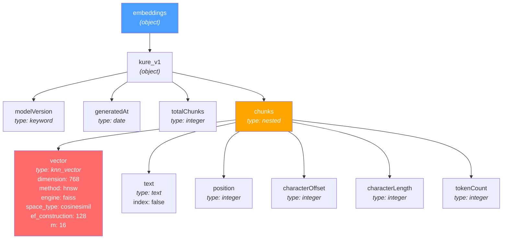

### 8.3 벡터 필드 전체 경로

```
embeddings.kure_v1.chunks[*].vector
```

| 속성                                  | 값                                          |
| ------------------------------------- | ------------------------------------------- |
| **type**                              | `knn_vector`                                |
| **dimension**                         | 768                                         |
| **method.name**                       | `hnsw` (Hierarchical Navigable Small World) |
| **method.engine**                     | `faiss`                                     |
| **method.space_type**                 | `cosinesimil` (코사인 유사도)               |
| **method.parameters.ef_construction** | 128 (빌드 시간 정확도)                      |
| **method.parameters.m**               | 16 (노드 당 연결 수)                        |

### 8.4 실제 OpenSearch 도큐먼트 예시

```json
{
  "urn": "urn:li:dataset:(urn:li:dataPlatform:mysql,db.user_activity_log,PROD)",
  "browsePaths": "/mysql/db",
  "title": "user_activity_log",
  "description": "사용자 활동 로그 테이블",
  "embeddings": {
    "kure_v1": {
      "modelVersion": "local/nlpai-lab/KURE-v1",
      "generatedAt": 1712467200000,
      "totalChunks": 1,
      "chunks": [
        {
          "position": 0,
          "text": "user_activity_log\n사용자 활동 로그 테이블\nuser_id action timestamp ip_address",
          "vector": [0.023, -0.041, 0.087, ...],
          "tokenCount": 28
        }
      ]
    }
  }
}
```

---

## 9. 상태 다이어그램

### 9.1 임베딩 생성 Hook 상태

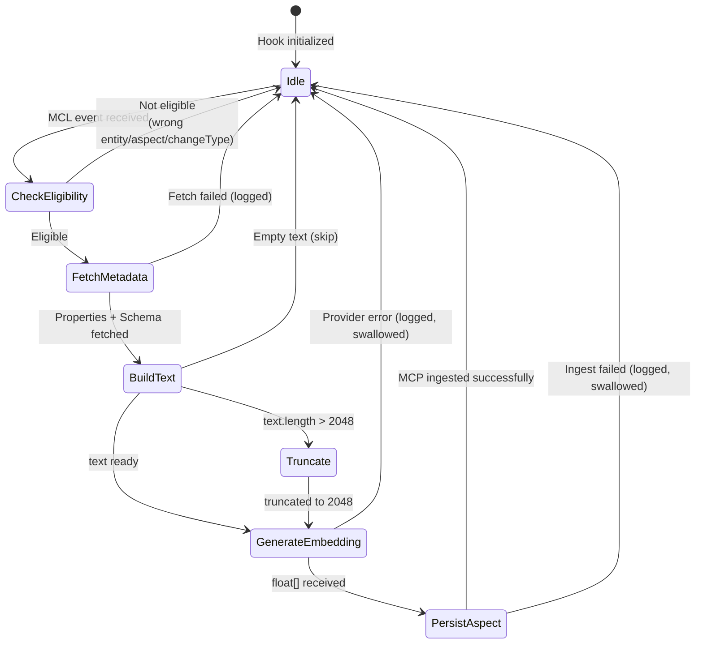

### 9.2 검색 결과 병합 상태

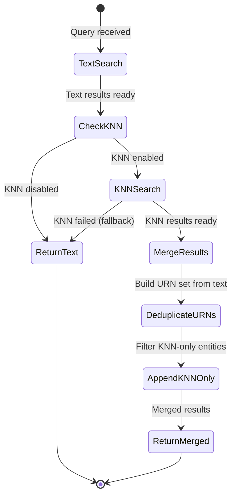

---

## 10. 배포 다이어그램

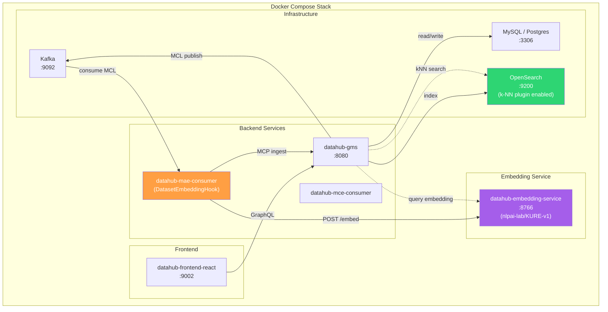

### 환경변수 설정

```
MAE Consumer / GMS:
  DATASET_EMBEDDING_ENABLED=true
  ELASTICSEARCH_SEMANTIC_SEARCH_ENABLED=true
  ELASTICSEARCH_SEMANTIC_SEARCH_ENTITIES=dataset
  EMBEDDING_PROVIDER_TYPE=local-http
  EMBEDDING_SERVICE_URL=http://datahub-embedding-service:8766
  SEARCH_SERVICE_SEMANTIC_SEARCH_ENABLED=true
```

---

## 11. 설정 참조

### application.yaml 주요 설정

```yaml
# OpenSearch 시맨틱 인덱스 설정
elasticsearch:
  entityIndex:
    semanticSearch:
      enabled: ${ELASTICSEARCH_SEMANTIC_SEARCH_ENABLED:false}
      enabledEntities: ${ELASTICSEARCH_SEMANTIC_SEARCH_ENTITIES:document}
      models:
        kure_v1:
          vectorDimension: 768
          knnEngine: faiss
          spaceType: cosinesimil
          efConstruction: 128
          m: 16
      embeddingProvider:
        type: ${EMBEDDING_PROVIDER_TYPE:local-http}
        localHttp:
          baseUrl: ${EMBEDDING_SERVICE_URL:http://localhost:8766}
          timeoutSeconds: ${EMBEDDING_SERVICE_TIMEOUT:120}

# 검색 서비스 시맨틱 검색 활성화
search:
  semanticSearchEnabled: ${SEARCH_SERVICE_SEMANTIC_SEARCH_ENABLED:false}

# MAE Hook 활성화
featureFlags:
  datasetEmbeddingEnabled: ${DATASET_EMBEDDING_ENABLED:false}
```

### 활성화 체크리스트

1. Embedding Service 컨테이너 실행 (`:8766`)
2. `ELASTICSEARCH_SEMANTIC_SEARCH_ENABLED=true` (시맨틱 인덱스 생성)
3. `ELASTICSEARCH_SEMANTIC_SEARCH_ENTITIES=dataset` (대상 엔티티)
4. `DATASET_EMBEDDING_ENABLED=true` (MAE Hook 활성화)
5. `SEARCH_SERVICE_SEMANTIC_SEARCH_ENABLED=true` (검색 시 KNN 사용)
6. `EMBEDDING_PROVIDER_TYPE=local-http` (임베딩 프로바이더)
7. `EMBEDDING_SERVICE_URL=http://datahub-embedding-service:8766`
